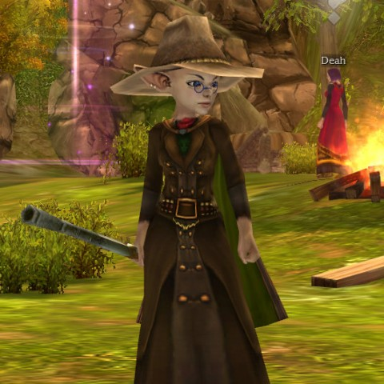

Back to: [West Karana](/posts/westkarana.md) > [2011](/posts/2011/westkarana.md) > [April](./westkarana.md)
# Mythos is back! Kinda!

*Posted by Tipa on 2011-04-29 06:58:18*

[caption id="attachment\_6358" align="aligncenter" width="480" caption="Gremlin Gadgeteer"][/caption]

A couple of years ago, you could have sold a Mythos beta key on eBay for a hundred bucks, easy. Now that it's finally out -- in Europe, anyway -- the reaction is a little more muted. What's happened to the Diablo 2-inspired action MMO in the intervening time?

Hellgate: London devs Flagship Studios, so the story goes, had used Mythos as sort of a proof of concept for some of the tech they were using in their main game. Turned out the devs liked Mythos so much that they decided to build it out into a follow-up title. It featured bizarre races, inspired character classes and talent trees and some of the most involved crafting you could ever find.

Then [disaster felled Flagship Studios](http://en.wikipedia.org/wiki/Flagship_Studios) and all the assets were claimed by HanbitSoft, and now Hellgate: London lives on in an Asia-only incarnation, while [Mythos has been extensively re-worked and released as a free-to-play game](http://www.mythos-europe.com/en/index.html) in Europe, though there's no barrier to non-Euros playing (as far as I can tell). [Redbana is licensed to release Mythos in North America](http://www.mythos.com/) based on the European release, but there's been precious little news of any progress there in quite a long time.

I have just played Mythos a very short time, but it's still very much the same game. There is a new, very comprehensive tutorial, though the quest text has the characteristic unusual phrasing often found when translating from Asian languages. Publishers Frogster have set up servers for not only English, French and German, but Polish and Turkish as well.

Mythos' original developers moved on to found Runic Games and develop the action RPG Torchlight, which shares a lot of the same concepts as Mythos, though in a single player package and without the extensive overworld.

Mythos is still the fast paced hacky/slashy/dungeon crawly game it was two years ago, but Torchlight may be spoiling its chance to make any sort of significant splash here in North America.

## Comments!

**[Petter](http://gamereactor.net)** writes: I never played Mythos back during the legendary beta, but with the hype surrounding it has really reverberated throughout the years since Flagship closed. So I downloaded it straight away when it launched yesterday. Then I played for two minutes, checked the item shop and logged out.

Seriously, what is it with F2P shop designers and rentable stuff? I don't mind having cheaper rentable mounts, like in Runes of Magic, for a cheap penny. But when everything that is available is temporary inventory bags, and no permanent option, I'm turned off straight away. Like the hair cuts in Vindictus, which I never even tried out because I saw the item shop on their website.

Perhaps it's silly, but it bugs me *way* more than the fact that I won't even be able to reach my character if I don't pony up $14.99 for a sub-game. At least there's a flat fee for *everything*. Give me a freemium option any day of the week. Or permanent bags. Otherwise the feeling of being nickled and dimed gets way too strong.

---

**[Tipa](https://chasingdings.com)** writes: I hadn't had a chance to look at the cash shop. That's Allods Online levels of fail there.

---

**[Friendly](http://thefriendlynecromancer.blogspot.com)** writes: She's cute! I'd feed her after midnight.

---

**Yarr** writes: Agreed, I'm not interested in cash shop games with rental stuff. Let me buy it outright and forever. I uninstalled Vindictus partially over that, and I just didn't care much for the limited combat and lack of any persistent world that I could find.

With most subscription games moving to a cash shop on top of the monthly sub as well, I'll probably not be playing anything other than what I am now, besides GW2. Single player games are just much better value compared to the way the MMO industry is moving, at least until they do over the top with DLC nonsense... oh wait... they already have. *sigh*

---

