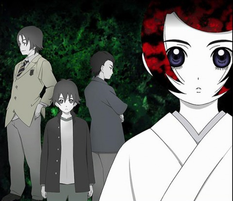

Back to: [West Karana](/posts/westkarana.md) > [2011](/posts/2011/westkarana.md) > [August](./westkarana.md)
# Review of Ghost Hound

*Posted by Tipa on 2011-08-13 08:00:37*

*I am the Lord of One Word. Say a word to me, and be it evil or good, it will be done, for I am the Lord of One Word.*

Review of [Ghost Hound](http://en.wikipedia.org/wiki/Ghost_Hound) (available for streaming on Netflix and Hulu Plus):

11 years ago, Tarou Komori and his sister Mizuka were kidnapped and held for ransom in an abandoned hospital. Mizuka died before she could be rescued. Tarou, now a junior high student, still shows signs of post-traumatic stress disorder from the incident, and a new psychiatrist travels each week from Tokyo to help him come to terms with his sister's death and move on.

But there is far more to the incident, and to the small town where he lives, than either of them realize. Makoto Oogami, a distant relative of Tarou and also a jr high student, suspects his father (who committed suicide eleven years ago) might have been the one who kidnapped Tarou and Mizuka. Worse, his grandmother is the last high priestess of a splinter religion, the Oogami sect. And she wants him to take over the leadership of the sect when she dies.

Masayuki Nakajima's father works in a mysterious laboratory. Masayuki has his own secret; he once bullied a younger classmate until that classmate jumped to his death from the roof of the school.

The three of them must navigate a twisted plot of murder, betrayal, religion, secrets and out of body experiences to find the truth about what happened eleven years ago, to discover what is going on inside the mountain top laboratory, and the hidden agenda of the Oogami sect.

It's Twin Peaks without the cherry pie. Ghost Hound rarely stays on one track for very long; what starts out as a psychological drama turns to spiritualism and then back to hard reality as the situation with the Oogami sect mingles with government, the mob, and the experiments done at the lab.

Production IG, best known for their Ghost in the Shell, throws everything but the kitchen sink into the intricate plot that eventually resolves into an improbably happy ending. Nonetheless, I love creepy psychological thrillers and Ghost Hound more than delivers on that front.

Recommended.

(First episode embedded below)

## Comments!

**Cow Nose the 50 Pound Cat** writes: I liked it too. :)

---

**[Cassaendra](http://cassaendra.blogspot.com/)** writes: Thanks for including the 1st episode. It reminds me a bit about Lain, from what I remember. I can't wait to check out more...

---

**[Cassaendra](http://cassaendra.blogspot.com/)** writes: Duh, I just clicked on your Wiki link that mentions Lain. :P

---

**[Tipa](https://chasingdings.com)** writes: One of the first things I thought when I started watching Ghost Hound was its resemblance to Lain; that's probably what convinced me to get through the rather bizarre beginning until it started to all make some sort of sense. Lain meets Twin Peaks.

---

**[bhagpuss](http://bhagpuss.blogspot.com/)** writes: Ghost Hound was the name of my first character in Golden Heroes, the long-forgotten tabletop superhero RPG.

---

