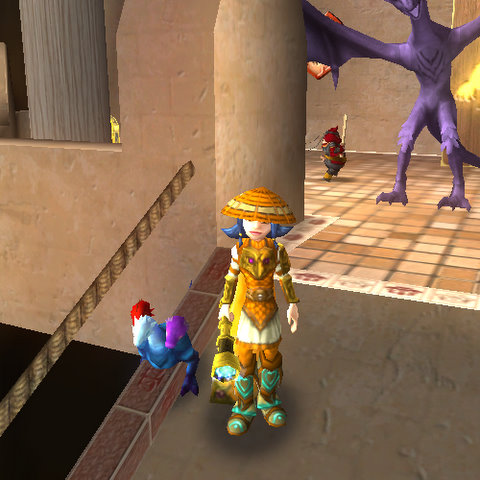

Back to: [West Karana](/posts/westkarana.md) > [2011](/posts/2011/westkarana.md) > [August](./westkarana.md)
# Wizard101: HOUSE-A-PALOOZA CONTEST!

*Posted by Tipa on 2011-08-15 22:20:38*

[caption id="attachment\_6458" align="aligncenter" width="480" caption="Alison Goldtalon notices something"][/caption]

**THE CONTEST HAS ENDED! SCROLL TO THE BOTTOM FOR THE LIST OF WINNERS!**

**The answer was Greyson Chance, and the silver chest was in the Library.**

Woot! West Karana is proud to announce that we are giving away *15* Balance Houses to anyone that can solve Alison Goldtalon's puzzle! Since everyone says my puzzles have been too easy, I've made this one (I hope) a little more challenging!

Here's how to enter.

First, solve Alison's puzzle. It *may* help to go into Wizard101 and have a look around the Balance home there. It shouldn't be necessary. Once you have the solution, e-mail it to me at **xxxxxxxxxxxxxxx**. This is important. I will be turning off comments on this post so that the puzzle doesn't get spoiled for everyone else.

Each day I will choose *two winners* from among the correct answers received until then. Be sure you have included an e-mail address with your entry where I can send a code if you win! I will be posting the winner's names to this post as the codes are won.

If you are a lucky winner, head to [http://www.wizard101.com/promo](http://www.wizard101.com/promo "http://www.wizard101.com/promo") to redeem your prize and claim your new home! (Be sure you have space enough for a new home on the wizard who claims the prize!)

That's the important stuff! Now, here's the puzzle:

[caption id="attachment\_6459" align="aligncenter" width="480" caption="Map of Balance Excavation"][/caption]

Alison Goldtalon was standing in the basement excavation of her Balance home, when she, by *chance*, noticed that each of the seven rooms had a chest in it, and each of the chests was made of a different material. If you went counter-clockwise starting in the nearest room, the first letters of the material the chest in that room was made in would spell the name of her favorite singer.

She is keeping the Balance House codes in a silver chest. Who is Alison Goldtalon's favorite singer, and which room holds the silver chest?

**HINTS!!!!!**

* The room that looks like it might say "SALINA" really should say "SAUNA". Selena Gomez is not the singer. Good guess, though!

* Alison is standing outside the Wyrmkin Room. If you look carefully, you can find the chest in that room.

* The material of that chest provides the first letter of the singer's name. The singer's *last* name is given somewhere in the puzzle description.

* Woody Guthrie is not the answer :-) We're looking for a ROOM name and a SINGER'S name.

**WINNERS!!!**

1. Morgrim Deathwielder

3. Adrianna Aune

5. Alura HexCaster

7. Justus Story

9. Saffron Fireblossom

11. Jose

13. Alyssa Moonheart

15. Paige Unicorncaller

17. Matthew

19. Valdus Talegiver

21. Noffin (forgot your wizard name :/ )

23. Eric Bearstrider

25. Lane Mills

27. Dylan GhostRider, the hardest working wizard in the Spiral!

I used random.org to help me award the last two homes to the people who gave the correct answer today. Here's the list from random.org:

There were 6 items in your list. Here they are in random order:

1. Jacob Redblade

 3. Victoria AngleBlossom

 5. Moria Shadow

 7. Blaine Lionheart

 9. Amanda

 11. Wolf NIghttail

Timestamp: 2011-08-19 02:23:16 UTC

Grats to Jacob and Victoria!

