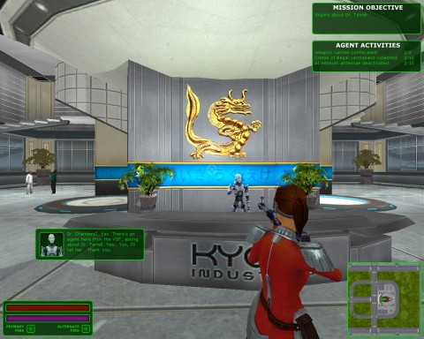
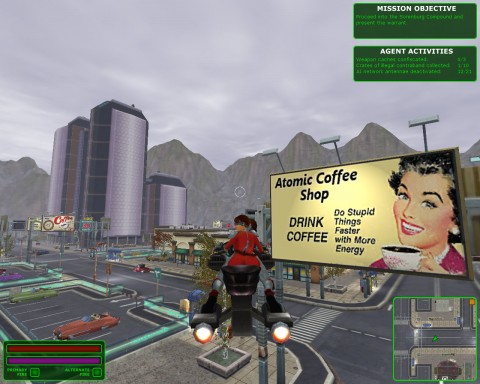
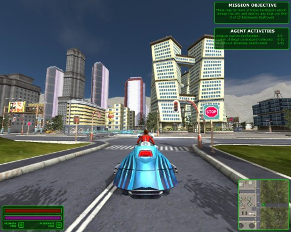

Back to: [West Karana](/posts/westkarana.md) > [2011](/posts/2011/westkarana.md) > [August](./westkarana.md)
# First impressions: Atomic City Adventures: The Case of the Black Dragon

*Posted by Tipa on 2011-08-20 20:41:04*

Two things I ask whenever I start playing a game with the word "Dragon" in the title. First, will I get to see a dragon? Second, can I kill it? I was wandering through Windstorm Studios' Atomic City Adventures almost holding my breath until on the third mission, I found a golden dragon. Not a black dragon. Not a dragon I could kill. But there's hope.

Atomic City Adventures is a story set in a 1950's smitten 24rd century where cars all float, synthetic humans do all the work, trigger-happy gangs roam the streets and only the VSF -- Vehicular Strike Force -- can manage to keep the city from tearing itself apart.

You play Pam Rodgers, newly promoted from the ranks of the ground police, whose job it is to patrol Atomic City on your hoverbike and take on trouble whenever and wherever you find it.

[caption id="attachment\_6483" align="aligncenter" width="480" caption="Atomic Coffee -- one of the many puns in the game"][/caption]

(Re: Puns, also spot the references to 2001, Blade Runner, I Robot et al. This game is full of genre nods!)

When you're not busy round-kicking your enemies back to 2233AD, you'll be on a hoverbike, scouring the skies for trouble. Hoverbikes are difficult to control because, after all, there's no road there to keep you pointed in the right direction. Your bike has mass and inertia, and you'll have to learn how to strafe while turning in order to change direction quickly. You'll want to get very good at this, as the weapons on your hoverbike point forward and don't turn unless you do.

You'll be able to upgrade your hoverbike through missions, and its weapons by finding the weapons caches strewn around the missions (hint: listen for the ominous hummmmmm as you float near). You also get points for finding illegal contraband and flying through glowing circles called "AI Antenna". Note that even when all the AI Antennae are active, the default NPC AI isn't all that smart, often walking neatly into your sights if you just back up slowly.

[caption id="attachment\_6484" align="aligncenter" width="480" caption="You meet the neatest people in the VSF!"][/caption]

You can also find weapons for when you're afoot, which you'll be using when you're having conversations with NPCs. A gun to the face really gets them to open up.

Atomic City Adventures is a story told through a number of missions. Each one starts with a briefing which advances the plot (yes, there is a plot!). You choose your vehicle, weapons for same and your personal weapon, then set off on your adventure in a city that looks like it was transported whole from City of Heroes.

Waypoints show you the next step in your mission, which usually tends to be go to this spot and kill enemies, go to this spot and kill enemies and destroy the building they're in, or go to this spot and talk to someone. Optional objectives may pop up when you near certain locations, and enemies, cowed by your superior skill in firing while backing up slowly, will take off, fleeing for a safe point.

Now *you're* the one trying to keep them in your sights, which requires mastering the drift/skid hoverbike turns while using your alternate, power-sucking but highly damaging weapon mode to blast them out of the sky.

[caption id="attachment\_6485" align="aligncenter" width="480" caption="Mission Complete"][/caption]

Once all mission objectives are complete, you're scored on the primary, secondary and optional objectives you completed. You aren't scored for \_time\_, though, and that's important, because you'll definitely want to make sure you've found the weapon caches in each level before moving to the next. Enemy firepower increases rapidly from mission to mission. Even though it's easy to lure enemies into your sights (move slowly backward), that puts you right in \_their\_ sights, too. Luckily it's not hard to disengage and heal up.

[caption id="attachment\_6486" align="aligncenter" width="480" caption="Atomic City"][/caption]

ACA: TCotBD has flying vehicle combat! It has femme fatales! It has a story full of battle and betrayal! It has a jazzy soundtrack (which changes to a foreboding march when... well, you'll see). It has police with Irish accents! It has a retro-techno feel!

It doesn't have gamepad support, however. It could really use it. The graphics are a couple generations behind the times and the character animation is a bit stiff. Your hoverbike gets stuck on things so much, the game gives you tips on getting unstuck.

Developer Windstorm Studios is a one-man shop formed after Ensemble Studios, developers of the Age of Empires series \_et al\_, went bust in 2009. This action/adventure title is their first release, and is available through [GameStop's Impulse online store](http://www.impulsedriven.com/atomiccityadventur "Impulse's Atomic City Adventures page") and [Direct2Drive](http://www.direct2drive.com/11271/product/Buy-Atomic-City-Adventures:-The-Case-of-the-Black-Dragon-Download "Direct2Drive"). At $14.99, it's a bargain.

## Comments!

**Longasc** writes: With so many great games getting released for 14,99 USD (it's only 10,42 EUR but usually VAT gets added so often rather 12,40 EUR) I wonder if some people shouldn't cancel some 150 bucks CEs, get the next cheaper and still overpriced CE and buy some of these games.

I wish Atomic City Adventures would become a series. Every half a year a new expansion that would be cool!

---

**[Tipa](https://chasingdings.com)** writes: Won't get any argument from me. I think those $150 CEs are insane. People must really just have too much money.

---

**[Jomu](http://www.justonemoreunlock.blogspot.com)** writes: that billboard in the second photo (atomic coffee shop) reminds me of something you'd see in the Fallout series :)

---

