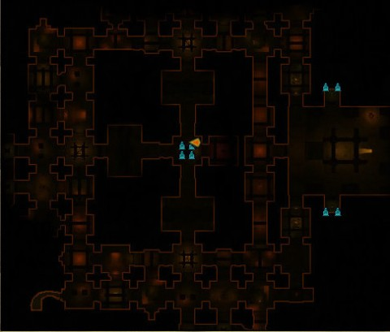
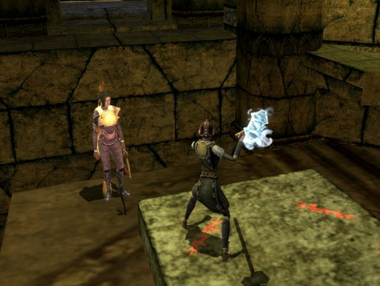

Back to: [West Karana](/posts/westkarana.md) > [2011](/posts/2011/westkarana.md) > [August](./westkarana.md)
# DDO: Justifiable Homicide.

*Posted by Tipa on 2011-08-21 20:45:33*

[caption id="attachment\_6493" align="aligncenter" width="480" caption="Partial map of the Chamber of Raiyun"][/caption]

If the Chamber of Raiyun were a module for the tabletop version of Dungeons & Dragons, Wizards of the Coast would be sending lawyers all over the country, the world even, explaining to judges and juries why the dead dungeon master found floating in the river, perhaps slowly colliding with even more dead dungeon masters, wasn't a justifiable homicide. Or why it was, depending on which side brought in WotC.

Because after about the fifth false floor or the tenth mummy ambush or the fifteenth trap or the fiftieth wrong turn because everything looks the same and you can't tell what floor you're on or where you've already been -- any party with an ounce of self-respect would have tossed the DM from the nearest window and named themselves victorious.

But since this is online, and the DM is just a computer program rolling virtual dice, even a good old-fashioned lynching is off the table, and players must just suffer.

[caption id="attachment\_6494" align="aligncenter" width="480" caption="Nowhere to go but down"][/caption]

We've done the Chamber of Raiyun in the Sands of Meneschaum module a couple of times. Usually, after a few failed jumps, I just end up hanging around the central treasure room while Gleek, Ulan and Lessah leap about like the gazelles they are and finish the dungeon without my help.

Upshot is, I really didn't know the dungeon that well. Well, turned out I needed the phylactery from this dungeon and didn't have it. Maybe I accidentally destroyed it for bag space. Maybe I never got it in the first place. But it was the last piece of the module's quest chain, and the only thing I could think of that would be worse than trying to solo the place myself, would be to make the rest of Team Spode have to do it a third time with me.

I thought with a Favored Soul hireling, I could have it tank and heal me while I killed things with Sneak Attack. That's the rogue power. If I'm not tanking, stuff is dying very fast. If I am tanking, then I'm dead, at this level. This was not only a test to see if I could complete a dungeon I'd never managed to do even in a group, but to see if there was any chance I could still do anything at all solo.

Things went pretty well; I cleared the first of the three towers and was halfway through the second when my hireling started getting nuked by an undead Eternal Wizard which never showed itself, but also never had any trouble hitting the hireling no matter where we were. She'd keep herself healed for awhile, and me as well, and do her job, but eventually she'd be drained and start to die. It was while running back down to a shrine that I got four mummies on me that eventually got trapped in the shrine room with my and my hireling's soul stones.

We still would have been okay if that Eternal Wizard didn't start nuking my hireling again whenever she'd rez.

So did what I did not want to do and I called upon Team Spode, hours earlier than we usually met. Gleek and Spode came on (gaining wife aggro in the process!) and we finished it -- and for the first time, I saw the tops of all three towers, got the phylactery, and finished up the quest.

The virtual DM for that module, though -- it better be thanking the gods of Intel that it doesn't have anything I can throw out a window.

## Comments!

**[Quote of the Day &laquo; Bio Break](http://biobreak.wordpress.com/2011/08/21/quote-of-the-day-155/)** writes: [...] Tipa Like this:LikeBe the first to like this post. This entry was posted on Sunday, August 21st, 2011 [...]

---

**[Wilhelm Arcturus](http://tagn.wordpress.com/)** writes: I seem to recall a level in the original Wizardy that was like that. Except I think it was creeping coins that got you every few steps. Or something.

---

**[Yeebo](http://yfernbottom.blogspot.com/)** writes: I did that one once. A three man where we all had NPCs. I was cursing both the designers and the day I was born by the time we finished. That phylactery doesn't sound familiar. I hope that I either already used it for whatever it's supposed to do or don't need it...

---

**[Tipa](https://chasingdings.com)** writes: I just don't get modules which have as their only purpose, punishment.

---

