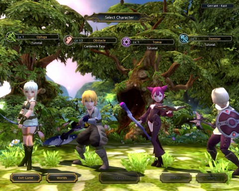
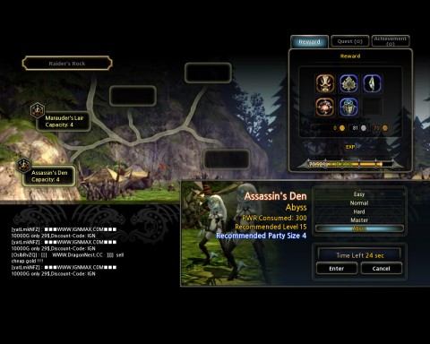
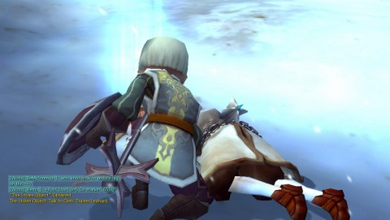

Back to: [West Karana](/posts/westkarana.md) > [2011](/posts/2011/westkarana.md) > [August](./westkarana.md)
# Dragon Nest: A Warrior, a Sorceress and a Priest walk into a bar...

*Posted by Tipa on 2011-08-23 07:06:26*

[caption id="attachment\_6498" align="aligncenter" width="480" caption="Warrior in the Valley of Mourning"][/caption]

Wanna blow stuff up, defeat dozens of monsters at once, perform ridiculous combos and fall in love with an NPC? Wanna go to incredibly atmospheric locations again and again? Wanna read some of the most hilarious game text in any MMO? Want to look just like everyone else? Wanna have a crowd of thousands cheering you on in the arena?

Nexon's [Dragon Nest](http://dragonnest.nexon.net/) just might be your thing.

[caption id="attachment\_6499" align="aligncenter" width="480" caption="Archer, Warrior, Sorceress, Cleric"][/caption]

Action MMOs like La Tale, [Dragonica Online](../../../index.php/2009/08/25/a-first-look-at-dragonica-online/), [Fists of Fu](../../../index.php/2010/06/25/fists-of-fu-beat-em-up-mmos-go-platform/) and so on specialize in removing everything that doesn't have you out in the world, killing things. Dragon Nest is the next generation of action MMO. It adds a third dimension to the often flat action world.

Typical of these games, you can choose from four different classes, each of whom can be customized in a very limited manner. Warriors chew things up in melee; Archers destroy things at range; Sorceresses make things go boom; and Clerics wallop stuff with maces, shields and spells. At level 15, Warriors can become Swordsmen or Mercenaries, Archers become Acrobats or Sharpshooters, Sorceresses become Elementalists or Mystics, and Clerics become Priests or Paladins.

All warriors are going to look like a boy with a huge weapon. All archers are going to look like lingerie models. All clerics are going to look like roughhousing bullies, and all sorceresses are going to look like demonic succubi. It's just the way of things.

No matter the class, though, play is essentially the same. You choose from a ever-growing list of moves that knock your opponents off balance, stun them or otherwise incapacitate them, then follow it up with devastating following moves. Passive special attacks mapped to your right mouse button o various things depending on how you incapacitated the enemy. It all comes together to make a very fluid, almost cinematic contest of utter destruction. As you roll or leap away from opponent attacks to hit them from behind with a suitably meaty thud, then use a jumping side-kick to push them off a cliff... combat is sweet in Dragon Nest.

[caption id="attachment\_6500" align="aligncenter" width="480" caption="Dungeon screen"][/caption]

There's two main plots in Dragon Nest. if you're a Warrior or an Archer, a chance encounter on the road to Ironwood Village leads you to investigate the kidnapping of a woman who may be the key to ancient power. If you're a Cleric or a Sorceress, a priceless artifact is stolen from a caravan of priests on their way to Mana Ridge, exposing a culture of corruption and misdealing in the highest levels of the church.

No matter the path, you're going to be heading into dungeons to deal with it. Many times. Dungeons can be done solo or in groups; there's a complete party-matching system in towns with which you can find people for the more difficult missions. While you can move the plot along through solo excursions, the best loot is found in the group-focused levels.

Each dungeon portal leads to several themed dungeons, which open up based on plot and level. Titles (which grant stats, and thus are desired), side-quests and general xp grinding/loot farming will have you repeating each dungeon many times. Regardless of dungeon or the difficulty setting, each run will take you less than fifteen minutes, offering an addictive sort of "just one more dungeon" gameplay which will keep you at your keyboard far longer than you'd expect.

The dungeon screen shows you what quests and achievements are available for each dungeon based on difficulty, gives an idea for the sort of special items might be found within, and tells you how much experience you'll gain from completion.

Your run is graded on speed and style. The higher the grade, the better selection of random loot at the end. Naturally, you can spend real money at the cash shop to buy items that make the random loot a bit less random.

[caption id="attachment\_6501" align="aligncenter" width="480" caption="The Arena"][/caption]

At the cash shop you can buy appearance items which \_do\_ affect your stats. You can also buy the expected selection of potions, extra storage space, resurrection scrolls and courier birds. These little critters allow you to broadcast messages to your current location or to everyone in the world. In Dragon Nest, spammers have to pay money to Nexon to hawk their wares.

(And that they do. General chat in town is useless because of the gold seller spam).

You'll be returning to town often in order to sell your loot, craft new items and enhance old loot. Most weapons and armor can be enhanced at the blacksmith; you can enhance any item to +6 without danger, but past that, a risk of failure can ruin your item (unless you have bought the cash shop item which guarantees success).

You can also make crests, crafted items which fit into a screen and grant you chooseable stat increases. You can build friendship with NPCs which will lead to more side quests and rewards. You can extract magic components from loot you don't like. There's a full skill tree system for each class and subclass. There's a player marketplace. 

[caption id="attachment\_6502" align="aligncenter" width="480" caption="Cleric intro"][/caption]

If you're looking for an MMO where your unique character forms the basis for years of deep role playing and adventure, Dragon Nest may not be what you're looking for.

If you're just looking for a game that connects you with a decent plot, good writing and loads of action, give Dragon Nest a shot. It's free to play, groups come easy if you want them but aren't required if you don't, and the fast pace brings an addictive, almost arcade sense of fun to the MMO genre.

I have not yet encountered any dragons. The NPCs warn of Dragon Cultists and such that \_worship\_ dragons, so I am forever hopeful.
## Comments!

**[bhagpuss](http://bhagpuss.blogspot.com/)** writes: I don't usually have much time for Action-RPGs but the promo video for Dragon's Nest was so pretty I downloaded the game to take a look. Haven't had much time to play yet but long enough to want to see more. It really is gorgeous to look at.

---

**[Warsyde](http://rpgwire.blogspot.com)** writes: I downloaded this two nights ago and have found it to be a pretty fun and addictive little action RPG. "Just one more dungeon" is a serious hazard, and that alone says a lot for the game.

---

**[Tipa](https://chasingdings.com)** writes: Yeah, usually I hate having to repeat content, but when a dungeon run only takes a few minutes, why not go for an achievement or something?

---

**[Randomessa](http://casualdoes.wordpress.com)** writes: Having tried Vindictus and given that up because I felt it was simply too repetitive, Dragon Nest is really hitting the spot for me. Its ease of pick up and play is what makes me keep coming back for more.

---

**[Tipa](https://chasingdings.com)** writes: I was wondering about Vindictus, a game I haven't played, because it seemed it would be a lot like Dragon Nest. The videos I've seen of it didn't look that inviting; glad to see I made the right choice going with DN :) Thanks!

---

