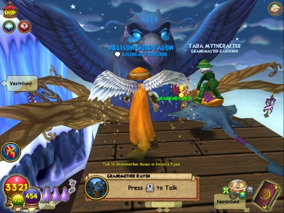
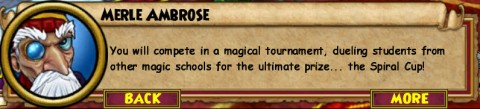

Back to: [West Karana](/posts/westkarana.md) > [2011](/posts/2011/westkarana.md) > [August](./westkarana.md)
# Wizard101: Ravenwood vs Hogwarts

*Posted by Tipa on 2011-08-25 06:55:10*

[caption id="attachment\_6511" align="aligncenter" width="480" caption="Pining for Hrundle Fjord"][/caption]

It's been no real secret that Wizard101's Ravenwood Academy owes at least a little of its inspiration to Harry Potter's Hogwarts. Alison Goldtalon and I were having a chat with Grandmother Raven over in Wintertusk; we'd just tied some gewgaws to the threads of our destiny in the Loom of Fate and freed her. Forgotten was that we'd earlier been told that because we were outsiders, the threads of our destiny were not part of the fabric of Wintertusk reality.

Well, NOW they are. ANYWAY, Headmaster Ambrose, using that mind talk voodoo all the Ravenwood faculty have mastered, summoned us back from deciding the fate of Wintertusk to give us some exciting news.

[caption id="attachment\_6514" align="aligncenter" width="480" caption="The Spiral Cup!"][/caption]

Finally! We'd teach those uppity upstarts at Hogwarts a thing or three. Those losers get all heartsore if they just see a couple of giant spiders. At Ravenwood, we fight the primal forces of nature.

Get ready, Potter. You may have overcome Death, but you have no power over Life.

Ambrose gave us the Spiral Key for the world of Wysteria, and we set off.

Wysteria, home of the famous wizarding school of... Pigswick?

Pigswick?

[caption id="attachment\_6513" align="aligncenter" width="480" caption="This is not Dumbledore."][/caption]

Bait and switch much, Ambrose?

Well, before we can compete in the competition for the Spiral Cup, we have to win a series of duels against Pigswick students, and if the first couple of battles are any clue, this should be an easy run. But... rumor has it that the higher form students *cheat*. And the headmistress knows about it and does nothing!

[caption id="attachment\_6512" align="aligncenter" width="480" caption="The grand prize"][/caption]

That doesn't matter. I will defeat my enemies. I will drive them before me and hear the lamentation of their pets.

## Comments!

**[katie](http://kalypso-and-cinnimin)** writes: wow that is a lame prize why did they make it that

---

