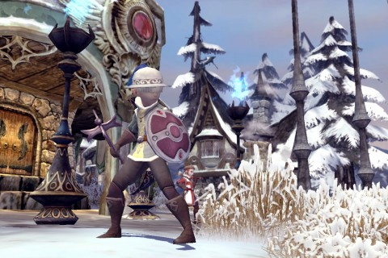

Back to: [West Karana](/posts/westkarana.md) > [2011](/posts/2011/westkarana.md) > [August](./westkarana.md)
# Dragon Nest: Out of Power

*Posted by Tipa on 2011-08-26 06:33:30*

[caption id="attachment\_6517" align="aligncenter" width="480" caption="Der Ritter, cleric"][/caption]

Dragon Nest has it's own version of World of Warcraft's "rest xp" -- power. There's a power bar next to your experience bar that slowly fills up over time. Each dungeon instance you do takes some of this power away; doing a low level dungeon on "easy" mode might cost 25 power. Doing a level 15 dungeon on "master" mode might take 300 power.

It didn't take long last night to use up my warrior Obstacle's power last night. I re-ran Valley of Mourning a couple times for side-quests and achievements, then moved into the Forest Ruins -- a new spot -- to advance the plot, complete some quests and look for higher level skill books. I didn't find any skill books, but I \_did\_ find some good high level sparks, which are similar to adornments in other games -- they add attributes to the gear you have.

Anyway, the show I was watching on Hulu (the premiere of the Syfy Heroes-clone "Alphas") still had more to go, so I parked now-level 14 warrior Obstacle in Carderrock Pass, his current town, and logged Derritter in.

Derritter = Der Ritter = The Knight. Although a lowly cleric at the moment, Derritter can grow to become a Paladin (hence the name) or a Priest. I still haven't decided which way to go with him. Like all class-based MMOs, higher level instances really demand a dedicated healer, and there's almost always groups asking for one.

I didn't choose him as my main from the start because the game itself warned me away from him. Warriors and Archers, says the character creation screen, are the classes for beginners. Sorceresses are medium difficulty. Clerics are for experts. Clearly day 1 in Dragon Nest, I wasn't an expert.

While writing my original Dragon Nest article, though, I created characters for all four of the base classes and went through their intro missions to get an idea for how they operated.

Thing is, the cleric and the warrior aren't all that different at the low end. I've gotten Derritter up to level 5 (and am enjoying the Mana Ridge storyline more than I did the Ironwood Village storyline) and it's pretty much the same thing: charge into a group of enemies, lay in with the AE, focus fire on the enemies with special abilities (magic, shields) and use special attacks on staggered enemies. Clerics don't get the sheer weapon abilities of the warrior, but they have magic to make up for it. It's pretty much the same thing in the balance.

For the other two classes, Archers seem to be your standard ranged fighter, but they still have a lot of close-up attacks which leave me wondering how best to play one. Soften stuff up from range and then close in for the ninja attacks? Or just ignore the melee-range skills until you change class to Acrobat at 15?

With the Sorceress, same issue. You nuke from range, then wade in and slap things with your book. For classes that are explicitly weak in melee range, there sure are a lot of skills that keep you within reach. I suspect that Archer and Sorceress turn out to be the real expert-level classes.

They'll all be much easier to play for me, though, because I have been sending all of my alts skill books and weapons and armor from Obstacle. I go through the low level instances on Master level and send the good stuff :) Because that's another thing you can do when you're out of power -- repeat the instances that wouldn't have given you xp anymore, anyway.

## Comments!

**Blamefulgecko** writes: Things are really different as you split off into your specialized classes ala Seiken Densetsu 3. The videos I've seen of the Paladin actually have him killing things by standing in the middle of enemies blocking attacks and somehow killing things with, what I'm guessing is, some mystical buff. The Priest (My mains spec) has a ton of support spells and later becomes heavy with the use of totems or AOE Zeus Jesus lightening spells.

I also run out of power all the time but keep on playing. I know I'm not optimizing my time but Master and Abyss dungeons give so much xp even without power that I just play those :)

I created all 4 characters classes also but have stuck with the Cleric to give him a chance...the later Warrior stuff intrigues me though!!!!

---

**[Tipa](https://chasingdings.com)** writes: I like what the website says about the cleric, that they can become a secondary damage dealer, which sounds like something I'd like. 

My warrior is going Swordsman probably tonight. I created the cleric to go Paladin but may go Priest after all. 

Do you solo Abyss dungeons?

---

**Blamefulgecko** writes: Nope Abyss dungeons would only be able to be soloed once you're way leveled passed it. I just group with a few people when I want to do a few abyss runs. You use the dimensional keys at the end of Abyss runs to get a chance to get some nice items from a crazy bunny! I'm going the route of damage dealer.

If you look up Korean Dragon Nest videos online you'll see that each spec has some kind of Master mode solo run video! Even the classes that the website and forums say aren't good at soloing.

---

