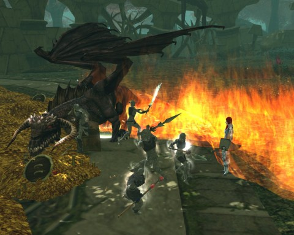
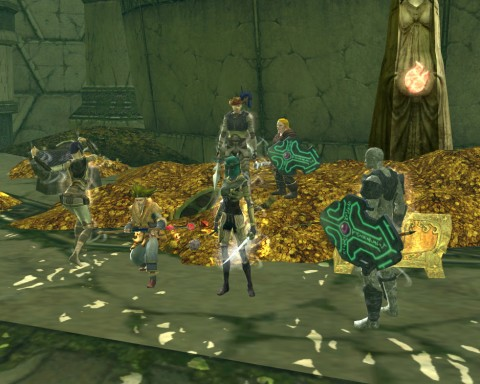

Back to: [West Karana](/posts/westkarana.md) > [2011](/posts/2011/westkarana.md) > [August](./westkarana.md)
# DDO: Team Spode is Mired in Kobolds

*Posted by Tipa on 2011-08-29 06:23:08*

[caption id="attachment\_6520" align="aligncenter" width="480" caption="Varath the Unloved"][/caption]

Team Spode isn't an adventuring party with a lot of principles, but there's one principle which we regard as iron-clad. And that is, never leave loot on the table. This simple rule has served us well over the years.

Having finished for now with the Sands of Menechtarun (we have a raid to attempt at some point), we took our guild ship to the compound of The Twelve. There were reports of dragons in the area. We thought back to our (short) list of principles, noted that dragons were known for their hoards of treasure, and we volunteered for the job.

But first we would have to wade through kobolds. Bunches and bunches of kobolds. Some kobolds even wore armor, which I thought was against the kobold code of behavior. We weren't ready for kobolds with any sort of self-preservation!

Thankfully, they were still too dumb to live. Above each of their camps, a pulsating crystal provided power. A couple plinks with arrows and they'd explode, killing the kobolds beneath them. Oops. The rest would run merrily into Gleek's fire walls. Firewall \_has\_ to be the most valuable spell in the entire game.

At one end of the kobold camp, we freed an explorer and her huge chest of loot. At the other end, the kobold's secret weapon: a young black dragon.

We all put on our poison resist gear and headed in to kill and slay our first dragon in a game named after them.

You know, there's this thing about memory. After a decade or two of not playing D&D, you tend to forget exactly what powers each dragon has. Red dragon = fire, everyone knows that. But if we'd had our Monster Manuals at hand, we could have looked up and noticed that black dragons are \_acid\_ dragons. Acid. Not poison.

Nonetheless, Varath was a weak dragon and we soon had him down.

[caption id="attachment\_6521" align="aligncenter" width="480" caption="Sinvala the Recently Deceased"][/caption]

We didn't realize the thing about the acid vs poison breath until Varath's mom, Sinvala the Vile, dropped by to avenge her son.

Apparently she was fine with Varath being exploited by the kobolds to power their traps and their magic. Sinvala told us that Varath was the least of her children, but that he deserved a better death than one at the hands of Team Spode.

I think we were just insulted... by a dragon. By a dragon whose power was preventing us from getting to two chests of loot. Our \_principles\_ were in danger.

Our history with destroying crystals to kill kobolds got us (well, Gleek) wondering if the crystals in Varath's lair could help kill his mom. We'd drag her beneath one and destroy it. Forks of lightning would arc down and slam in to the beast. We ran out of crystals before Sinvala ran out of hit points, however, and we ran out of hit points before Sinvala ran out of acid breath.

So: next time, we prepared for acid.

[caption id="attachment\_6522" align="aligncenter" width="480" caption="Lewt"][/caption]

We started Mired in Kobolds from the beginning once more. This time the kobolds died without any surprises like "armor" or "healing themselves". We learned not to step in the patches of spiky bushes. We learned to avoid a dragon's mouth when it's about to breathe acid. And we learned to kite.

Gleek has his firewall, but Ulan has his blade barrier. Set those up and kite Sinvala back and forth through them and that was pretty much a win.

Well, we died when she was at 40%. This is still an elder dragon, and even having a strat doesn't mean a clean kill. Spode held open the instance, while the rest of us released back to town, healed up, and headed back in. Sinvala was so happy to see us that she almost forced her way through the barrier the kobolds had set up to keep her child imprisoned.

More Gleek firewalls and more Ulan blade barriers, some master kiting on the part of Spode, and I even got a little backstab and sneak attack action in. Sinvala was dead. The piles of loot? Ours.
## Comments!

**Egat** writes: Bravo Tipa! This nearly made me brush off my DDO account.

---

**[Tipa](https://chasingdings.com)** writes: After that horrid dungeon last week, we really needed a fun romp like this one! I really need to thank Gleek, our cruise director, for that :)

---

