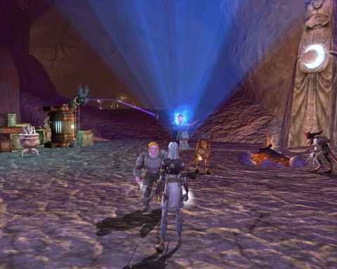
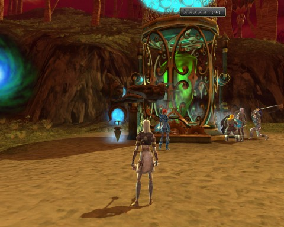

Back to: [West Karana](/posts/westkarana.md) > [2011](/posts/2011/westkarana.md) > [December](./westkarana.md)
# DDO: Challenged by House Cannith

*Posted by Tipa on 2011-12-05 08:13:11*

[caption id="attachment\_9874" align="aligncenter" width="480" caption="Lava Caverns: Colossal Crystals"][/caption]

With the dragons in Gianthold Tor apparently out of our reach and with Ulan gone for two weeks, the question of "what's next?" has been hanging in the air in Team Spode HQ.

We need a level or two to properly kill the dragons -- or a better \_plan\_. We have tried all different combinations of resist gear, DPS, tanking and kiting, but we don't kill fast enough or evenly enough. Anyway. We decided to work on the new House Cannith challenge dungeons for a change.

I'm the only one of us who has bought the expansion (I wonder if this means I can roll an Artificer?). Gleek and Spode logged on each day and got the free challenge dungeon tokens handed out each day. Sunday we lined up inside the House Cannith compound to try our luck at two of the dungeons: Lava Caverns: Colossal Crystals and Kobold Island: Short Cuts.

The goal in *Lava Caverns: Colossal Crystals* is to discover an enormous blue crystal called a Progenitor Crystal, inevitably as far away from the home base as it is possible to get. There is a secondary objective to get the kobolds to return 10,000 lava crystals to the home base. The first job: actually find a progenitor crystal. Spode took the lead, smashing through enemies and exploring until (after a few failures on the dungeon) he discovered one, along with the crests needed to unlock the gate that protected it from kobold miners.

Gleek was in charge of actually getting the kobold miners to the crystal by placing a trail of regular and healing torches to that crystal, but every time the miner came across a crystal, they would mine it and return to base. Eventually I was left at base (I was there to buy supplies and kobolds as needed and to fend off invasions of the home base) with a dozen kobolds.

We suspect there is a way to use the teleporters to get the kobolds closer to the crystal, but we couldn't get kobolds to use the teleporters to get \_back\_ to the far teleporter. Perhaps by placing one in a circle of power?

We made progress. But ultimately failed. However, even our failures got us loot chests. So that was nice.

[caption id="attachment\_9875" align="aligncenter" width="480" caption="Kobold Island: Short Cuts"][/caption]

On to *Kobold Island: Short Cuts*. Here, the group competes against time to extract 400 dragonshards using the small and large extractors scattered around the island. Each extractor has a portal near it, which randomly teleports each player to a different location on the island. Our first shot at this ended in failure as we all jumped into a teleporter and ended up in different places.

You can take another chance at getting back together by jumping through the exit portal again, but each portal can be jumped through only three times.

All the extractors, by the way, are broken. The small ones can be fixed by collecting parts from kobolds by either clicking on a totem near a kobold camp, or killing them. (There is an optional objective to not kill any kobolds.) Every extractor is defended; the smaller ones by regular mobs and the larger ones by boss-level mobs.

The small extractors, once fixed with parts, come immediately under attack once they start generating dragonshards. You can buy magic turrets (for 10 shards) to help defend the turret, or upgrade the extractor (for 75 shards) to make it a little tougher, but starting and protecting one small extractor will not win the challenge.

The large extractors take *300 shards* to start. This is very near the winning requirement of \_400\_ shards. We never had enough shards to get a large extractor going.

We would start as many small extractors as we could, but no matter how well we upgraded or magically defended a small extractor, unless we were physically present to clear the waves of attackers, they'd soon destroy the extractor.

We never came close.

So, another frustrating week in DDO. I don't know what we're doing next week. We did make good progress on the House Cannith challenge dungeons we tried, but these may require more than three people to complete.
## Comments!

**[bhagpuss](http://bhagpuss.blogspot.com/)** writes: I have to say that while I always enjoy your accounts of your DDO adventures, the actual adventures themselves sound dire. I quite enjoyed DDO for the fairly short time I played it, but I thought it was attritionally repetitive. The whole model relies on being prepared to do the same content over and over again to progress. 

That was bad enough at low level, where at least what you were required to do was fairly achievable. 
Once you add in the high chance of failure at higher levels or difficulty settings it becomes hard (impossible for me) to see where the entertainment value comes in. Other, of course, than the getting-together-with-friends part, which is always good. There surely must be things to do with friends that are more fun, though.

---

**Tipa** writes: I think we'd have more success as a full group, but we've been unable to fill the remaining two spots with anyone for very long. And given how long it would take for a new character to catch up, we would have to restart for any new members -- something we have already done once and won't do again. 

Our typical stray on difficult content is to our level it. Which isn't ideal by any means. 

We all want to see level 20. Past that, I don't know what we'll do.

---

**Phule** writes: I have yet to run these even once. They don't seem to be very popular for pug groups on Kypher.

---

**[Tipa](https://chasingdings.com)** writes: Well, if you're in our level range and are available Sunday evening...

---

**Phule** writes: What class do you need to fill out your party? I might try to power level to 15.

---

