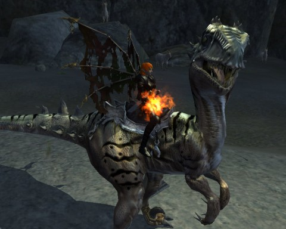
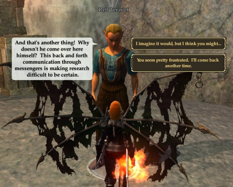

Back to: [West Karana](/posts/westkarana.md) > [2011](/posts/2011/westkarana.md) > [December](./westkarana.md)
# EQ2: What, no SWTOR?

*Posted by Tipa on 2011-12-15 00:43:27*

[caption id="attachment\_9882" align="aligncenter" width="480" caption="Rapture Raptor!"][/caption]

I do WANT to play Bioware's Star Wars: The Old Republic. I WILL play it. Just... not right now. I'm not in a good place with MMOs at the moment. See, I've just spent a month playing Skyrim, and it's left quite an impression. I just don't know if I can play a tightly scripted MMO when I've just spent 130 hours exploring a world.

There's just too much hype around the game right now. The hype makes it impossible for me to consider the title calmly, because, being the contrarian I am, I'd be inclined to hate it. It can't possibly live up to its hype, but why should that matter? Someday I'll sit down and watch all the Star Wars movies, or maybe play KotOR again, and then I know I'll want to play SWTOR. Or someone will want to form a static group -- because it doesn't even matter what game it is, meeting once a week for a static group is reason enough to play anything. My time in DDO proves that.

Anyway, EQ2 was my game tonight. I'd had to stop playing months ago when some sort of driver upgrade kept resetting my video card every minute or so, making the game unplayable. When EQ2 went F2P last week I deleted entirely all my old installations and made a new one from scratch -- and it worked wonderfully!

BUT... EQ2 F2P is not EQ2. It's some different beast. I was grandfathered in to a "Silver" account, but my characters were too far advanced in abilities and gear to use much of their stuff. I understood that EQ2 wasn't ever going to be playable entirely for free once past the very beginning levels, but I'd been hoping.

I couldn't get into my account details (for some reason) to check out my subscription plans. SOE customer service just tonight cleared that up. I got in game and blew the rest of my Station Cash on a one month gold subscription. 31 days to see what's happened to EQ2 since the last time I played. A long, long time ago.

[caption id="attachment\_9883" align="aligncenter" width="480" caption="Why do I need to carry messages back and forth?"][/caption]

All that time ago, I'd been working on the quest for the one "flying" mount available to a level 58 berserker, the leaper. This quest starts at a fossil dig in Butcherblock Mountains, and involves bringing a fossilized egg to life. There's so much back and forth couriering between two close NPCs that finally one of them lampshades the absurdity by wondering loudly why the OTHER NPC doesn't just COME OVER and talk to him!

The quickened egg is used to summon a fully grown "sailraptor" into Norrath, which instantly imprints and just begs to be jumped all over the zone. How could I possibly refuse? I could not.

The next mount, the glider, requires level 60. The flying mount requires level 85... but Fae, such as my dear Scatter, can actually gain true flight without needing a mount at all. So that's something cool.

I don't think I'm getting Scatter to 85 in 31 days, though. To be honest, I'm not even sure how I'd go about soloing a berserker. Fae are hardly the best race for it. I just rolled her up for fun when the race became available and never expected her to get out of her teens. Now look at her.

## Comments!

**quizzz** writes: My first character in EQ2 was a Fae berserker... loved it! But eventually I fell in love with the crafting system...and made so many alts (just to craft, harvest, sell, trade) that I forgot how much fun it was to be the mini-tank-terror-with-wings!

Have fun getting re-acquainted.

---

**[bhagpuss](http://bhagpuss.blogspot.com/)** writes: The new F2P implementation of EQ2 is a vast improvement over any previous version. Don't even waste a second thinking about what you can't use as a Silver account holder because if you are soloing below level 85 you won't need any of it. I know you've gone Gold but honestly, there was no need.

After seven years of playing EQ2 and several previous max level characters, my Freeport Berserker became my most developed character ever within about 9 months. Level 90 in adventuring and crafting and 240 AAs so far. Much of that was soloed although there was a bit of duoing here and there. 

Until he hit the very high 80s all his gear was either Mastercrafted or Treasured. His spells were Expert, although actually I didn't even bother with that on the non-key stuff, which I left at Adept or even Journeyman. Much of that was done pre-item revamp, when treasured gear really wasn't up to much. Post-revamp, treasured quest rewards and many of the dropped items are extremely nice - much better than the old equivalent Legendary. Even in the 80s you absolutely will not need anything better than the treasured quest rewards from Odus content.

Berserkers solo brilliantly. I miss not being able to fall over and reset the encounter when it's going badly as I would as a bruiser, but survivability makes up for that. Go sword and board and maximise every possible AE (there are lots) and soloing consists largely of running into rooms yelling and spinning in a circle until everything dies. Never gets old!

If you have evil characters I would very strongly recommend doing the new Freeport content. Every quest I've done so far has been interesting and involving and the art direction is superb in the revamped zones. Best quest content I have done in EQ2 for a very long time.

I'd heartily recommend the new Age of Discord expansion too, because every single thing it offers is useful to all levels and all classes and most of it makes major improvements to gameplay for anyone who isn't already a committed raider. Overall I think EQ2 is in a better place now than it has been probably since launch and there's never been a better time to start or start over.

---

**[kaozz](http://www.ectmmo.com/)** writes: "I do WANT to play Bioware’s Star Wars: The Old Republic. I WILL play it. Just… not right now. I’m not in a good place with MMOs at the moment."

That is pretty much how I feel also. I have been really excited about AoD so I'll probably grab that before I mess with SWTOR.

---

