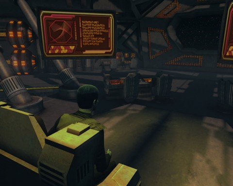

Back to: [West Karana](/posts/westkarana.md) > [2011](/posts/2011/westkarana.md) > [December](./westkarana.md)
# Star Trek Farmville: Duty Officers and Cow Clicking!

*Posted by Tipa on 2011-12-18 22:00:17*

[caption id="attachment\_9892" align="aligncenter" width="480" caption="Execute for Incompetence"][/caption]

I want to say right at the start that I am back playing Star Trek Online, and it was the new duty officer system that brought me back. Now I'm leveling my characters, running special task forces and in all senses am back in the game.

But... duty officers. You bring up the screen, clickclickclick accept all the completed missions and reap the rewards, then clickclickclick send your duty officers off to perform more randomly generated tasks. You get small amounts of dilithium (the special gear currency), energy credits (the normal currency), general experience and experience toward the heading under which ranked the mission -- diplomacy, exploration, marauding and such.

You don't have to do anything else. You can level up entirely through logging in, clicking and logging out... though it will take some time.

But my perennially first tier Vulcan lieutenant is now a lieutenant commander sitting in a Sabre-class escort, from clicking.

My three-ranks-from-max-level Klingon started on his way to level cap this weekend... by clicking. And then a heck of a lot of special task forces. HE'S now in a ship used by the demons from Klingon hell. And isn't it interesting that in Klingon mythology, the demons come via starship? Now he drives one.

My max level science captain; well, as Krontar tears up the space ways in his Hell carrier, Tipa heals Borg missions. She clicks in the hopes that she will one day be able to afford that smoking hot Vulcan cruiser. But that's going to take awhile. She needs about 500 more Cryptic Cash to afford it. That's what Cryptic says about the Dilithium grind; you can buy the most advanced starships with it. Well, the most advanced starships cost 2000 Cryptic Cash. A typical STF gives 450 Dilithium. The exchange rate is (coincidentally) around 450 Dilithium for 1 Cryptic Cash. Lessee... that's 2000 missions, right? A max of 8000 Dilithium per day at 450^2 Dilithium = 25 days of grinding. Of course you can't BUY that much Cryptic Cash at once without driving up the exchange rate, so double that to take advantage of only the best deals... in a couple of months you could have that ship.

Or, just pay for it. With cash. Which is what they want you to do. They hold out the promise that you can buy anything you want in the game with in-game currency, but you'll eventually decide your time is worth more than your cash, and you'll just end up paying.

This is TOTALLY Farmville territory!

I only need about 500 more CrypCoins for my ship, so that's just shy of a quarter million Dilithium ore. I've got that in the bag.

Remember, though -- I'm actually having \_fun\_. I know the D'Kyr Vulcan science ship is far in the future and that doesn't bother me. I could pay cash if I wanted it today. Star Trek Online gives plenty of free ships, and after all, that cruiser is \_mostly\_ cosmetic. All the really expensive ships have some cool things, of course, but nothing you can't live without.

I thought I'd spend some time writing about what I have been doing in game -- when I'm not Doffing.

[caption id="attachment\_9904" align="aligncenter" width="480" caption="Krontar"][/caption]

Klingons are -- and I have always said this -- just so much \_fun\_. They are just this ultimate masculine force. I just couldn't see having a female Klingon character. Naturally MY Klingon would have to be the old school Klingon. Klingon duty officer missions are likewise a blast -- even though they are all, after all, just clicking. Like the one I highlight at the top of the post; Execute the Incompetent. Duty officer always failing their missions? Toss them out the airlock! You get POINTS for it! And they are truly gone from your roster afterward.

Unlike Farmville, failing duty officer missions can have repercussions. Crew members can end up dead or have to spend days recuperating in Sick Bay. Succeeding in them can get you duty officers that add passive buffs, crafting supplies, rare weapons and consoles and so on. 

My issue with Star Trek Online, as it is with most MMOs, is my love/hate relationship with groups. If I am soloing and I screw up, I'm the only one who has a penalty. If I am grouping and I screw up, I have just wasted the time of several people. Filling a spot in a group means understanding your role and not screwing up.

Well. Krontar is my screw-up character. I did some duty officer clicking, but that wasn't enough, so I started doing some of the Klingon-only Pi Canis sector espionage missions -- go into a zone, blow Federation stuff up, leave without letting anyone warn Starfleet. And combined with the doffs, I started leveling. Felt good. I queued up for some Special Task Force missions -- they have an automatic group finder now. Started earning more dilithium, more encrypted data chips (EDCs) for special Borg items, and especially, started rolling in the experience. Dinged max level. Got my new ship -- the demonic Kar'Fi carrier.

Opened the power list, put them into hotkeys (surprisingly few of them), queued up and headed into a STF... and did TERRIBLY. Died all the time. I SUCKED at carrier! I realized halfway through that I had forgotten to assign bridge officers to their bridge stations. I was running the whole ship myself. Poorly.

The other people in the group were kind enough not to say anything, or perhaps didn't notice how often I died. Afterward, I assigned the officers, went back to Qo'noS and got them trained appropriately, got some good quality weapons off the Exchange, learned important lessons about keeping as far as possible from the fight, and did a couple more Pi Canis missions for practice... then I returned to STFs and started kicking Borg butt in space. Started outfitting the carrier in more Borg gear, too.

So that's Krontar: the Terror in Space. I could queue for ground missions, but why bother? Space is so much more fun.

[caption id="attachment\_9905" align="aligncenter" width="480" caption="Tipa in "The Cure""][/caption]

Now, I've never really felt like I contribute as much as I can with Tipa in her Nebula. I love that ship to death, but it draws aggro it can't tank. But as a ground mission healer, she rocks. I've been doing ground task forces with her. Might even start the elite ones, which give a better chance for the base of rare faction stuff you almost never see.

She's been doffing, too. You get different kinds of duty officer missions depending where you are. If you're in Borg space, you get a lot of missions trying to grab some Borg tech, for instance. If you're in Earth Spacedock, you get a lot of diplomatic and recruitment missions. Plus you can always check out the duty roster and get people running your level 5 diagnostics while the ship is idling in space dock.

Not a lot of stuff for Tipa, really, though I did design her a Christmas outfit. It's always winter on Andoria, after all.

[caption id="attachment\_9906" align="aligncenter" width="480" caption="T'pral and her Sabre"][/caption]

I've done a couple missions with T'pral, my Vulcan engineer, but mostly, she's my doffer. She's low enough level that the experience from each successfull doff mission is pretty significant; she made the last couple levels of Lieutenant without much trouble at all, and is now two levels into Lieutenant Commander. Almost all SHE does is hang around the Captain's quarters clicking on doff assignments and taking a trip into Q's Winter Wonderland once a day to try for a Jem'Hadar fighter... which would at least make for a more interesting setting for doff clicking.

Vulcans live for a long time. No need to rush around "leveling". 

[caption id="attachment\_9899" align="aligncenter" width="480" caption="On the bridge of the Kan'Fi"][/caption]

Star Trek Online has always been a fairly quick game; you could always log in, race around zapping stuff in a ground mission or battle stuff in space in a way that puts other space battle MMOs to shame with how good it is, then log out in half an hour. STO has added queuing for special task forces, hourly events that give extra rewards for completion (including special event-only task forces and fleet actions as well as other races and mini-games). Doffing gives you something you can do even if you only have five minutes. You can even spend a few energy credits to warp right to quest starters from anywhere in the universe, in case you don't have time to fly there.

It's the perfect casual space-based MMO. I've seen a few MMOs go free to play, and I think STO has hit upon a pretty good formula. Make no mistake; they want you to spend money; but there's plenty of free things to do and most of them have gotten a lot more fun.

## Comments!

**[Randomessa](http://casualdoes.wordpress.com)** writes: Yes on all of these features. I still have hours and hours of content to play through since I'm only a Lt. Commander and haven't come close to finishing the storyline, but I am loving all the additions made to the game (I don't clickclickclick quite so quickly, as I do read the quest text and pass on the amusing snippets to my husband). The ability to transwarp to mission locations and the sidekicking feature means that my husband and I don't have to play in lockstep with each other, either, which IMO too many MMOs don't allow us to do.

If STO had a fantasy setting, it'd be my dream game until GW2 came along. As it is, it's so very close as not to matter.

---

**Pai** writes: "They are just this ultimate masculine force. I just couldn’t see having a female Klingon character."

The Duras sisters would be very hurt by such a sentiment, if they harbored such pansy-cake weakling sentiments.

---

**[bhagpuss](http://bhagpuss.blogspot.com/)** writes: Going to give STO a try when it goes F2P. It can go in the Hard Drive space SWG just freed up. I wouldn't have bothered except for your posts here, which make it sound a lot more interesting than I thought it would be. Randomessa's endorsement adds weight as well, although I agree 100% about the setting. As a lifelong SF reader my big issue with both Star Trek and Star Wars isn't that they're Science Fiction, it's that they're the wrong kind of Science Fiction. Where's our Philip K Dick MMO?

---

**[Tipa](https://chasingdings.com)** writes: The Duras sisters are the perfect example of how Star Trek does not know what to do with its aggressive women. At turns seductive, duplicitous and demanding, they are a perfect example of what men believe women would be if they were acting like men.

---

**[Tipa](https://chasingdings.com)** writes: I just like being mean and asking the same DOFF to perform that level 5 diagnostic... AGAIN. Bwahaha.

---

**[Tipa](https://chasingdings.com)** writes: @Bhagpuss Yeah. I can just imagine the Three Stigmata of Palmer Eldritch MMO. That... would be creepy.

---

**[Werit](http://www.weritsblog.com)** writes: There was also Worf's ex-wife/girlfriend (K'Ehleyr). I believe she was a Human/Klingon mix though, but definitely different than the Duras sisters.

---

**[Tipa](https://chasingdings.com)** writes: B'lanna Torres from Voyager was another, but it was hard to get a feeling for what it was she got from her Klingon heritage aside from an irritableness.

---

