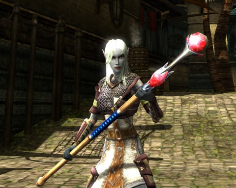

Back to: [West Karana](/posts/westkarana.md) > [2011](/posts/2011/westkarana.md) > [December](./westkarana.md)
# DDO: At the Mountains of Madness

*Posted by Tipa on 2011-12-19 08:05:26*

[caption id="attachment\_9909" align="aligncenter" width="480" caption="Evil is in the eye of the..."][/caption]

Ulan was back from Mexico last night. How we missed your blade barriers so very, very much. Those little mechanized sawblades of suffering just tear through groups of mobs. We fed many mobs to the magico-metallic maw last night.

We've taken a step back from Gianthold to focus on some easier adventures that grant actual xp. Gleek, our manager, thought that the Harbinger of Madness module would be just the thing to celebrate the group being all together again.

There's a newspaper in Stormreach, the Stormreach Chronicle. (Not to be confused with our group's tabloid, the [Stormreach Sentinel](http://happyduelingddo.blogspot.com/ "Stormreach Sentinel")). Their reporters have been tracking down a series of mysterious disappearances in the harbor area, and they're paying well for some adventurers to help them find some answers.

When I saw the quest NPC for the first of the quests, "Missing", was a halfling, I naturally suspected he had just eaten the people himself. Perhaps baked in pies. But no, there was an even greater evil than a halfling afoot.

The Saltire District of Stormreach is perpetually shrouded in fog and darkness. Anything could be hiding in those mists. When we arrived, citizens shivering in madness were crumpled to the ground. The local guards had been driven insane. Burning hounds roamed the streets in packs. Mysterious flesh golems called "Taken" howled at us from the alleys. We were just there to find clues to the disappearances, but we ended up being the scalpel cutting out the diseased flesh of Saltire from the healthy tissue of Stormreach.

Turns out the mysterious warforged responsible, who went by the name of Mr. Smythe, had a secret of his own. My first thought when I saw him was, "Why does this warforged have a beholder head?" Because that's a beholder's DISGUISE! Mr. Smythe soon dropped the warforged costume and revealed himself as (surprise!) a beholder! He summoned some Taken, but was himself soon ... Taken down.

The second quest in the series, Sinister Storage, was a quick trip into a warehouse where we killed waves of Taken and hounds and demons and stuff, as well as some maniacal bosses. Short and sweet.

In Fear Factory, the third quest, we start finding out some answers when we find some Taken birthing chambers in the sewers. Horrible, yucky places. You put people in a cocoon and they come out as Taken. Gleek was reminded of the quest to get the Key to Saryrn's Tower in EverQuest, where you had to enter the stomach of the extra-planar creature Baraguj Szuul in order to progress. (I totally remembered that name without having to look it up in Allakhazam's. Totally.)

We ran around for a bit and eventually came to the boss, who was being berated by the illusion of a mindflayer for falling behind quota. The illusion of the mindflayer then killed the boss. Frickin' kill stealer. We were pissed off for missing the kill, but what could we do? Mindflayer was an illusion! He summoned a demon for us to battle but it really wasn't the same thing.

I guess we'll encounter him on the final quest next week.

[caption id="attachment\_9910" align="aligncenter" width="480" caption="Staff of the Flesh Shaper"][/caption]

The end of the quest brings with it the best rogue armor I have ever seen, but there's a bunch of significant loot that drops along the way. I got this Staff of the Flesh Shaper, a pretty gnarly weapon... if you happen to be a caster. The game warned me before I collected it that it would be bound permanently to me. Seriously, what are my options? Just ignore it? Nobody else can take it out of the chest.

Looks cool, though. Maybe I can use it to whack oozes.

Another end reward is a huge dagger -- so huge that it uses STR modifiers instead of DEX, making it less useful for rogues, your usual dagger-wielding class. Which is odd because it carries a lot of other rogue benefits, like sneak attack bonus. It also occasionally curses the wielder.

Rounding out the final rewards for rogues is the bow, which bypasses all alignment resistances but also makes your oblivious to traps and stuff while wielding it, so maybe not the perfect weapon for rogue types after all.

Ulan missed talking to an NPC for Fear Factory, so next week (or whenever we do meet, what with the holidays) we will be re-doing Fear Factory and then moving on to the final quest, In The Flesh.

