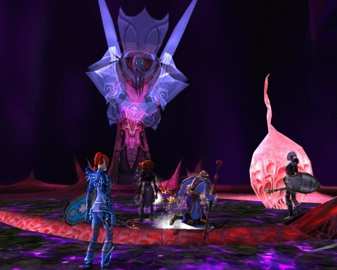
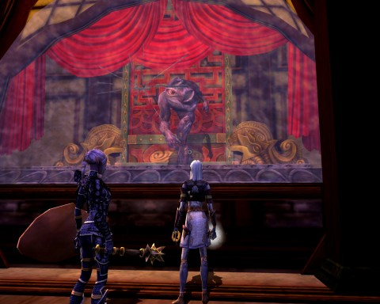

Back to: [West Karana](/posts/westkarana.md) > [2011](/posts/2011/westkarana.md) > [December](./westkarana.md)
# DDO: So ya thought ya might like to go to the show...

*Posted by Tipa on 2011-12-27 22:33:57*

[caption id="attachment\_9922" align="aligncenter" width="480" caption="Yaulthoon, in the flesh?"][/caption]

In the flesh, indeed. After crawling through the luxurious Harborview Lofts -- entirely transformed into upscale accommodations for twisted monsters -- we finally met Yaulthoon... in his mind. Nothing seemed quite real.

We didn't get to him right away, though. First, we had front row tickets to a fashion show.

[caption id="attachment\_9923" align="aligncenter" width="480" caption="Fashion Forward"][/caption]

Yaulthoon isn't your garden variety boss. No. As the architect of the Harbinger of Madness, the creator of the Taken, the gardener of horrors, he's proud of his works. Proud. "How wonderful it must feel," he shouted at us. "Knowing that one of your old Stormreach friends might be a small piece of flesh within one of my artworks. I am envious!"

For it was he that had been responsible for kidnapping the lost souls of Stormreach, sealing them within fleshy wombs and transforming them into the Taken.

New for this year -- hats!

[caption id="attachment\_9924" align="aligncenter" width="480" caption="A display case"][/caption]

Discerning shoppers could stay for the fashion show or just browse the display cases, many showing the Taken performing the same sort of mundane, everyday routines they might have done before they were transformed. Sitting down to eat. Reading a paper -- perhaps the Stormreach Chronicle! In their madness, they would sometimes escape and then we would have to kill them a little bit.

I don't know many people in Stormreach. I didn't have to wonder if I was killing anyone I knew.

[caption id="attachment\_9925" align="aligncenter" width="480" caption="Pykzyl (the living)"][")](../../../uploads/2011/12/dndclient-2011-12-26-22-47-13-09.jpg)[/caption]

Pykzyl the Beholder stepped in to slow us down. Have you ever seen a beholder dance? They stick all their tentacles out and wave them in turn. It's kind of beautiful in a way. Gleek's become a big believer in the power of dance, and this has made so many of our fights so much easier.

Devil hounds get up on their hind legs and step from side to side, like Scooby Doo. The Taken turn and turn and turn in blissful emptiness. Beholders do "the wave" by themselves.

Pykzyl died. Death can't keep a good beholder down, though. Yaulthoon raised him and set his shade behind a locked door that came with a warning. Don't open this, it warned, if you want to live. We opened it and died. And died. And died. And died. And died.

So that was fun.

We let him be and did a couple optional explorations. Then on to meet Yaulthoon in the flesh.

Briefly -- but then he sucked us in to his madness, a dark plain of flesh dotted with meaty hairs and swollen pustules. And looking down at us, Yaulthoon's avatar. He was SO GLAD to see us. Unhappy a little that we'd killed all his display models, but our corpses could help build back the supply.

The DM had told us that we couldn't attack him directly, but what does he know? We soon convinced ourselves that the DM was not lying (this time). It didn't take us long to figure out that the bubbles of pain Yaulthoon was blowing at us could burst those swollen pustules, causing him pain and allowing him to be attacked for a brief time.

Yay! We could kill him! We took him down in waves of Taken, hiding behind pustules and bursting out to do damage. Then he went insane -- MORE insane -- and started hitting us with "Mind Thrust", which I resisted a couple of times before it slammed my soul out of my body.

We regrouped and came at him again -- same story. It was time to look at the Wiki... and it told us about the fleshy pods that would appear at his feet when he was about to do the Mind Thrust. Destroy those and he would be powerless for a short time.

That was the secret. The third time was the charm, and he died.

I didn't get anything in particular. The primo light armor dropped for Ulan and Spode, and I believe it was an upgrade for both of them (this light armor an improvement over Spode's heavy armor proving what good armor it was).

We emerged into the Stormreach Harbor sunlight, blinking our eyes clean. The rewards for finishing all Harbingers of Madness quests are random, apparently. The light armor was not available for me, but the dagger \_was\_, so I chose that.

It can curse me, sure, but it is the most powerful weapon I own. It might be the most powerful weapon I \_ever\_ own.

Next week: We'll either redo this quest chain (for more loot) or head back to the Necropolis. Personally, I vote for the loot. I want my own chance at that armor. Or the bow.

Plus, maybe we can kill undead Pyzkyl this time around.

And once I am thus equipped, there are dragons that need killing.

This post cost me $15, by the way. Pink Floyd's "The Wall" is now digitally mine. I had it on LP and on CD, but I tossed the LP when I moved to Connecticut (along with all the rest of them), and my daughter borrowed the CD a decade ago and borrowing is a one way street with her :P

[caption id="attachment\_9926" align="aligncenter" width="382" caption="Ophiga with dagger"][/caption]

[caption id="attachment\_9927" align="aligncenter" width="284" caption="Polycurse Dagger"][/caption]
## Comments!

**Gleek** writes: Great post, Tipa! That fashion show was hilarious. :) I like how Spode and Ulan were sporting pumpkin heads to the show.

I definitely want to hit these again next week.

---

**Earthweaver** writes: Hey, Tipa, was wondering if you'd ever played SWTOR, am looking into the game, and would like to hear feedback about that game. Thanks.

---

**[Tipa](https://chasingdings.com)** writes: Nope, I intend to play it once all the excitement dies down. A friend of mine hit level 50 in a week of regular play (he had a vacation), so it does seem to move pretty fast. From what I am hearing, if you love leveling alts, you'll love SWTOR. I don't know if the end-game will be enough to keep people once the next flavor of the month is released.

---

**Earthweaver** writes: What game would you suggest for someone like me. *I am not a HEAVY gamer, and don't really like WoW or those kinds of games, but do like MMORPGs* I notice you play STO and DDO the most... what do you like about those games?

---

**[Tipa](https://chasingdings.com)** writes: I like the story missions and the space battle stuff in Star Trek Online. I am leveling my third character there, an Engineer. With her fabrication kit, she sends in the red shirts while setting up a whole range of automated turrets and buff generators. This has made ground combat more fun :)

DDO I play in a static group. If I just wanted to play DDO solo (which I wouldn't really recommend), I'd choose some other class than a rogue.

I'd definitely recommend sticking with free-to-play games. There's a ton of excellent F2P games, though some are more insistent than others that you give them money. STO is going F2P in a couple of weeks. EQ2 is already there, but they have their hand out all the time. I played Dragon Nest heavily for awhile; you can see the entire game without paying a dime, but money will get you better gear.

---

**Earthweaver** writes: I don't want to play DDO. However, I do think that STO sounds interesting... EQ2 isn't my kind of game either... I don't think I've ever heard of Dragon Nest... will have to check it out. Thanks for the advice!

---

