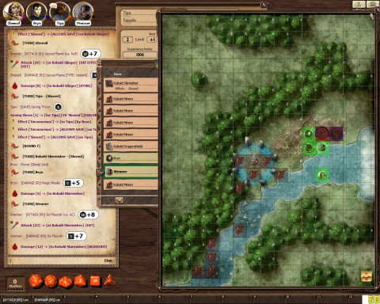

Back to: [West Karana](/posts/westkarana.md) > [2011](/posts/2011/westkarana.md) > [December](./westkarana.md)
# D&D 4E: Sleep the sleep that knows not breaking...

*Posted by Tipa on 2011-12-30 21:11:13*

[caption id="attachment\_9930" align="aligncenter" width="480" caption="Swimming a river of death"][/caption]

Curious about the blog title? You know that wizards get a spell called sleep, but did you know it can hit friendly targets, too? Anyway, we'll get back to that.

After skipping a week for the holidays, the Adventure Company convened again where we left off -- having finished a pitched battle along the road from Winterhaven, we pursued a kobold to a waterfall-fed river, with excited barking noises coming from the direction of a stone circle we could see looming past a thin line of trees.

The Lord Warden of Fallcrest has tasked us with mapping some ruins in the Winterhaven area, but our every step has been dogged -- so to speak -- by marauding kobold bands. Determined to focus on the job for which we're being paid, we deal with the vermin and then move on. Destiny, however, has taken control, and it seems clear that the "kobold problem" must be eliminated before we can move on the haunted keep and have our souls rent from our bodies by creatures of unspeakable horror.

None of us are eager for our lives to be ended so soon. And so we kill kobolds and build our strength for the coming campaign. We are on the edge of a battle and the clock is ticking.

**Round 1**

Where is the kobold barking coming from? We each rolled against our Perception and were informed that there we could hear some coming from the direction of the stone circle, some from the river's edge, but the noise of the waterfall drowned out any more distant noises. Those kobolds we could hear, then, were close.

Bryn passed his turn.

Wenner crept stealthily into the trees -- super successfully, he seemed to become one with the leaves and shadows. He soon whispered the locations of the kobolds he could see -- a powerful dragonshield within the stone circle, and three kobolds frolicking in the water.

Sheeoil passed his turn. It was my turn to act. I charged the three kobolds in the water, came out of the trees yelling, swinging Lifedrinker around my head, I swung ferociously at the closest -- and missed. Grunting, I used an action point and swung again. A hit, and a kill. The kobold lay dying, and Lifedrinker granted me five temporary hit points. The glee of righteous battle was on me then.

**Round 2**

More kobolds ran from the bushes at the commotion. But so unnerved were they, that all their attacks missed.

Bryn shot a never-miss magic missile at a kobold minion, killing it. In his eagerness to enter the fray, Wenner tripped out of stealth, but still managed to send another minion to its doom. Sheeoil doused one (ironically) with Sacred Flame, killing it in its turn. I dispatched the last kobold frolicker with Lifedrinker, then roared up the river, intending to gain the attention of the dragonshield and the other kobolds who were running from behind the waterfall, doubtlessly from a hidden lair.

**Round 3**

Another magic missile, another dead kobold. Bryn allowed himself a thin smile. Wenner stealthily crept to within stabbing range of the dragonshield in the stone circle, who seemed reluctant to add his blade to the melee. Wenner added his blade to the kobold's back, but the dragonshield was made of sterner stuff, and brushed aside the attack with only a scratch to show for it.

A trio of kobold minions turned to protect their leader and assault the halfling rogue. Sheeoil doused one again in the Sacred Flame, and there was one fewer, then. I don't like being ignored by monsters. I charged up, swung Lifedrinker and ... missed. I opened my mouth and let slip a cloud of acid, which killed a minion and further damaged the dragonshield. Lifedrinker moaned in fury at having been denied a life to drink.

**Round 4**

More kobolds splashed out of the hidden lair. Another minion, a skirmisher -- and a slinger. Sheeoil started with apprehension. Once, a slinger had broken a fire pot on his head, setting him aflame. We all now know how flammable elves can be.

He allowed himself a sigh of relief when he saw the slinger fling a pot at Wenner. The slinger's aim was true and the pot broke on the halfling, immobilizing him in glue.

Bryn chased another minion to hell hounded by a magic missile. Sheeoil sent a companion after it with another Sacred Flame, then moved up and across the river from the slinger and skirmisher. Wenner struggled in his gluey prison but was entirely unable to move.

Lifedrinker drank the life of another minion. None of the kobolds had been able to get through the temporary hit points the sword kept giving me. I moved into place to take on the skirmisher and slinger while Bryn and Wenner finished the dragonshield.

**Round 5**

While the skirmisher advanced, the slinger hurled a glue pot at me -- no effect. I grinned that scary toothy grin I have. That was too much for the slinger, who, muttering something about warning Irontooth, turned to escape back under the waterfall.

Bryn thought that Irontooth would be happier not hearing the news of our attack, and instead of using a spell like, oh, magic missile, cast Sleep over the area. It hit the kobold slinger. It hit the kobold skirmisher. And it hit me. All three of us were immediately slowed. On our turns, we would make a saving throw or fall asleep.

I let out a shout. BRYN! The birds heard it in their trees, the goats in their mountains, and holy Bahamut in the clouds took notice. Sheeoil bloodied the slinger with a Sacred Flame. I failed my saving throw and fell into a deep sleep.

The rest of the combat is based on what was told to me much later, when I finally awoke (after failing the saving throw SEVEN TIMES.)

**Round 6+**

Wenner glowed with halfling fury, he says, and grew to double his height, becoming a whole-ling. His giant feet made no sounds as he made the glade a whirlwind of whizzing shuriken.

Bryn called a storm of lightning from the suddenly-gathered clouds, broiling every kobold within a league of our spot. Laughing maniacally, he forced the lords of the forest to bow before him and grant him eternal youth, endless power, and a twelve inch pianist.

A holy light shone from beyond the clouds, bathing Sheeoil in heavenly grace and power. The demonic presences in the Keep we may someday see shuddered without knowing the reason.

It was dark when I awoke. We were gathered at a camp, preparing to set up watches to guard us as we rested before the next day's assault of the kobold lair and our meeting with the being named Irontooth. I listened to my comrades tales with some skepticism and then knelt to fervent prayer.

Lord Bahamut, I prayed, grant me the strength to let Bryn live.

## Comments!

**[Toldain](http://toldaintalks.blogspot.com)** writes: The wizard in my group doesn't cast sleep much, because the bad guys always seem to make their saving throws. Which is why the group doesn't much like "save ends" kinds of things. But it does make for hilarious war stories, like this one.

---

**[Blue Kae](http://bluekae.com)** writes: That's the third (?) time I've used sleep actually. The first time it worked wonders, second time fizzled, but this third was the most fun.

Oh and I considered magic missile, but that wouldn't have killed the kobold and he would've escaped before anyone else could have gotten to him.

---

**[Tipa](https://chasingdings.com)** writes: Oh, I know why you did it, and as it was the end of the encounter I didn't really mind -- but my CHARACTER is pissed!

---

