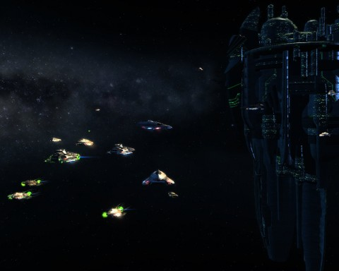
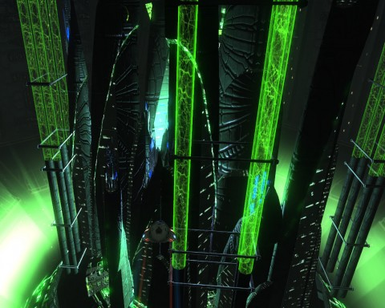
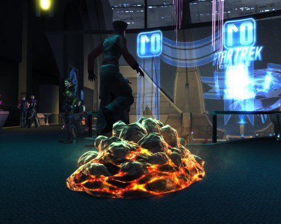

Back to: [West Karana](/posts/westkarana.md) > [2011](/posts/2011/westkarana.md) > [February](./westkarana.md)
# Star Trek Online FE301: The Vault (spoilers)

*Posted by Tipa on 2011-02-06 11:52:29*

One lowly shuttle stands between the broken Romulan Star Empire and the rebellion of their ex-slaves, the goblinoid Remans, as their private war threatens to draw the Alpha Quadrant into a conflict that could destroy worlds.

More worlds. The Romulans are still feeling a little sore that [Spock didn't save Romulus](http://structureddream.blogspot.com/2010/02/nice-special-effects-zoom-typical-of.html), even though he [PINKY PROMISED](http://en.wikipedia.org/wiki/Pinky_swear)!

Before I get into the interrupted adventures of the Federation News Service, Cryptic made a teaser for the arc, "Cloaked Intentions". You will believe Star Trek is still on the air!

"The Vault" after the break.

The space around Starbase 39 in orbit around Sierra II in the Alpha Centauri sector was crowded with the assembled ships of the Federation's finest. Hints and rumors from beyond the Romulan neutral zone told tales that would chill even the bravest starship captain.

The most disturbing rumor was of a giant space station nicknamed "The Vault", a hidden Romulan research facility where they studied Borg technology and, continues the tale, fitted Nero's fleet killing megaship before it was lost in the explosion of Hobus' Star.

Now, we could go in there in our powerful ships and our highly trained crews and our superweapons and our technobabble and sort the thing out in a couple of days, but that's not our mission. Our mission is one of reconnaissance. We need to sneak in there with a fleet of shuttles and runabouts, because there's absolutely no way the Romulans and Remans could possibly detect the signature of a SMALL ship warping in on their most secret facility. It would be like hearing the sonic boom from a supersonic mouse.

We in the Federation News Service are VERY good mice.

Those of us without shuttles were issued same by Admiral T'Nae and sent to an intelligence operative, Lt. Cmdr. Kyle "No I'm not Section 31 HAHAHAHA" DeSoto. We handpicked two bridge officers from our crews to accompany us into danger. I made sure to take my first officer and my chief of engineering, to make absolutely sure the crew of the Nebula-class USS Concord would miss us if we failed to return. Isn't that why the highest ranking officers always go on the most dangerous missions?

I chose the Delta Flyer for my ride; Kae was in a runabout, and Longasc and Thumupp formed up with Type 8 shuttles. You wouldn't know it to look at us, but we were probably the deadliest mice in the quadrant -- these small ships come with beam weapons with a 360' arc that scale infinitely; it's not uncommon to find these unassuming shuttle weapons mounted aft of Starfleet's most powerful megaships.

We set course for the Haakona system, which was in danger of following poor doomed Hobus to a singular(ity) fate from the sheer press of shuttles, runabouts, Delta Flyers and KDF door stops that were [doing their best to inseminate the place](http://www.youtube.com/watch?v=TDW28qWBhzc). (Go watch the vid at that link! It's only half a minute!)

Far from the bustle outside the system, the space around the Vault was quiet. Just some rocks, a Reman fleet, and the Vault itself -- which, though it is the size of a small moon, is not a moon, it's a space station. You CAN and WILL go full impulse inside it without touching the walls. 

We moved to engage the Reman fleet.

In retrospect, that might not have been the absolute BEST strategy. We were soundly thumped. We regrouped a little further away and decided to see what being sneaky might bring us.

There's hints scattered through the system on how to disable the security field protecting the Vault; Tactical officers can search for clues in a derelict ship. Engineering officers can analyze the effluvia from a suspicious rock. Science officers can perhaps decode the binary language of a stray satellite. If all that fails, the entrance to the station is conveniently abut a sensor-jamming cloud of radiation. In our own ways, we dropped the sensor grid around the Vault and snuck in on maneuvering thrusters.

We gasped at the sheer SIZE of the thing. You could fit worlds inside without scraping the edges. I thought immediately of the planet-sized machine at the core of the Krell homeworld in Forbidden Planet; others were reminded of the interior of V'ger from the first Star Trek movie.

We were the mice in the machine. Romulan shuttles scurried away from our approach, refusing communication. A massive door prevented exploration deeper into the station, where tantalizing signals hinted at strange devices and energies. We shot through the door locks, but that may not have been the smartest plan. In the debris, we found a door code, though -- and in some crates another -- and by finally contacting some Romulan refugees living on the fringes and giving them some necessary supplies, a third. With those, the doors opened for us.

We sailed through immense corridors, past the traces of battles and sudden exodus, taking out the occasional automated sentry gun. In one immense chamber, a Borg sphere sat in its entirety, held in place by an enormous frame. It was dormant, but confirmed that the Romulans had long been trying to integrate Borg technology into their ships.

In the last chamber, we found the source of the thalaron radiation that had done more than worry us the entire mission. Thalaron radiation was the biogenic power that could utterly destroy living tissue in huge areas and at great distances. That kind of power is too dangerous for anyone to control -- if Shinzon had only had a few more hours to deploy his thaloron weapon in Star Trek: Nemesis, he'd have taken out the crew of the USS Enterprise-D in one shot.

(Gawd, that was a terrible movie)

As in Nemesis, it was Remans behind this latest incursion -- the Reman Obisek accosted us as we worked to disable the thalaron radiation source. He acknowledged that we were no friends to the Romulans, but nonetheless, Romulus was not the only world destroyed by preventable supernova, Remus met its fiery fate that same day, and there could never be common cause between the Federation and the Remans.

We would have to die.

Obisek then kicked the server plug and Star Trek Online crashed us all, proving, conclusively, that the Remans are by far the most impressive race in the galaxy. They can take THE WHOLE FRICKIN' UNIVERSE OFFLINE.

With that kind of power, what the HECK do they need with thalaron radiation?

Hours later, and alone this time, I crept back in, avoiding the things that should be avoided, solving the puzzles I could solve, and confronting Obisek once more in front of the thalaron generator.

He had his hand on the power cord. I showed him the receipt for my UNINTERRUPTIBLE POWER SUPPLY, and he backed down. "Well, I guess I'll just have to kill you the old fashioned way," he might have said, if I'd been taking notes. The old fashioned way being him taking off and leaving me at the tender mercies of a fleet of Scorpion fighters and a frigate. This is where being a science officer comes in handy -- each encounter, I'd just pop my photonic fleet (which generated only runabouts and shuttles, alas) and have some fun.

Carefully avoiding the notice of a picket ship that had given me trouble before, I snuck out of the Vault, taking on fighter squadrons and more automated guns and the single guard at the exit.

There was to be a Federation ship keeping station outside the system, waiting for our signal. Our last job was to stay alive long enough for the ship to warp in and clear our path out. We rendezvous'd with the ship inside that conveniently located cloud of radiation. Our shields were useless, but with any luck, we would draw no fire. Our job was merely to take care of fighters and plasma torpedoes while our help took on the Reman battleship rapidly heading in our direction.

The Reman battleship exploded prettily, no doubt helped along by the highly volatile matériel stored in its holds.

We fled the cloud and retraced our warp trail back to Starbase 39. I had to admit to Admiral T'nae that the Remans probably knew by now that we had discovered what they were up to in the Vault. And yet, I got rewarded with a squadron of Romulan Scorpion fighters. I can call upon their aid twenty times -- much like [the golden, winged-monkey summoning cap](http://oz.wikia.com/wiki/Golden_Cap) Bastinda uses to terrorize Dorothy and her friends.

My plan: Use them nineteen times, and then hand the Scorpion fleet the summoning crystal, setting them free so that they will love me forever.

---

[caption id="attachment\_6146" align="aligncenter" width="480" caption="Horta Hears a Q"][/caption]

It's been too long since Cryptic gave us a feature episode, but it was well worth the wait. As the single feature that really draws people to the game, though, the mission-ending crash that kept thousands of hopefuls from completing the mission due to the sheer numbers of people trying to play it SHOULD have been anticipated.

Afterward, I completed the mission on my Klingon brigadier general, Krontar, then had some fun with the anniversary celebrations going on in Qo'noS, where giant, scantily-dressed Orion slave girls provide entertainment throughout the Great Hall, and Earth Spacedock, which just has a disco. Yawn. ANYWAY, Son of Q was in both places, asking trivia questions and turning people into stuff. I was thrilled to become a Horta, at least for awhile.

I want a Horta bridge officer!
## Comments!

**Higgs** writes: Post like yours make me wanna give STO another try.

If only the Nebula class wasnt a C-Store only ship.

Theres someone at cryptic wearing a suit that i hate.

---
btw. Shinzon fought the Entreprise-E

---

**[Tipa](https://chasingdings.com)** writes: The E? Oh yeah. Generations was the end of the D.

I believe you can buy the Nebula with enough marks -- some huge number, like 500, but it doesn't have to cost money. Me, I don't mind paying occasionally. The ship isn't more powerful than free ships, and it looks cool.

---

**[Eliot](http://expostninja.wordpress.com)** writes: I miss STO, but just don't have space to fit it back into my gaming rotation at the moment. This is a decent compromise.

I liked Nemesis, but then again, anything would have looked good after Insurrection and Generations. The TNG crew tended toward more sedate and psychological stories, they never really seemed at home with the big blockbuster approach.

---

**[A Little Too Successful | Blue Kae](http://bluekae.com/2011/02/07/a-little-too-successful/)** writes: [...] “Wow!” I don’t want to go into spoilers, especially since Tipa has already done a much better job of summarizing the mission (warning there are spoilers there), but it’s very good. The [...]

---

**[STO: Cracking The Vault &laquo; MMO Gamer Chick](http://mmogamerchick.wordpress.com/2011/02/07/sto-cracking-the-vault/)** writes: [...] T’Androma and her crew are tasked to investigate “The Vault”, a giant Romulan space station rumored to have carried out research on Borg Technology. In connection to the overarching Star Trek story, this facility allegedly outfitted Nero’s technologically-advanced ship Narada before it and Spock were sucked into the black hole that sent them back in time into an alternate reality. We are to enter the space station covertly, our superiors advised, utilizing a small craft like a shuttle or a runabout. For more information on the mission, Tipa has done a very nice and detailed write-up. [...]

---

**[MmoQuests.com » The Vault #STO](http://mmoquests.com/2011/02/08/the-vault-sto/)** writes: [...] read with information that actually makes sense (as opposed to my ramblings) be sure to check out Tipa, BlueKae, and MMO Gamer Chick and their write ups. I don’t want to give away any spoilers but [...]

---

**[Pumping Irony » STO: Season 3: The Vault](http://pumpingirony.net/2011/02/15/sto-season-3-the-vault/)** writes: [...] already completed The Vault so I set out solo. Tipa did an excellent (and timely, imagine that!) writeup (with spoilers, however), as did MMO Gamer [...]

---

