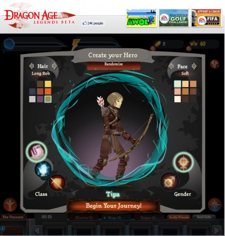
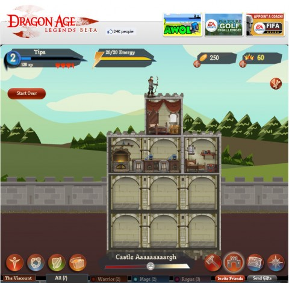

Back to: [West Karana](/posts/westkarana.md) > [2011](/posts/2011/westkarana.md) > [February](./westkarana.md)
# Dragon Age goes social (codes included)

*Posted by Tipa on 2011-02-09 07:14:29*

[caption id="attachment\_6153" align="aligncenter" width="458" caption="Dragon Age Legends character creator"][/caption]

Ahead of Dragon Age Origin's release in the fall of 2009, Electronic Arts' web games division, [EA2D](http://www.ea2d.com/), came out with a teaser game, [Dragon Age Journeys](http://www.dragonagejourneys.com/). DA:J gave a taste of the Dragon Age milieu, introducing several of the locations you'd explore in game (such as Ozrammar and the Deep Roads), the creatures you'd kill, and the classes you'd be playing. Completing goals in Journeys led to rewards for your characters in the game.

Now, leading to next month's Dragon Age II, EA2D has gone social with a Facebook-based entry to the series, [Dragon Age Legends](http://www.ea.com/dragon-age-legends). A year and a half ago, Facebook was just beginning to emerge as a force in online gaming. Now it's a phenomenon. DA Legends rides the wave with adventures that require friends to complete.

[caption id="attachment\_6155" align="aligncenter" width="480" caption="Castle Aaaaaaaaaaargh"][/caption]

As in DA Journeys and DA: Origins, in Legends you choose from one of three classes -- warrior, rogue and mage. Unlike the earlier games, you do not get to choose a story for your character. This reflects the lack of individual backgrounds for your Dragon Age II character, all of whom share the same background, a refugee from a town early overrun by the Darkspawn. I can't see how this won't hurt replayability, as playing through the different origins was such a large part of the first game.

While Journeys featured a hex grid, tactical combat with NPCs as companions, Legends has characters facing off against the enemy in rows and performing actions from an initiative list, a technique that will be instantly familiar to anyone who has ever played a console RPG. The social twist is, though the game provides you with low level NPC companions, if you want to really progress in the game, you're going to have to have active friends playing the game that you can hire as your own companions.

Legends also gives you a home base of sorts, a castle that you can furnish and expand to provide you with items you'll need on your adventures. I've got an alchemy lab making bombs, next to a worker's quarters providing workers. You can buy taverns, a forge and so on, making your castle into a bit of a city.

Like Journeys, progress in Legends will lead to rewards in the live game. Even if you're not planning on picking up DA2 right away, there's no reason you can't play the social version for nothing (caveat: There IS a cash shop).

Wouldn't be much of a social game without the help of friends, and the game just started its closed beta so the usual crowd of Facebook RPG fanatics hasn't descended upon the game yet.

However, EA has sent along five exclusive closed beta keys for Dragon Age Legends. First come, first serve; use the key, get on Facebook, make a character and friend me (if we aren't friends yet). My Facebook account is under the clever pseudonym "Brenda Holloway", and if you're friending me, include the message "Dragon Age" so I know who's a fellow darkspawn slayer.

DEAR GREY WARDEN,
DRAGON AGE LEGENDS IS BEST PLAYED WITH FRIENDS.

HERE ARE FIVE ADDITIONAL KEYS TO SHARE:
~~DLXD-XJQ2-T2ST-ST5W
DLXD-XJQ2-33D4-R3R2
DLXD-XJQ3-C32F-F23H
DLXD-XJQ3-N4PR-BV5C
DLXD-XJQ3-W5A2-TY35
~~
HOW TO REDEEM YOUR BETA KEY:
 GO TO <HTTP://APPS.FACEBOOK.COM/DRAGONAGELEGENDS/>
INSTALL THE FACEBOOK APPLICATION
LOGIN OR CREATE AN EA ACCOUNT
ENTER YOUR BETA KEY
START YOUR LEGENDARY ADVENTURE!

**Note: Apparently all the keys have been redeemed, but you can still go ahead and friend me if you like!
**
## Comments!

**[Paeroka](http://paeroka.wordpress.com)** writes: I just took a key. So thanks! :) Friending you is a different matter, though. I found five people with the same name. ^^

---

**scopique** writes: I took a key also (second to last). Thanks! I'm on the iPad right now, so I'll add you as a friend when I get to work (did I say work...I meant...next time I'm at a computer)

---

**[Tipa](https://chasingdings.com)** writes: I'm the pasty white one. http://www.facebook.com/brenda.holloway :)

---

**[Taymar](http://www.mmorpg-info.org/)** writes: This looks like fun. I think all the keys posted above have been redeemed, but I've filled in the form on the EA site to be included in the beta, so hopefully they'll send some more. :)

---

**[Tipa](https://chasingdings.com)** writes: Dang, really? That was fast!

---

**[Wiqd](http://www.digital-lemonade.com)** writes: Heh heh, you said "Orgrimmar" when I think you meant "Orzammar," in the first paragraph.

---

**[Tipa](https://chasingdings.com)** writes: Oh fer cryin' out loud! WoW's hooks dig deep...

---

**[Eliot](http://expostninja.wordpress.com)** writes: I was too late for the codes, but eh, I can add you on Facebook. I'll take my wins where I get 'em.

Also I need to figure out when DA2 actually releases, as I've already purchased the game and that seems like the sort of thing I ought to know.

---

**[spinks](http://www.spinksville.com)** writes: Oo, congrats on getting into the closed beta of it. Let us know what it's like. I;m really looking forwards to this. (Just hope it doesn't rely too much on facebook friends cos mine really aren't gamers.)

---

**[Tipa](https://chasingdings.com)** writes: @Eliot -- Amazon will just send me my copy :)

@Spinks -- I'm afraid it really does require friends. Having gotten a bit deeper into the game, it's clear the NPC hirelings just can't do the job themselves. I'm hoping that the NPCs get an upgrade from level 1 at some point.

Right now I have three friends available -- Stargrace, Scopique and Nadine. They are all Level 2 (as am I), but once I recruit them in to a battle, they are unavailable for two hours. So the more friends you have, the more you can play each day. Plus friends can send useful gifts, same idea as in other social games. And, you can see your friends' progress on the world map, though I'm not sure there's any benefit to that yet.

---

**[stargrace](http://mmoquests.com)** writes: I did manage to snag a code - tried the bottom three first and all were taken, the 2nd one is the one that worked - and thank you VERY much for posting! I have only played a bit so far (it was down the 2nd time I attempted) but it seems pretty fun. I don't know how many friends I'll be required to have to progress, hopefully the small selection I have is enough.

---

