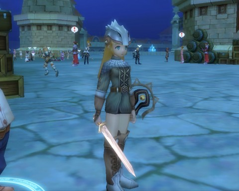

Back to: [West Karana](/posts/westkarana.md) > [2011](/posts/2011/westkarana.md) > [February](./westkarana.md)
# I'm in LUCENT HEART, Trick!

*Posted by Tipa on 2011-02-13 00:47:19*

[caption id="attachment\_6164" align="aligncenter" width="480" caption="My Lucent Heart warrior, Tipa"][/caption]

Thanks to the heroic efforts of Drew and her boyfriend, and an entire day of downloading, patching and trying to navigate what must be the absolute MOST COMPLICATED installation method EVER, I have managed to create a character and am a warrior in the kingdom of Thereall.

One hour review: It's an Asian MMO. All the elements you expect are there: timer rewards for staying logged in; a magic bag that gives you items when you level, to a certain point; click to move; a character creator that seems unusually interested in your blood type; anime/manga inspired character designs.

LH has a LOT of emotes for being polite, greeting and so on -- just a really long list. This is of course Lucent Heart's niche; a MMORPG with the emphasis on being social.

After my hour in the game, I was level 8 but had not, alas, found true love. Given that it's an Asian F2P game, I'd worry that if I DID find my true love in game, he'd be 12.

More once I know more :)

