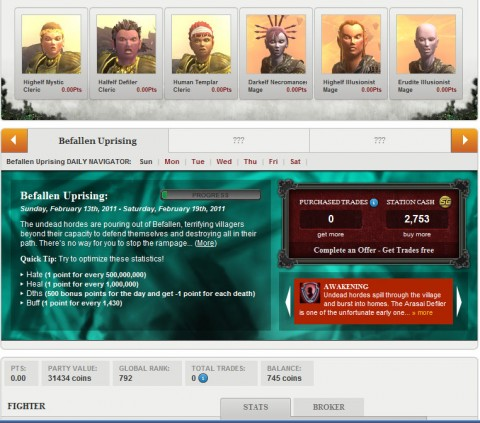
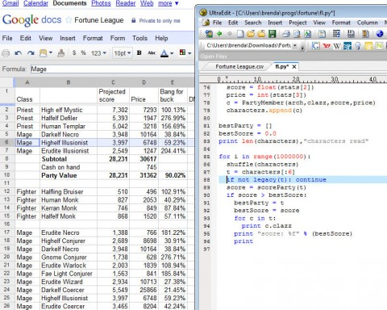

Back to: [West Karana](/posts/westkarana.md) > [2011](/posts/2011/westkarana.md) > [February](./westkarana.md)
# EQ2: How to win at Fortune League

*Posted by Tipa on 2011-02-13 13:03:59*

[caption id="attachment\_6168" align="aligncenter" width="480" caption="Party Lineup Screen (click to enlarge)"][/caption]

A couple of weeks ago, I started playing [Fortune League on Facebook](http://apps.facebook.com/fortuneleague/) with absolutely no idea what I was doing. Or rather, with all the wrong ideas. Fortune League is based off of EverQuest II, and success in the Facebook game brings rewards to the live game. You get AA experience and enhanced XP potions just for participating. If you do well, you can get some cosmetic items -- currently some tattered wings and, for the best of the best, a gold trophy for your home.

My first group was a balanced party that would do well in an EQ2 dungeon -- tank, healer, buffs and DPS. I made them all halflings, just for fun. And then... well, and then nothing. I had no idea what happened next. Nonetheless, for doing nothing, at the end of the week I got a scroll good for some AA xp. I went into game with my troubadour, redeemed it, and dinged an AA point. So my mental model of the game was something like:

1. Do nothing
2. ???
3. Profit!

Finding the whole thing rather pointless, I set it aside for a couple of weeks. When I [sat down to write about it](../../../index.php/2011/01/10/fortune-league-or-wall-street-raiders/), I realized that it wasn't about making a balanced party and going on adventures at all -- it was a fantasy adventure league (and in fact, the JavaScript code for Fortune League clearly shows its roots, as it calls the characters 'athletes'). But basically, the real deal is: you buy characters according to your budget. They perform based characters of that race and class in the game -- if there's a hundred iksar defilers pumping out the heals one day and the froglok furies are slacking off, people with iksar defilers in their parties will be getting more points than the ones with furies -- IF the particular adventure is assigning points for healing.

That's the next piece to the puzzle. Each week is a new adventure, which scores your characters in a new way. For instance, this week is a Befallen adventure. Your party receives points for Heals, Buffs and Hate, and loses points for Deaths. Last week, it was about AOE and Pet Damage.

And the last piece of the puzzle are Events. Each day, the events screen tells about any additional advantages or disadvantages applied to your characters. For instance, today, mages are doing far less pet damage due to the fallout from the end of the previous adventure. However, pet damage is not given points this week, so it doesn't matter.

Lets run down the screen shot from top to bottom.

**Party display**

Across the top is my party. Portrait, class and archetype. You can only have max three characters of the same archetype (cleric, fighter, scout or mage) in your party. Since this adventure highly favors clerics and mages, I have no scouts (who have no abilities that earn points) or fighters (whose deaths tend to wipe out the gains from their hate generation).

You do NOT need to worry about how balanced your party is. ALL that matters is the points they earn.

In the lower right corner of each portrait is the number of points they have earned today. Points are assigned only at the lockout time, each midnight, Pacific time. You cannot make any trades during lockout. While it is locked out, though, you can see the points your party has earned that day, and check out other people's parties for ideas.

Moving down, we see Befallen Uprising, the name of this week's adventure. You can scroll back and forward to see previous adventures.

The Daily Navigator lets you turn back time and see how your party has done in the past -- this will fill in the points in the portrait bar for that day.

**Adventure Display**

Below is the description of the adventure. Some lore about the particular situation, and below that, the algorithm for assigning points. This is key to winning at Fortune League. You go to the broker and choose characters that maximize this score, add them to your party, and win. (Or at least do well).

To the right of that is your purchased trades window. In between adventures, the score conditions are going to change, and your uber party may suddenly be pretty weak. You may find you want to trade out some low performers for better performers. You get a number of free trades during the week -- three each Wednesday, and I believe players who have linked their EQ2 account to the game get a couple more. If you want to do further trades, you have to pay or use the "offer wall" to earn more.

Below that is a display that gives reasons why you might want to make an unexpected trade. The opportunity display tells which classes and races are receiving bonuses or penalties due to events in the adventure. You can find clues to future events that might get you ahead of the curve so you can make a strategic trade.

**Party Stats**

Below this is the stats display. Zero points, as this is the start of the adventure, and nobody has earned any points for it yet. But they will go here during the week. Party value, the sum of the buy price of all my adventurers, plus my cash on hand. Global rank is my standings with party value, and not standings in the adventure -- THAT figure is next to my picture along with my party name and my league. (Being in a league does not affect your game in any way; it's just a collection of other players with whom you can compete and chat). I'm in the Antonia Bayle Champions league, and I was third in that league after the last adventure.

Below, not shown, are the broker stats for the party -- how much they are worth, how their value is trending, high and low price figures and so on. While you win the game by maximizing your hero points -- score, you need a good party value in order to make trades.

[caption id="attachment\_6167" align="aligncenter" width="480" caption="The Spreadsheet (click to enlarge)"][/caption]

What makes a good party? Maximizing the return on the investment. You can have a real winner of a character who generates three times as many points as any other character, but if it costs ten times as much, is it a good deal?

The spreadsheet can answer these questions. If you really want to do well in Fortune League, you're going to have to do some analysis. I made a spreadsheet in Google Docs with the top ten or so class/race combos based on the sorts of things needed in the adventure, based on values from the broker. I entered them all by hand -- no screen scrapers! -- then started adding formulas. "Bang for the Buck" to give me clues to whether or not a character was worth the price. A simple sum to make sure that trades I considered would fit in my budget and so on.

If this is all you do -- you will do well in Fortune League and [win your wings](http://mmoquests.com/2011/02/12/tattered-wings-eq2/). To win the cup, you'll either need to do day trading (buying and selling characters on an ongoing basis during the day to catch rising stars) or start doing some combinatorial analysis.

I did well last week, but I want to do better. So I wrote a program to take all the stuff I entered in the spreadsheet and try a million different class combinations that fit my criteria as to number of trades left and budget. It turned out that I was pretty close with just the spreadsheet, but it suggested some tweaks.

Even that won't necessarily push someone to the top 40 slot (probably won't do it for me), since the actual points are based on semi-random factors, like performance of that class in the live game. There's an element of luck involved. If you make good investments, you'll have more money with which to buy better characters, and so on.

Follow this guide and you should do fairly well, though.

If you're just starting out, here is what my program calculates for the best 30,000 gold (your starting stake) party:

 * Halfef Defiler

 * Erudite Warlock

 * Barbarian Defiler

 * Erudite Illusionist

 * Highelf Templar

 * Gnome Conjurer

That gives an expected score of 30,228. Actual performance depends on in-game events and the daily numbers are usually proportionate but way lower. This is actually a higher value party (you'll notice from my spreadsheet) than **my** party, since I wasn't starting from scratch -- I have some legacy characters due to the number of trades I had available.

## Comments!

**Bhagpuss** writes: I think this looks pretty intriguing and I'd like those wings. Not so much that I'd sign up for Facebook, though.

---

**[Jaffa](http://dailyanimals.net)** writes: Are you sure your program is calculating the score from (500 - deaths) summed over the week correctly? It looks to me like your projected score from fighter characters is way too low. The score for halfling bruiser should be (500 - small number of deaths + inconsequential hate) per day, which comes to closer to 3,500 for the week.

---

**[Tipa](https://chasingdings.com)** writes: Yeah, am overestimating actual daily performance by a factor of eight, I noticed this morning. Broker figures are from a longer term. Am adjusting tonight. 

---

**[Jaffa](http://dailyanimals.net)** writes: I think broker figures are the total over a week, but I don't know which week. Have the broker numbers changed at all since Fortune League started? I really would like to be able to see perfomance over the last couple of days for each character, without having to dig through random teams until I find someone using that character.

---

**Ritchie** writes: Interesting. I am beginning to understand how he game works. Like you, I muddled through the first few quests and only became interested when the prizes arrived. Nice prizes for very little work. But now that's not enough, it annoys me that I'm still basically fumbling in the dark.

The spreadsheet you've created is very cool, so the attributes of each character remain the same from week to week, or does the spreadsheet have to be updated from time to time?

Any chance of getting a copy of your spreadsheet? Not sure I really need the wings, but I expect there will be other prizes down the track. :-)

---

**[Tipa](https://chasingdings.com)** writes: The broker stats don't seem to change, but they only tell part of the story. Using the broker stats will get you a good portion of the way to the top, but to actually get over the edge, you need to use the daily stats, which change daily. So I'm not sure how much the spreadsheet will help -- but if you want to see what it does for you, here's a link to it. http://bit.ly/grT48O

---

