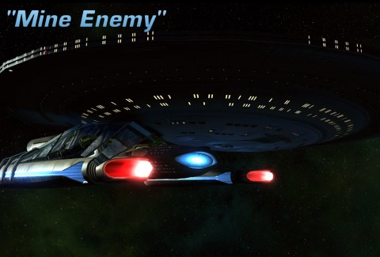
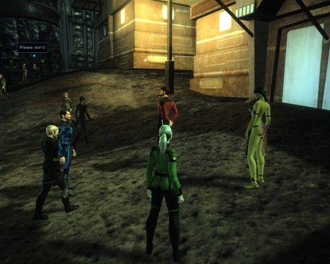
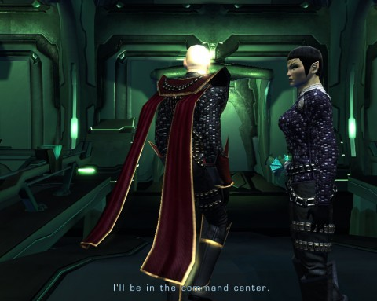
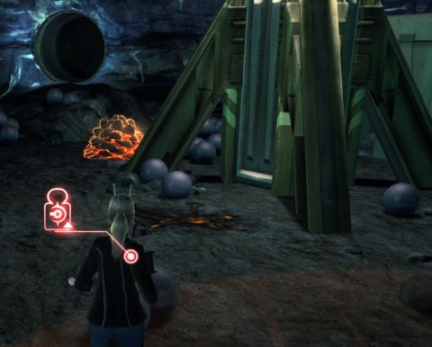
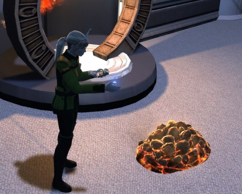

Back to: [West Karana](/posts/westkarana.md) > [2011](/posts/2011/westkarana.md) > [February](./westkarana.md)
# Star Trek Online: FE302 "Mine Enemy" (spoilers!)

*Posted by Tipa on 2011-02-13 17:22:37*

Mine enemy? Mine enemy is Cryptic, who, for the second feature episode in a row, couldn't handle the press of people wanting to do the episode the moment it went live. I guess they should make some sort of queue system, somewhere... The swarm of starships outside mission systems is just amazing.

This is your money, Cryptic; this is why we play. PLEASE make the servers work on FE day!

Last week, in "The Vault", we traveled to an immense space station in the Romulan neutral zone and discovered the sorry state of the Romulan refugees in the area, as well as the militaristic designs of the Remans. Some of the intelligence we recovered there pointed a moon in the Hfihar system, an old Romulan mining colony that has been re-opened by the Ferengi. What the Ferengi want, why the Remans were interested and which old friends will we find there... after the break.

But, just this: it's worth turning the voiceovers up so you can hear the Vulcan admiral pronounce "Hfihar". It's tiny joys like this that brighten the Alpha Quadrant.

[caption id="attachment\_6179" align="aligncenter" width="480" caption="Longasc, Tipa, Four Eleven and friends."][/caption]

The Federation News Service formed up outside of the system; Longasc in his Excelsior, Four Eleven in her ship (wasn't paying enough attention, sorry!) and me in the Nebula. It was nice to stretch out in the big ships after having to swim through the Vault in a shuttle.

The Hfihar system includes three habitable moons orbiting a barren planet. The presence of magnetite blinded ships sensors so much that we couldn't determine which of the moons had the magnetite, so we had to go to each in turn.

A note about [magnetite](http://en.wikipedia.org/wiki/Magnetite): it is very common on Earth, being an oxidized form of iron, commonly found magnetized, hence the name. I have no idea HOW Starfleet couldn't figure out WHICH of the three moons was largely a magnetized chunk of iron. Maybe they should have used a paper clip on a string or something...

(Oh, wait... my science officer tells me it was [magnesite](http://en.wikipedia.org/wiki/Magnesite)... Something entirely different! Never mind!)

Anyway, I decided I was going to be Ms. Happy Sensors and I flitted to the nearest moon, scanning everything in range. Rock rock rock rock Orion Syndicate fleet rock rock r... DAMMIT! Where'd THEY come from? I didn't get destroyed, but it was a near thing. Amazing, though, what popping a photonic fleet and then jamming sensors will do when you're in a bind :) With the Orion fleet now attaching Longasc and 411, I swung back in and got debuffing. We soon were done with them. You're welcome, Hfiharians! Hfiharrarsi? Whatever.

The people at the next moon didn't want to talk with us. They didn't want to shoot at us either.

The last moon, inevitably, was the moon we were looking for. A Ferengi by the name of Madran gave us transporter coordinates to his operation. Down we went.

The mining colony had seen better days and was doubling as a Romulan refugee camp. The miners were grumbling that the Ferengi were taking advantage of them, but even they had to appreciate regular food, drink and a place to sleep.

While we were chatting up the locals, we came across three missions. A drill operator needed a tactical officer to help retrieve drill parts from thugs, a surveyor needed a science officer to perform a quick bit of geological surveying done, and another needed an engineer to do something I didn't capture. Nonetheless, separate optional quests to do is kinda neat, continuing a trend of giving optional paths through quests that they started on the Devidian arc.

When we confronted Madran with questions about the source of the magnesite in the mine, Madran admitted that he wasn't in charge of the mine itself, just the trading. The Romulans were entirely in charge of the mine itself. If we had questions about it, we would have to go looking ourselves.

[caption id="attachment\_6180" align="aligncenter" width="480" caption="Discord in the Tal Shiar"][/caption]

A Romulan foreman just inside the mine entrance had zero interest in tourists, but a little diplomacy got us past. (If you have skill in Diplomacy, you can skip this fight and gain an accolade). Inside, miners objected to our presence, and came at us with mining lasers. We had to take them down. This will likely make us no friends among the Ferengi...

A simple pressure lock puzzle admitted us through a secret door and into the REAL heart of the "mine" -- a secret Tal Shiar base, fully stocked with Romulans. We felt we could sneak past some Romulan analysts engrossed in their consoles, but we also felt their backs made tempting targets.

After the dust settled, we downloaded the data from the consoles -- detailed records of the movements of the Federation, the Klingon Empire, the Borg (full report: Resistance is futile!), the True Way and so on.

We heard shouting through another door, and opened it to see a Romulan colonel having a loud disagreement with a Tal Shiar commander about innocent blood on their hands. The colonel left for the command center while the commander went, muttering to herself, to the brig. We followed, freeing Romulan prisoners along the way; prisoners who joined our group to help fight.

Commander Janek, once she saw us, planted a radiation mine and fled. That mine would instantly kill everyone in the area; destroying it was the first priority. After that was done, we captured her with great prejudice until she surrendered. We used diplomacy (again) to get her access codes and left her alone. Because we're cool like that.

[caption id="attachment\_6181" align="aligncenter" width="480" caption="Soylent Orange is Horta!"][/caption]

The code opened a door deeper into the mine and what we found their froze our souls.

Since [their discovery by Captain Kirk and the crew of the original Enterprise](http://en.wikipedia.org/wiki/The_Devil_in_the_Dark) centuries ago, the Horta had become members of the Federation in their own right and apparently had started a secret colony here on this moon. The Horta chew up rock with powerful acid. Their eggs are pure magnesite.

The Romulans weren't mining ANYTHING. They were merely collecting the eggs of Horta and grinding them up for the ore. This isn't a mining operation -- this is genocide. One of the Horta, mistaking us for Romulans, etched "NO KILL I" into the stone. [Unfortunately, it used Comic Sans for the font](http://observatory.designobserver.com/entry.html?entry=4567)... there was no saving it after that.

Infuriated, we returned to the Tal Shiar base and headed down to the command center to confront the Tal Shiar colonel. He was surprised to see us.... so surprised that he put the base on auto destruct. This is also MY first reaction when someone surprises me.

Out we ran, with our freed Romulans at our heels. We met our stymied mine foreman, briefly, on the way out as the mine collapsed around us.

Madran denied any knowledge of the Tal Shiar base. Uh huh.

[caption id="attachment\_6182" align="aligncenter" width="480" caption="All out of Horta chow"][/caption]

We each returned to the ready rooms of our individual starships to decode the files we downloaded from the Tal Shiar base. It was at this point that the servers crashed. Hours later, I managed to return.

One of the files was heavily encrypted. Further analysis turned up inconsistencies in several of the other files. We corrected these errors with good information, which caused the files to cough up passkeys... somehow. With these passkeys, we were able to decrypt the main files to find that the Tal Shiar had been specifically targeting the Romulans with devastating attacks for months. This was the root of Obisek's war against the Romulans (revealed in the previous episode, "The Vault"). While the Federation might ordinarily turn a blind eye to such intramural squabbles, the use of prohibited thalaron radiation cannot be ignored.

We will have to deal with this before more innocents die.

Meanwhile, Admiral T'nae gave me a Horta hatchling to take care of.

I'm a little unsure of the ethics of having a sentient citizen of the Federation as a pet, but I'd just be happy if the little tyke would stop burning his initials into the carpeting.

---

If it hadn't been for the crashing and disconnections, this episode would have been a high point. Cryptic is using optional objectives and class-specific dialog choices to add real depth and lore to the missions. This whole arc connects to the Romulan plots in the movies (chiefly Star Trek Nemesis) and the TV shows (TOS, TNG, DS9 and Enterprise). STO is well on the way to creating an MMO that extends and completes the series, which is pretty much all I wanted from a Star Trek MMO.

## Comments!

**[STO: Valentine, Valentine, Wilt Thou Be Mine (Enemy)? &laquo; MMO Gamer Chick](http://mmogamerchick.wordpress.com/2011/02/14/sto-valentine-valentine-wilt-thou-be-mine-enemy/)** writes: [...] not used to seeing too many outsiders to their area. For more on the plot and story of the mission, check out Tipa’s great write-up. Traffic congestion in sector [...]

---

**[Fun Mission, Irritating Glitch | Blue Kae](http://bluekae.com/2011/02/14/fun-mission-irritating-glitch/)** writes: [...] you don’t mind spoilers go check out the mission debriefings by Gamerchick and Tipa. Tags: mmo, star trek Category: Rambles  |  Comment (RSS) [...]

---

**[Eliot](http://expostninja.wordpress.com)** writes: You know, this does seem to be the sort of thing that Kirk would have noticed back when he discovered the Horta. I mean, he might have not been the most observant of captains, but "eggs contain large quantities of a really rare mineral" might have pinged on his radar, especially when the miners thought they were just useless spheres of silicon. Maybe it depends on the creature's diet.

---

**[West Karana » Star Trek Online FE304: Coliseum (spoilers)](https://chasingdings.com/index.php/2011/02/27/star-trek-online-fe304-coliseum-spoilers/)** writes: [...] We were surprised to see Obisek’s scarred face on the USS Concord’s main screen. We’d last seen the Reman resistance leader in his secret base on an ice planet in the Dera system. We let him go* despite our reservations about his ability to deploy thalaron weapons after talking with his people (in Frozen) and uncovering the dishonorable actions of the Romulan Tal Shiar (in Mine Enemy). [...]

---

