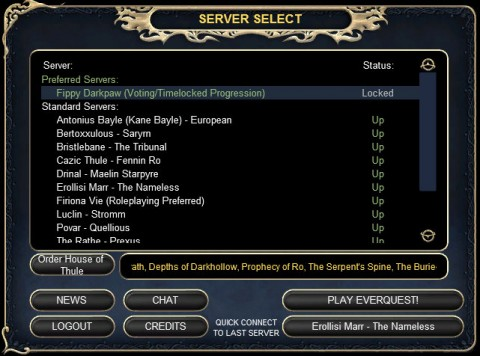

Back to: [West Karana](/posts/westkarana.md) > [2011](/posts/2011/westkarana.md) > [February](./westkarana.md)
# EQ: Fippy, Fippy wherefore art thou, Fippy

*Posted by Tipa on 2011-02-15 07:09:12*

Fippy Darkpaw isn't quite live yet, but he's in the server list. And as I scrolled -- yes, this list is so long that it scrolls -- through the list, it struck me how a near-twelve year old MMORPG has fifteen servers, one opening this very day, while far newer games like Vanguard and Warhammer Online are down to ~~one or two~~ far fewer.

The game designers for every new MMO can probably recite page after page of EverQuest's flaws. And yet EQ is still going strong while new games come and go.

Maybe they're doing something right?

## Comments!

**[Werit](http://www.weritsblog.com)** writes: WAR has 6 servers after the transfers (actually 7 including Russia).

---

**[Tipa](https://chasingdings.com)** writes: So there are! Thanks!

---

**[Werit](http://www.weritsblog.com)** writes: Thanks! EQ having 15 is pretty impressive though, I wish I was interested back when it was in its prime.

---

**[Mojeaux](http://voodoogamer.wordpress.com/)** writes: I'm anxiously awaiting getting home tonight so I can get started with my first foray in Norrath in a very long time! I played way back in it's heyday and left after 4 years. I've always wished for another opportunity to play it all over again :-)

---

**[EverQuest Nostalgia Tour &#8211; Fippy Darkpaw Edition &laquo; The Ancient Gaming Noob](http://tagn.wordpress.com/2011/02/15/everquest-nostalgia-tour-fippy-darkpaw-edition/)** writes: [...] And I have another chance for nostalgia.  SOE is launching a new progression server, and they are launching it TODAY! (Though not quite yet.) [...]

---

**Bhagpuss** writes: EQ didn't only just start a new server with Fippy, they started another new one last summer. No-one really seemed to know why - they did it right after the last round of server merges.

Fippy tomorrow for me. Just did three hours chasing Rifts just for the fun of it and now it's time for bed!

---

**Egat** writes: Fippy has been population locked since I got home, they are trying to bring up a second progression server now.

---

**Damage** writes: For the record all three of the initial MMORPG's, UO, AC and EQ are still up and running.

---

