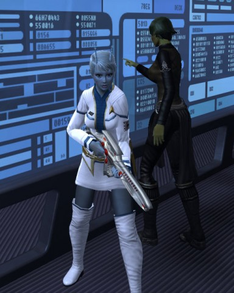
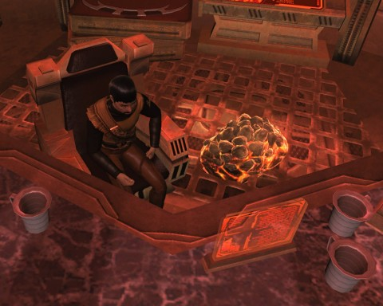
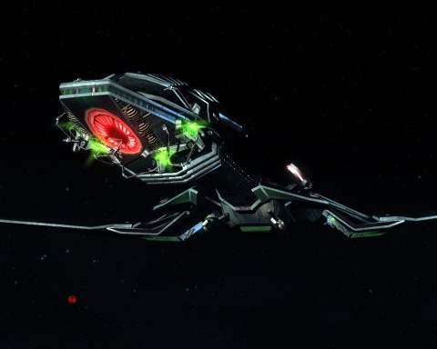
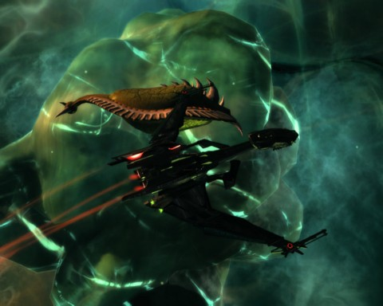

Back to: [West Karana](/posts/westkarana.md) > [2011](/posts/2011/westkarana.md) > [February](./westkarana.md)
# Star Trek Online: Ambassadors

*Posted by Tipa on 2011-02-20 20:52:35*

[caption id="attachment\_6195" align="aligncenter" width="384" caption="This one\\'s for Longasc"][/caption]

This post is just about my two Star Trek Online characters, the Andorian science captain Tipa D'zoph, and my old-style Klingon tactical captain, Krontar.

Hot on the heels of [fellow Federation News Service editor Blue Kae](http://bluekae.com/2011/02/17/captains-log-88734-94/), Tipa D'zoph was appointed Ambassador-at-Large to the scattered races that rim the Alpha Quadrant, and speaks with the voice of the Federation in these matters. I have not been working seriously on the ambassadorship for several months, even though I've gotten close, mostly because grinds BORE me. The occasional first contact mission, worth double the normal diplomacy XP, are fun, BUT... the exploration missions that require you to go scan flowers that look like Greek columns or to run through abandoned bases piecing together log entries from computer consoles just don't do it for me.

In the real world, it would be like the ambassador to China being trained for his or her job not by becoming part of the greater delegation to China, but instead, training for it by running road races in Michigan with the occasional meal at a Chinese restaurant.

Blue Kae's achievement spurred me on, mostly because of one of the secondary rewards of the position: the ability to recruit an officer from the Klingon Empire to work on your ship. EVERYONE seems to choose Orion slave girls; but I wanted to bring my Klingon captain, Major General Krontar, over. Now, since Krontor is an old-style Klingon, in the character editor I had to base him on the alien model.

Turns out that you can't bring Klingon/aliens over. Or newstyle Klingons, either (you have to buy them in the C-Store). Your choices are: crab-faced Nausicaans, lizard-faced Saurians, or ... Orion slave girls and their boy-toys.

So yeah, I got an O.S.G. I was shocked to find out that you could actually get one with clothes on. I'd never seen one like that -- but mine CAME that way! I put her in the oldschool Klingon uniform shared by all the officers on Krontar's ship.

Then I turned to Tipa's ambassadorial outfit. You do have a fair amount of leeway with the colors, so I opted to pair the white of the jacket with the blue of her science specialty. The standard black striped pants made her look like either a maitre'd or a majoret, so I hunted up a skirt instead. I also cut her hair. Now that she's a vice admiral AND an ambassador, it's time to get serious with the hair.

They have all the cash shop outfit pieces at the tailor now; you don't have to have bought them before you see how they look on your character. This is a huge deal, and I hadn't heard anything about it. There was a REALLY cool little number for formal off-duty wear. I didn't buy it... but it looked hot.

[caption id="attachment\_6193" align="aligncenter" width="480" caption="Krontar and Horta"][/caption]

Having a high level character on both sides of the Federation-Klingon conflict means doing everything twice. I run a featured episode on Tipa, then log and run it on Krontar. For older missions that Tipa did long ago, though, Krontar goes it alone.

The captain's ready room on both the Federation and Klingon starships has become a fairly important place. You can sit down in it, now. Well, you always could -- by positioning yourself above the chair, hitting the Sit emote and hoping you aimed well, but now there's a button that runs you to the chair and sits you in it. 

I like sitting there when I chat with people. Not my fleet -- I don't have one on the Klingon side. I used to be in a fleet, but in it I leveled from lieutenant to captain and was never raised in the fleet above the rank of "maggot". It was a dead guild anyway, and the FNS has its own chat channel that crosses both factions and games -- you can chat in FNS from within Champions Online, if you had the notion. Longasc has figured out how to chat in FNS without being in game at all.

Also in the ready room is the captain's private data terminal, which I use to rerun the latest episode, Frozen, again and again. More on that in the next post. When I leveled to Major General, the terminal informed me that my presence was now requested in the Gamma Orionis sector, at the battle fleet. I spent a lot of time there with Tipa; this would be my first time running it in a Bird of Prey.

[caption id="attachment\_6194" align="aligncenter" width="480" caption="Partially assimilated"][/caption]

I'd hoped to get the Borg arc, but Klingons are skipped straight to the Undine arc for an excursion into fluidic space, starting with the mission "Assimilation" ([which I wrote about last July](../../../index.php/2010/07/29/star-trek-online-assimilation/)). You fight a little skirmish with the Borg, who then suddenly break off to address an incursion from fluidic space.

At the end of the mission -- which is pretty long and involved -- you can choose an assimilated ship console as a reward. This is one of a set of four that give your ship a Borg-like feel, as for instance the USS Voyager did in the Delta quadrant [during a temporary alliance with the Borg](http://memory-alpha.org/wiki/Assimilation). More importantly, these consoles are often best-in-slot items. The Borg-ified engines obtained from the first Special Task Force, Infected, allows faster turning and higher warp speeds, making for a very fast ship.

The mission Assimilated also gives a console, a tactical console (I think) that upgrades some power conduits and adds some hardware to the main torpedo launcher, which you can see in the picture above. It looks cool. I haven't yet done Infected with Krontar, but I look forward to seeing it. 

Once I saw that Assimilation was giving a Borg console, I redid the mission with Tipa and got the same mod for her Nebula. The entire mission was MUCH harder with a science officer in a science ship than with a tactical officer in a Bird of Prey, though both captains did have access to the squadrons of Scorpion fighters from "The Vault".

[caption id="attachment\_6192" align="aligncenter" width="480" caption="Fluidic space"][/caption]

Birds of Prey (Bird-of-Preys?) are really beautiful ships. When Krontar made Brigadier General, he went big with a carrier-class ship. Damn thing couldn't hardly turn at all, but it sure made a big boom when it blew up. BoPs come with battle cloaks and near instant turning. It's just a really nice ship.

Shown above cavorting with a bio ship in fluidic space.

I have a real problem with the concept of fluidic space. This is a space filled with liquid, right?

Well, it must be the most utterly clear liquid around, otherwise you wouldn't be able to see structures from any kind of distance. Clear and with no refraction at all. Plus, you'd expect creatures in fluidic space to evolve requiring a fair amount of pressure, since there is an infinity of material on all sides. Since pressure in and out must be in equilibrium, they should explode when they enter our space. For that matter, the pressure should crush us in fluidic space, yet we carelessly dance about in their prison colony. But seriously -- how could ships built (or grown) in fluidic space to swim through this mystery fluid operate in "normal" space? There's quite a lot of difference between swimming and navigating a vacuum.

I think maybe I need to go back and spend more time in my ready room....
## Comments!

**[Blaze](http://thewordfromstormthief.blogspot.com)** writes: Lovely post as usual, Tipa. Your well written posts have been responsible for several of the MMOs I've played, and this just gave me more of an itch to play STO :)

Blaze

---

**[Tipa](https://chasingdings.com)** writes: What a wonderful thing to say! Thanks!!!

---

**[Ozymandias &laquo; Combat Archaeology](http://combat-archaeology.net/2011/03/05/ozymandias/)** writes: [...] was dwarfed by Admirals Bryn Aev and Tipa D’zoph’s warships (both, coincidentally recently promoted to ambassador)… Also: Tippa's ship was a little more Borgified than mine. [...]

---

