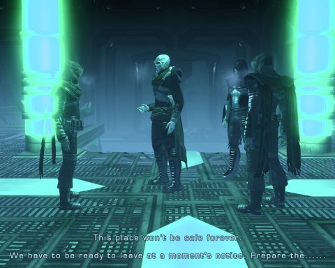
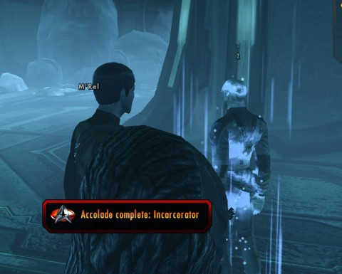

Back to: [West Karana](/posts/westkarana.md) > [2011](/posts/2011/westkarana.md) > [February](./westkarana.md)
# Star Trek Online FE303: Frozen (Spoilers)

*Posted by Tipa on 2011-02-21 07:37:29*

In the first episode of "Cloaked Intentions", the third Feature Episode arc, we visited a semi-abandoned, giant space station called "The Vault" deep within the Romulan neutral zone. There, we met Obisek, a Reman rebelling against the half-human Romulan empress Sela and her scattered empire of refugees. In the second episode, "Mine Enemy", we followed Obisek's suspicions to a hidden Tal Shiar (Romulan intelligence agency) base deep within a mining colony inhabited by the rock-like Horta.

The third episode, "Frozen", brings us to the Remans once more... after the break.

[caption id="attachment\_6200" align="aligncenter" width="480" caption="Romulan battleship ambushing a Reman scout ship"][/caption]

Starfleet had heard rumors of a Reman base hidden somewhere in the Dera system. The Remans have the entire system blanketed in a sensor-disrupting field, which is aided not at all by the presence of "micro nebulas", small regions of gas and radiation within which ships are essentially blinded. The Federation News Service dispatched the USS Amgarrak and the USS Concord to track down the rumors and get the facts of the story.

My science officer suggested modifying the signal of a communications satellite to indicate our presence, then hide in the micro nebula and see who showed up. We'd no sooner done this and returned to our bolt hole in the micro nebula when a Reman scout ship warped in and started scanning the area. We got a strong signal lock on them; we'd be able to follow them wherever they went.

We hoped they'd miss us in the nebula, but it turned out we were not alone in the system as a Romulan battleship decloaked and started firing upon the Reman scout ship. The Romulans had been there all along; who knows what they'd been thinking as they watched us do our little trick with the communications satellite.

[caption id="attachment\_6201" align="aligncenter" width="480" caption="Following the Reman scout ship"][/caption]

If we were ever to find the Reman base, we'd need that scout ship to lead us to it. We reluctantly left the cloud to the non-surprise of the Romulan commander, who ordered us to stand down lest we further disrupt relationships between the Federation and the Romulan Star Empire.

We destroyed his ship and everyone on it. Romulan battleships now have a devastating new ability -- they can fire a salvo of heavy plasma torpedoes. One can seriously injure a ship if it hits; three at a time can take even a strong ship down if the captain isn't on her toes.

While we fought the battleship, the Reman ship limped away. It tried to cloak, breaking our sensor lock. As soon as we could, we followed to try and re-establish the lock, which we managed just before the ship re-entered warp. We followed it to a cold, frozen moon where sensors showed a subterranean base. The base was protected by a transporter-inhibiting magnetic field, but we did discover a series of caverns which might lead us to the base.

We beamed in, ready for whatever might happen.

[caption id="attachment\_6203" align="aligncenter" width="480" caption="The Mining Laser Puzzle"][/caption]

The cavern was filled with space-hyenas and space-spiders and a ... starship. It turned out that the Reman base was a derelict ship that had been beamed, piece-by-piece, deep within the planet. The Remans had been mining these natural caverns for materials with which to make ship parts and weapons ever since, safe from any prying eyes... until we came around, anyway.

Access to the ship was blocked by a strong grate. Luckily for us, there was a powerful mining laser pointed right at it. But... the power couplings were fried. There were three things we could do to fix it. Tactical officers could get power supplies from consoles scattered about and fuse them into something workable. Science officers could try and shape and tune some of the natural crystals laying about. I don't know what the engineering solution would be, but I imagine it had something to do with the glowing flowers. (But I don't know). Longasc and I split up to collect crystals and power supplies and fix them up in the lab the Remans had kindly left operating.

Laser fixed (and accolades won), we blasted our way into the ship and into the super secret Reman base.

[caption id="attachment\_6204" align="aligncenter" width="480" caption="Obisek Ke-remie, we meet at last"][/caption]

That our presence had not gone unnoticed by the Remans was no surprise. That we were expected, and to some extent even welcomed, we did not understand.

We chatted with the Reman miners and rebels for a bit. They had no end of stories of hardships. They told tales of the madness of Shinzon, the Picard-cloned Reman leader who assassinated the Romulan leadership and nearly upset the delicate balance between the Romulan Star Empire and the Federation before being defeated by his own blindness and hatred (as told in "Star Trek: Nemesis"). They told of life under Seka's retribution. They told of life as refugees, with their home destroyed and their friends and family killed in the explosion of Hobus' Star that blasted both Romulus and Remus to bits (as told in "Star Trek: the Reboot").

When we worked our way to the center of the base and discovered Obisek, he understood that we'd been looking around and talking to his soldiers -- as he intended for us to do. We'd seen the plight of Romulan refugees in "Mine Enemy", could we have any less sympathy for the Remans?

The Thalaron weapons, he told us, were regrettable tools, but necessary ones. They had already lost so much. Without those, they would have nothing. If we wanted him to give up the fight and the thalaron weapons, we could offer to provide help. Ships, weapons, humanitarian supplies -- to take a stand against the evils of the Tal Shiar and bring life, hope and freedom to the Remans.

[caption id="attachment\_6205" align="aligncenter" width="480" caption="Incarceration accolade"][/caption]

All you can do is bring Obisek's story to the Federation. As for Obisek himself, you're given a choice. You can either let him go about his way or arrest him, and bring him back to the Federation yourself.

If you let him go, he and his crew will beam out to safety while Romulan commandos beam in, weapons locked and loaded and ready for bear. If you choose to arrest him, Obisek will STILL beam out with his crew, but he'll leave behind his Reman Resistance fighters, who you'll have to subdue (but not kill) on your way to disable to magnetic field prohibiting transport out for you -- it's apparently no barrier to the Romulans or Remans.

No matter which option you choose, Obisek escapes, begging once more for Starfleet help. (He's not bitter if you choose to arrest him and his people, but he won't go quietly). The mission ends when you disable the interdiction field.

However, if you had chosen to arrest the Remans, if you do NOT transport up to your ship but run around to all the defeated Remans and tag them for transport, you will eventually receive the hidden Incarceratior accolade once you have arrested forty of them. You get to arrest about fifteen per run, so you'll need to run Frozen at least three times to get the accolade.

With the three accolades for the various methods of repairing the mining laser, this makes four accolades achievable in the mission.

---

"Frozen" was heavy on story and cut scenes, but a little light on action. The new heavy plasma torpedo salvo was a new surprise, and the Reman Resistance fighters have a devastating mental attack which can quickly eat up health.

Aside from that, it was fun. I ran it many times, both choosing to arrest Obisek and choosing to set him free. Unless you're going for the Incarcerator accolade, it doesn't really matter, in the end, which option you choose. Choices that are no choice at all -- not so great.

Mission rewards were Romulan disruptor pistols and rifles. My Klingon's crew is well supplied in Romulan weaponry now.
## Comments!

**[STO: Burned, Blasted, Frozen &laquo; MMO Gamer Chick](http://mmogamerchick.wordpress.com/2011/02/21/sto-burned-blasted-frozen/)** writes: [...] and episode. There will be consequences to whatever you choose, but the scope remains to be seen. Check out Tipa’s write-up of the mission if you want a good rundown of what you can expect from each choice you make in [...]

---

**[/AFK: Server Is Full Edition &laquo; Bio Break](http://biobreak.wordpress.com/2011/02/27/afk-server-is-full-edition/)** writes: [...] West Karana — Star Trek Online FE303: Frozen “That our presence had not gone unnoticed by the Remans was no surprise. That we were expected, and to some extent even welcomed, we did not understand.” [...]

---

**[West Karana » Star Trek Online FE304: Coliseum (spoilers)](https://chasingdings.com/index.php/2011/02/27/star-trek-online-fe304-coliseum-spoilers/)** writes: [...] our reservations about his ability to deploy thalaron weapons after talking with his people (in Frozen) and uncovering the dishonorable actions of the Romulan Tal Shiar (in Mine [...]

---

