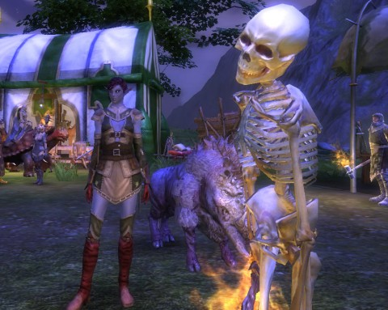

Back to: [West Karana](/posts/westkarana.md) > [2011](/posts/2011/westkarana.md) > [February](./westkarana.md)
# Rift: Photobombing, public groups and Iron Tombs

*Posted by Tipa on 2011-02-27 08:04:56*

[caption id="attachment\_6220" align="aligncenter" width="480" caption="Why, hello, Mister Skellington"][/caption]

Sometimes people are waiting JUST off camera for you to hit that PRINT SCREEN button...

Dina leveled to 21 last night and is nearly finished with all the non-rift based quests in Freemarch. I have to return to the Iron Fortress to hunt up an Unseen agent. I, um, didn't see her last time I was there. Then I'm off to the Stonefields, the next step in the linear progression.

Stonefields has its own planar currency, which makes it fairly important to spend all the Freemarch planar currency before I move on -- which I have done. I have a couple "purple" items and two "blue" that I bought at the vendor. The rest of my gear is either crafted, or rewards from Iron Tombs or quests.

I'm playing my character with most of her points in Bard, the buffing and soon healing rogue soul. Bards get a small heal-over-time fairly early, but once you have spent 20 points in the soul, you open access to very powerful group heals. The rest of my points are in Ranger, with enough points in Assassin to let me get in close for "wet work" when needed.

Since I have done so many rifts, capturing all the rogue souls was trivial. After every rift is sealed, the healing scar on the land is suddenly filled with named mobs as everyone uses their new planar shard to capture another new soul. It's like a rift after-party. I'm so happy with my current build, that I haven't felt the need yet to make a second spec. The other souls are there when I need them.

Rifts are clearly public content, but you can also join anyone's group if it isn't full and they haven't set it private. It's becoming perfectly natural for people to jump into each other's groups if it looks like they are farming the same area. This may be one of Rift's most defining features in the end, though of course, Warhammer did it first. Don't want to forget the game that clearly contributed so much to Rift. Warhammer is Rift's "EverQuest" -- the game that pioneered the mechanics so it could be done better by another game.

Iron Tombs the first time through yesterday was as fun as I remembered it; lots of little extra encounters, bits of unexpected humor, puzzles and a lot of loot. I dinged 20 in IT, and a dungeon ding is the best kind. Our group took a couple of minutes to sell, then we did it again. This time, without the quests, a lot of the fun encounters just didn't happen, there was a LOT less loot, and the xp wasn't as good. It left a bad taste in my mouth. I kinda want dungeon grinding to be as good a method of leveling as questing or rifting.

Nonetheless, still having fun, going at my own casual pace. Some folks in my guild are level 40, and there's a bunch of level 50s in the game. Those folks will be starting on the "Expert" dungeons and the raids. I'll get there eventually.

On the crafting front, I chose Outfitter and Butcher so I could make my own armor. I held off on my third profession until I found something useful; I went with Runecrafting in the end, which is identical to WoW's enchanting. I leveled runecrafting by disenchanting all the stuff I made to level outfitting, so it worked out well. Most of my gear is enchanted now :) In WoW, since I was not in a guild, it was problematic finding enchants for my items, and I never considered it a high priority since I wasn't at max level and my gear was constantly undergoing a degree of churn through dungeon or quest rewards.
## Comments!

**[MMOGamerChick](http://mmogamerchick.wordpress.com)** writes: IT is indeed a lot of fun. Interesting to see how different the experience is depending on your class and spec and group make up. The first time I went in, I was using my hybrid melee/heal role with two other clerics in the party. DPS wasn't great, but staying alive wasn't a problem even with no dedicated healer in the party, what with all the incidental heals flying around just from our abilities. The second time I went through was using my main healer role, and I was the only cleric. The DPS went way up, but I almost went crazy with panic trying to keep up with the healing. Makes me think each time going through I will have a different experience.

Anyway, I went runecrafting too. Wait til you get further in. Boy, now I'm thinking that's a profession for the masochists... :P

---

**[Jomu](http://www.justonemoreunlock.blogspot.com)** writes: how are people so high level so fast?? is it easy to level or these people took the whole week off to play 10+ hours a day?

---

**Azyrie** writes: I didn't see the agent either my first trip around, and the quest locator didn't really point out the agent either. I'm wagering you did notice a rather large scary elite worm-looking critter though, mayhaps you should check that out again now that you're a bit higher level ;)

---

**[Callan S.](http://philosophergamer.blogspot.com/)** writes: Who was waiting off camera? The skeleton? The giant turtle? The guy with a flaming hammer sort of in a suggestive position relative his anatomy? There is actually so much that is off in that picture I don't know which particular one your refering to? And yet at the same time it seems a normal mmorpg pic!

---

