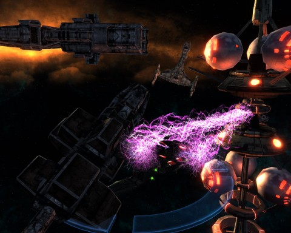
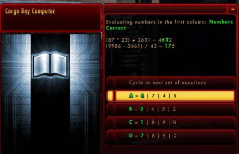
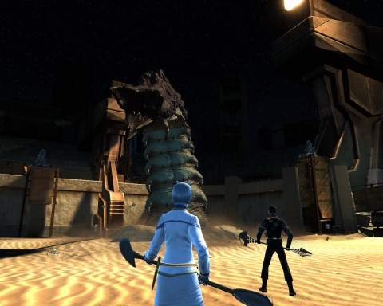
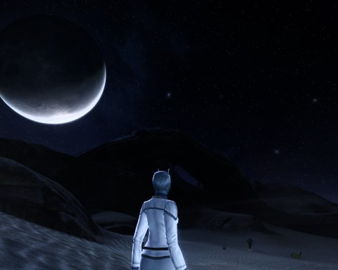

Back to: [West Karana](/posts/westkarana.md) > [2011](/posts/2011/westkarana.md) > [February](./westkarana.md)
# Star Trek Online FE304: Coliseum (spoilers)

*Posted by Tipa on 2011-02-27 13:21:35*

[caption id="attachment\_6227" align="aligncenter" width="480" caption="Vanity, thy name is Reman shields"][/caption]

You can't think of "Star Trek" and coliseums together without thinking immediately of the original series episodes "[Bread and Circuses](http://en.wikipedia.org/wiki/Bread_and_Circuses_(Star_Trek:_The_Original_Series))", where the Enterprise crew beam into a 20th century version of the Roman Empire, and "[Amok Time](http://en.wikipedia.org/wiki/Amok_Time)", where Kirk and Spock battle to the death on the planet Vulcan. (The director of "Bread and Circuses", Ralph Senensky, [blogs about directing that episode](http://ralph-senensky.blogspot.com/2010/02/bread-and-circuses-september-1967-star.html) -- a must read! Includes bloopers!)

In "Coliseum", the folks at Cryptic have managed to include nods to BOTH episodes AND to the Star Trek Enterprise episode "[Desert Crossing](http://memory-alpha.org/wiki/Desert_Crossing_(episode))". If it sounds like there's a lot going on in this episode, then you heard right. And speaking of sound -- make sure your sound and especially your music is turned on. There's a point in the episode where you expect to hear a certain bit of music -- AND YOU DO.

Spoilers after the break. Or, if you read this on my RSS feed, prepare to be spoiled. I'm going to be switching between screenshots of my Federation and my Klingon runs... they were identical aside from the PCs (who were played both times by Longasc and me).

[caption id="attachment\_6228" align="aligncenter" width="480" caption="A space junkyard -- and a trap"][/caption]

We were surprised to see Obisek's scarred face on the USS Concord's main screen. We'd last seen the Reman resistance leader in his secret base on an ice planet in the Dera system. We let him go* despite our reservations about his ability to deploy thalaron weapons after talking with his people (in [Frozen](../../../index.php/2011/02/21/star-trek-online-fe303-frozen-spoilers/)) and uncovering the dishonorable actions of the Romulan Tal Shiar (in [Mine Enemy](../../../index.php/2011/02/13/star-trek-online-fe302-mine-enemy-spoilers/)).

Obisek was coming to us, not because he thought we desired to take a side in the Romulan/Reman conflict, but because of the interest shared by all living creatures in the quadrant in keeping thalaron weapons out of the hands of any who would use them. A ship carrying a load of thalaron weapons had gone missing. Surely, we could set aside our feelings about the Reman resistance or any desire for impartiality and agree that those weapons must be found?

The Federation News Service could do what it liked with the weapons if we found them, as long as they were found. Obisek did not have enough resources to do the job himself, but he did have the last known coordinates...

We set course for the Nopada system at maximum warp.

Scanners showed no signs of the ship or of thalaron weapons. There did appear to be a debris field filled the hulks of old ships, in the midst of which was a satellite of unknown function. The Starfllet Manual of Rules and Procedures clearly states that in any instance where a ship should encounter a spatial anomaly or debris field in which it is likely other ships were ensnared, it is important to do whatever it takes to be likewise captured. We closed in on the debris field at full impulse, and scanned the satellite. Beams of purplish energy lanced out and held our ships motionless, while our power systems were slowly drained.

Starfleet, I love you, I would die for you, but really, why is this in the manual? What ever happened to marking it with a navigation buoy and sending in investigators?

[caption id="attachment\_6230" align="aligncenter" width="480" caption="Math R Fun"][/caption]

There was nothing to do but to transport a team to the satellite to try and disable it before we lost power to all systems. The drain was bad enough that the transport would be a one-way trip unless we succeeded. Using our power in this way would make even communication impossible. We would be on our own for the duration.

The satellite was abandoned. It appeared to be a facility for removing navigational hazards from the system -- debris, old space hulks and so on. They would be brought here by the tractor beams and then dealt with conveniently. It was possible that we and perhaps the Reman ship had just run afoul of a perfectly ordinary device. All the controls were locked down, though, and we could not alter the settings until we discovered one console unlocked on an upper level. Using that, my science officer thought she could use a "back door" to derive the unlocking codes for the consoles that controlled the facilities.

The codes we needed were hidden in the solutions to a series of short mathematical puzzles. Get out your pencils and slide rules for this one. Once we had derived the codes, we had to slowly bring the station offline. First we had to find another target for the beams to lock; then we had to alter the power settings so that the station had no power to keep both our ships and the new target held. (Apparently at least one system runs on Microsoft Windows...)

Success! Ships freed, we beamed back up to continue our search for the missing Reman vessel.

[caption id="attachment\_6232" align="aligncenter" width="480" caption="The Cell Game"][/caption]

Except... we didn't. We materialized in an iron cage -- our transporter signal had been intercepted and redirected. Our bridge officers must have been shocked to find their captains had been kidnapped.

In the cell next to us was a Reman captive wearing an electrified slave collar; he said nothing to us. Outside the cells we could see the missing thalaron weapons, protected by highly energized force fields. An amplified voice informed us that the cage doors would open, and that we would proceed at once to the arena, or be killed. Along the way, we passed a room where we could choose from a variety or melee weapons -- Klingon bat'leths, Vulcan lirpas or Terran swords. (Lirpas can be crafted or bought from the C-Store... but here they are free. Longasc and I each chose lirpas on our Feds; Klingons get "purple" bat'leths -- replicas of the legendary Sword of Kahless -- as part of the Barge of the Dead episode, so when we replayed this with our Klinks, we had no need of lesser weapons).

Along with the Reman slave, we took on wave after wave of creatures -- wallingpuseses, sehlats and sand spiders. After we defeated every wave, the Reman was fired upon by the arena defense systems and hung suspended above the arena floor, clearly in great pain. The amplified voice warned us to return to our cell or face the same. 

After we'd returned to our cell and the doors once again locked, the Reman was beamed in, battered, bloody and in great pain. He told us his name was Slemak, and that he had been part of the crew of the Reman resistance ship transporting those thalaron weapons. We were in the custody of a group of rogue slavers who were studying our response to pain. The Reman's ship had been captured by the satellite. Their masters had been sending them to their deaths in the arena ever since.

[caption id="attachment\_6231" align="aligncenter" width="480" caption="Arena"][/caption]

We were sent to the arena once more, this time fighting against sandworms. The baby ones were no trouble, if you dodged their acidic spit attacks and their devastating knock down spin attacks. After those were defeated, the slavers sent their mommy -- a huge worm which took no damage from our pitiful melee weapons. We managed to activate the arena defenses from one of the consoles to stun the creature.

When the baby sandworms returned and their now-enraged mother, we kept them off Slemak while he unlocked the door leading to the other captured Remans. Once they were in the fight, we had time to hack into the arena defense systems once more. This time we were also able to open the door leading deeper into the base.

We and Slemak fled there while the Reman slaves expended their own rage upon the sandworms.

[caption id="attachment\_6233" align="aligncenter" width="480" caption="An Iconian gateway"][/caption]

To our real shock, we found an Iconian gateway. We'd seen them lurking about on the fringes of the Federation for some time; interfering in the conflict between the Undine and the Borg, disrupting things in the Alpha quadrant... these supremely powerful beings had been playing coy, but here was proof indeed of Iconian interference. It wasn't the first Iconian gate we'd seen on a Romulan base, either.

We disabled the gate controls and climbed through a conveniently placed sewer pipe.

[caption id="attachment\_6234" align="aligncenter" width="480" caption="Crossing the desert"][/caption]

The pipe let us out on the planet's surface. Although it was night, Slemak complained that it was too bright... though it was night time, and it had been far brighter inside. Romulan Scorpion fighters flew a search pattern overhead, identifying our captors. We took shelter in some rocks.

Actually, we crossed the desert, went down a long canyon, fought off a lot of wildlife, discovered a cave and a possible passage through the mountains, all without completing the mission objective labeled "Take Shelter in the Rocks". We thought we HAD. The position hadn't been marked on the map. We returned and searched around a bit until we found the spot.

We then ran from cover to cover until we were beyond detection. Slemak, still feeling his torture, could not go on without some sort of medical aid. Luckily, we could synthesize medicine from the plants in the area (really? I mean, really?) and that gave him a bit of strength.

With temperatures plummeting, he was concerned how we would survive the night, which led to a profession-based search for the means of survival. Science officers hollow out a gourd and use it to carry water; Tactical officers build a fire; and Engineering officers kill wildlife for food. You only need to do one of these to advance the episode.

[caption id="attachment\_6235" align="aligncenter" width="480" caption="The Reman Remains"][/caption]

We spent the night in a convenient cave. Slemak said he had done some exploring, and a tunnel led through the mountain from the cave; it should let out near his crashed ship. 
The next morning, we found that it did indeed lead there.

The ship clearly would never see vacuum again, but we were able to jury-rig a short distress signal from parts we found strewn about. We had no sooner done that than we had an unwelcome visitor... and he brought an army.

[caption id="attachment\_6236" align="aligncenter" width="480" caption="Hakeev and the Night Visitors"][/caption]

It was Commander Hakeev, whom we'd met in the secret Tal Shiar listening post. The Romulans were the aggressors all along. And not only that, they were in league with the Iconians.

Hakeev explained all about that in a long, extended monologue that detailed his debt to the Iconians, how he had been a good servant, what good test subjects we had been in the arena, on and on and on and on, how Slemak had been a good spy, slave and traitor. Slemak! We made ASPIRIN for you and now you betray us!

Anyway, we were wondering when Hakeev would get around to ordering his army of Romulan commandos to open fire. Won't evil supervillains EVER learn the dangers of monologuing? Just when he was finally about ready to kill us... JUST when the Romulans were firing their disruptors... we dissolved into twinkly transporter sparkles. Our signal had gotten through; we were saved.

[caption id="attachment\_6237" align="aligncenter" width="480" caption="Shield wars"][/caption]

Obisek got in contact with us as soon we escaped the system. He offered our experiences as proof of Romulan involvement with the Iconians and with the enemies of the whole quadrant. Surely, Starfleet and the KDF could see the wisdom of allying themselves with the Reman resistance now?

Also, here are some shield modules for your ship. They make your ship all dark green and glowy. (We could have also chosen an engine, but it's not glowy and interferes with the Borg module, which is glowy. And you need MORE GLOWY).

(*) We let him go, and then we went back and arrested him to see if that changed the story any. It did not.

--

Epic? I think we can call this episode epic. Epic in scope, length and storytelling. There were a couple of glitches; the hidden spot to take shelter in the rocks didn't just catch us. Also, the Engineering path, killing animals for food, could be problematic if everyone had been too excited about killing animals BEFORE they got the quest to kill them, leaving no animals.

Nonetheless, awesome episode, great job. Can't wait for next week's finale!

## Comments!

**Subzzo** writes: i noticed the first picture and i was wondering is the glow all aegis gear?
cauze it looks diffrent, might be the monitor or picture quality though.

---

**Longasc** writes: Oh Hakeev, I thought it was Obisek.

The Reman shield is a only slightly weaker version of the Mk X Covariant Cap x3 Honor/PvP shield, many people use it together with 3 Borg Parts if they don't have the rather weak Borg Shield from Khitomer or simply don't deem it worthwhile for the 4 set bonus. I am still running 2 Aegis and 2 Borg, as my Fed is unlike my Klingon not yet past "The Cure".

This makes me wonder if customization / looks should not be revamped. It is incredibly how many MMOs still did not copy the brilliant concept of "cosmetic gear" or whatever the games that do this call it.

Commander Mupp also missed the rocks, almost everyone did. They should have noticed that, same for the Engineering quest. But they are getting better and better with the FE's, looking forward to the next missions.

---

**[STO: Into The Coliseum &laquo; MMO Gamer Chick](http://mmogamerchick.wordpress.com/2011/02/28/sto-into-the-coliseum/)** writes: [...] well done — which I think applies to this particular FE. I’m going to echo what Tipa has already stated in her write-up — this episode is truly [...]

---

**[Blue Kae](http://bluekae.com)** writes: Missed the rocks myself. I got all the way to the cave where you're supposed to spend the night and then had to head back. I guess this must've been the largest ground map in the game so far was why it threw off the minimap circles. I probably depends on those too much too. 

@Longasc - No kidding about the cosmetic gear, I was just thinking about that yesterday in reference to Rift. Really sucks too since I'd just paid money to dye some armor and then ended up getting something with better stats but uglier. I'm really tempted to just vendor it and keep the better looking stuff.

---

