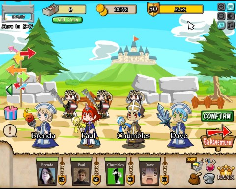
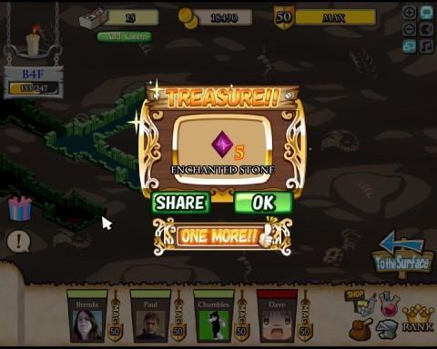
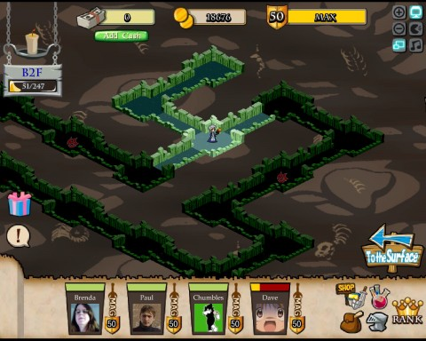

Back to: [West Karana](/posts/westkarana.md) > [2011](/posts/2011/westkarana.md) > [January](./westkarana.md)
# Treasure Abyss: The Enchanted Tower (walk-through)

*Posted by Tipa on 2011-01-01 10:26:38*

It's been a few months since the last significant content update to Namco-Bandai's "Treasure Abyss", when they added the Samurai class and the associated "Tower of the Samurai", wherein lay the components for creating the Samurai class weapons.

Since then, there's been precious little to do on the TA front. Namco-Bandai released some appearance armor for players who recruit more people to the game, but the low stats gear was inappropriate for dungeon crawling, and I haven't seen any of my friends, not even the low level ones, wearing even one piece.

Not to despair. Last week brought Treasure Abyss' eighth dungeon, "The Enchanted Tower". Only four floors -- and very small ones at that -- but with a unique restriction: the entire party must consist only of mages. Mages will want to explore the dungeon to the slot machine on the bottom floor that sometimes gives Philosopher's Stones, the alchemical ingredient that, along with ice crests, wood and enchanted stones, creates the new mage weapon, the Polar Staff. Dave, above, is wielding it.

The Polar Staff is an AE ice weapon. It does little damage by itself, but freezes enemies in place. Partnered with the AE fire weapon, the Ifrit's Scepter, monsters are locked in place and burned to death. I rounded out my dungeon party with mages wielding the Thunder Rod and the Blizzard Staff, which knock monsters back. Knock them back, freeze them in place, and incinerate them -- sounds like a recipe for victory to me.

If only we weren't facing mobs that were perfectly happy to toss spears of ice at us from the other side of the screen. These swirls of purple energy are the nuking cousins of the fire-hurling ghosts from the Tower of the Samurai (who make a brief encore appearance in this dungeon as well). The ice spears hurt A LOT. With the mages equipped as I had them, they died fairly quickly, but even one hit can knock a good chunk of health away. It's not rare to come to the last fight against four of the creatures with one of your mages already dead. Luckily it's a short dungeon -- you can probably make two attempts at the final encounter per day.

Once you do make it to the slot machine which holds the Philosopher's Stone, prepare yourself for disappointment. Missing the 7-7-7 that gets you the Stone (you need four stones to make the staff) gets you either nothing, a 20% candle or a hex stone (cherries)... or 5 Enchanted Stones (bells), of which you likely have hundreds already.

**Floor 1**

You start at the southern corner of the dungeon. Proceed straight northwest until you come to a teleport trap. That will send you elsewhere on the map. Walk to the most northern corridor on the right side of the map. With any luck, you'll only have to fight one fight, against the pair of Purple Swirls that guard the corridor.

Once those are vanquished, head to the end of the corridor and take the stairs down to the second floor.

**Floor 2**

The exit to the third floor is in the upper part of the leftmost corridor. Going the northern route sends you through two fights, while the southern route only has one. Don't be fooled. You may only have half the fights, but there are two spike traps along the way; you can't afford to give up any health. Go north and fight the two fights, both of which put you against two Purple Swirls. Purple Swirls can drop Spirit Stones, if you're still trying to make a samurai weapon.

**Floor 3**

The stairs to the fourth floor are at the end of the central corridor. Just head over that way and fight the single walking tree monster, who shouldn't even be able to do any damage to your group. Finish it off, continue past and prepare for the final battle.

**Floor 4**

There's only two fights on the fourth floor. Turn right to fight FOUR Purple Swirls and open the way to the slot machine with the stones. Turn left to fight two ghost wizards for the dungeon completion achievement. If you're the sort to buy a Resume Flag or a 100% Health Potion, now's the time to use them. You will want full health for the final fight.

You can see how damaged my group is from the trip down; thankfully, nobody has died yet. I spent a long time farming 50% health potions from the third and sixth dungeons, though, so I'm prepared.

We make short work of the four Purple Swirls, though Paul takes quite a few hits in the initial volley. After that, it's a short but ultimately disappointing trip to the slot machine, where I roll cherries and receive a hex stone for the thief's Cursed Dagger.

I'll eventually win enough Philosopher's Stones to make the Polar Staff, but it seems like the kind of weapon you only need one of in a group. Most of the times, the mage with the Polar Staff was at the bottom of the MVP list, and the one with the Ifrit Scepter was at the top. Yet, it was of great benefit to keeping the mobs all penned up close together so the Ifrit Scepter could work to its best advantage.

As in most social games, having a large number of friends who play is almost mandatory to success. There's no way around that, and even less so in this dungeon, which requires you to dig up three additional level 50 mages who just happen to be wielding the weapons you need.
 
