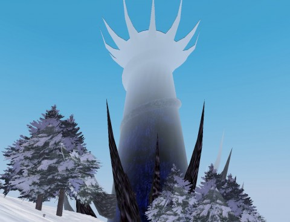
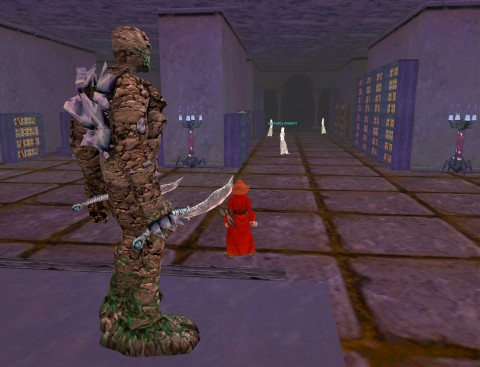

Back to: [West Karana](/posts/westkarana.md) > [2011](/posts/2011/westkarana.md) > [January](./westkarana.md)
# EverQuest: I can admit to myself that I like Velious now.

*Posted by Tipa on 2011-01-02 01:06:46*

Even in a California summer, the icy blankness of Velious' frozen wastes could make me feel chilly. EverQuest was always immersive for me in that way; the first time we raided the underwater dungeon of Kedge Keep, I thought I might drown, I was so short of breath. 

Every race had its own starting zone, with plenty of things to do up to around till around level 10 or so without ever having to encounter another race -- which, in most cases, would mean braving some dangerous encounters. The total immersion was what I loved most about EQ.

I was browsing around the old server forums and came across [this little bit of EQ nostalgia](http://www.erollisimarr.com/forum/archive/index.php/t-26860.html):

> You are old school if:

You were fighting over spawns at the spires in South Karana. 
You were one of the 100 people in South Karana.
You were one of the 50 people at any given time in SolB.
You were camping the BIBS and blackened iron armor in Runnyeye.
You were training the zone in Unrest, Blackburrow, Crushbone, etc.
You were level 46-50 (with nobody over level 50) and were fighting in Hate or Fear. People in their 60s still have trouble there.
You know what the Paw of Opalla is because you either camped it or paid lots of PP for it.
FBR was the Flowing Black Robe, not the Froglock Bonecaster Robe.
You were around when there were no epics.
You were fighting over camps in Oasis, No Ro, East/West Commons...
You had to ride the boat because there wasn't enough druids to port yet...and they cost way too much anyway.
You had no idea what a rez was because there wasn't one until like level 40...and who the hell was that high?!?!
You had to meet someone at the Freeport bank to finish a transaction for bronze armor.
Crafted was the armor for warriors until planar.
(Old) Planar was an upgrade over (just about) anything droppable.

I'm still coming down from the ending of Rift's third beta event. I kicked around in DDO for awhile, watched a movie, and when I came back and sat at my computer again, I knew just where I needed to go: EverQuest.

I ran around the Plane of Knowledge for awhile and ran into the gnome that gives the Frostfell quests. They all take place in the Great Divide, the zone at the center of the continent of Velious. Back when Velious first came out, you couldn't teleport in to Iceclad, Great Divide or Cobalt Scar until you'd taken the boat to Velious and walked to each zone.

The first quest in the Frostfell series required me to kill a bunch of goblins and then their goblin boss. Took me half an hour to FIND them -- I've gotten so used to quest trackers telling me exactly where I needed to go. Once I found them I killed them all, waited for respawns and killed them all again, with no sign of the boss. I didn't know if he would be showing up at all or if he was in a different spot. After awhile, I wandered off, explored Thurgadin, then headed to Iceclad, making that first epic journey in reverse, to the Tower of Frozen Shadow.

That was the first place I came to when I got off the first boat to Iceclad that left from North Ro. Zoned in with no idea what was happening, found a group, sat back against the wall and farmed the keys with everyone else. Came out of there with a lot of gnome skin armor, some velium weapons, and the keys up to the third floor.

Nobody knew how many floors were in the place.

Even though my mage, Tsuki, has the master key that would let her travel directly to the seventh floor, for old time's sake, I went floor by floor, killing everything. I even successfully farmed two of the keys, and got the prized Embalmer's Knife from Cara Omica. I would have cheerfully killed for that back in the day -- it proc'd Summon Bandage. Back then, mana was at such a premium that most healers expected anyone who was not the tank to bandage their own wounds.

Fourth floor, the floor that Bridgecrusher, Noffin, me and a changing crew of others traveled to again and again until Bridge had finished mapping the place. His map was the official fourth floor ToFS map for a long time. Fifth floor was the wedding floor, a great place for loot farming and solo XP. Sixth floor was a tedious slog. The seventh floor -- that was Tserrina's floor. She was the succubus boss of the place, and could pop randomly from any bat on the floor, so you were never absolutely sure if she was up or which trash mob would spawn her if she was.

(If you were of a level to make the distinction, the Tserrina-spawning bat would be slightly higher level than the other bats).

I never did get her mage robe. My mage has her staff, her symbol, the master key she drops, but the robe has remained elusive. She wasn't up tonight, either.

As happens whenever I log into EverQuest, I spent most of the time there chatting with old friends. This is the most important thing about EQ, for me: There is NO other game where I can log in after being gone for months and still chat with friends. 

I'll play a game for two reasons only: It's a great game, or it has great people. EQ was both a great game AND had great people. I just don't have the time to play EQ any more. But I have those eight years of memories to fall back upon.

*Special note for Stingite: Yes, I noticed. I was surprised!*

## Comments!

**[Genda](http://thegrouchygamer.com)** writes: TOFS was my favorite EQ dungeon no question. So quirky and odd in places, but great stuff dropped there and you had to do it right (if you were level appropriate). I still remember going in there with BC and others, you included. I would NEVER turn down a TOFS run no matter where I was in the world.

---

**[Bhagpuss](http://Yourwebsite)** writes: Okay you sold me. I have been on the cusp of logging into EQ for a week or two now anyway. I spent a lot of time in both South Karana and ToFS last year. Up until the unexpected appearance of EQ2x, which ate my Autumn, I was playing four or five hours of EQ a week, slowly chipping away at various of my 30 or so still-active characters. 

I have finally peaked in EQ2X, I think, with my silver account ratonga maxed at 80berserker/80weaponsmith with just under 160 AAs, a full set of adorned Warpainted etc etc. Although I spent the whole day today playing him with Mrs Bhagpuss's ratonga berserker, having a great time doing KoS dungeons...but it's definitely time to get back to a proper MMO rotation and EQ will be a highpoint.

And your Rift hangover is very familiar. I was grumpy all day yesterday because of mine. Honestly, if they'd take my money I'd pay them now just to play the two zones we've seen until they're ready to launch.

---

**[We Fly Spitfires](http://blog.weflyspitfires.com)** writes: Yeah! I'm old school EQ :D

---

**[Mojeaux](http://voodoogamer.wordpress.com/)** writes: Old School fo' sho! Hell, I was there on the opening day of the Tribunal Server.

---

**[Yetian](http://www.mmo-symposium.com)** writes: Wooo I'm old school too.... wait? erm? I'm old enough to remember it all, damn. ;)

I've often thought about dropping back into EQ, I'm just not sure if the feeling will be the same as before. I guess I don't want to risk ruining the memories.

---

**[Tipa](https://chasingdings.com)** writes: If you do go back, don't do it alone. You don't need a full group for most things anymore, with the hirelings, but a friend or two makes it just as fun as ever.

---

**[Looking back through&#8230; let&#8217;s say sepia-tone lenses &laquo; Visit Scenic Magical Elf Land](http://magicalelfland.wordpress.com/2011/01/20/looking-back-through-lets-say-sepia-tone-lenses/)** writes: [...] this lovely post by Tipa of West Karana about revisiting old haunts introduced in EverQuest’s Velious expansion. This was my favorite [...]

---

