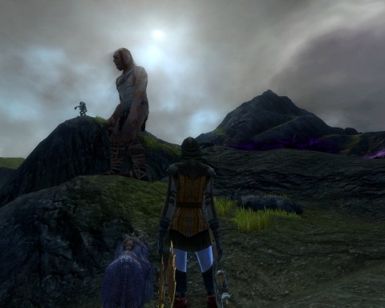
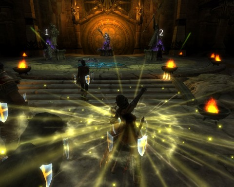
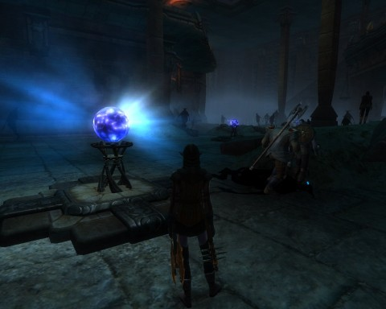
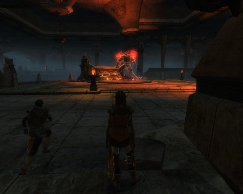

Back to: [West Karana](/posts/westkarana.md) > [2011](/posts/2011/westkarana.md) > [January](./westkarana.md)
# Rift Beta 4: In Search of... a Spec.

*Posted by Tipa on 2011-01-10 07:54:52*

  
*A Giant in the Stonefields*

This weekend's fourth Rift beta event introduced seven new levels, two new zones, two new dungeons, and Warfronts. Warfronts being Rift's version of instanced battlegrounds.

And aside from the new Defiant-side dungeon, I saw all these things. I played a heck of a lot of Warfronts, each time tuning my various specs. With so much choice and so many combinations and so many styles of play, players should plan on making their specs flowing, freely changeable plans.

  
*Granite Falls*

I had two clerics at 20 -- a Guardian druid/inquisitor/sentinel and a Defiant justicar/druid/shaman. With them was my character from beta 1, a Defiant blademaster/riftstalker. 

Warfronts were my plan for all three.

My Guardian cleric, Peridot, had the best healing spec, so her role in the battleground was fairly simple: Keep healing. Joining a warfront auto-inserts you into a raid, and the player names in the raid window light up when they are in the range of your heals. So largely I looked on the map to see where people were, kept near them, clicked names on the raid window and healed them.

The Sentinel is such a SLOW healer that I'd get lots of notice from the enemy Defiant, but since the Guardians (for whatever reason) tended to stick together fairly well, I'd come out of the battleground usually a winner and placing fairly high up on the healing chart.

I spent some time on Peridot earning some more souls. (My Defiant cleric from Beta 3 got all the cleric souls before they put the quests in). All the soul quests are the same. You help seal a rift and get a planar shard as a reward. You use a special item you were given to open a small rift into the Plane of Death and pull out the spirit of a dead hero with the soul you want. You battle this spirit, then draw their soul out into a soul collector. Return to the quest giver and you have your new soul.

You CAN use your new soul without buying a new role. Go to your trainer and ask them to "reset your souls". When you open your soul window, all your points will be refunded, but you'll only see the soul selections you've already made. Click on one of your soul icons and choose the new soul from the popup list.

I made Peridot a druid/sentinel/warden and signed up to heal the dungeon in the Gloamwood (at just short of level 22). Things went well until we came to the first boss; none of us were high enough level to do much and we eventually had to give up. Even though the monsters are around level 22, you should probably be level 25 to go...

  
*Ghost Trap in Iron Tomb*

Clerics, especially healing clerics, are fairly easy to play, and even the wide variety of healing souls doesn't lift it much from the select target, hit heal level. I've hardly ever had trouble healing in any MMO I've played unless my gear sucked.

I really wanted to see what it would be like as a bard.

Ever since EQ, I've loved bards. Bard fast. The EverQuest bard NPCs would zoom around Norrath delivering the messages that druids and wizards could not trouble themselves to carry. Player bards were the ultimate shiny blue Swiss army knives -- able to do pretty much anything, if they had enough skill. Bard songs only lasted nine to twelve seconds, and took three seconds to cast. By casting a new spell every three seconds, they could keep three or four buffs active, or mix two buffs in with crowd control, or... there were lots of combinations. Every EQ class had its "masters" who could do amazing things you wouldn't think possible, but only bards demanded mastery at very low levels.

The trick of keeping several buffs going while also meleeing and carrying on a conversation was called "twisting" or "juggling" or "using my gaming keyboard to twist for me".

Dark Age of Camelot's Albion Minstrel was similar to the EQ bard in a lot of ways. That was my first experience playing a bard as a main -- and I was hooked. In EQ2, I picked troubadour as my main, and had lots of fun with the twisting and the juggling, until they removed all that and made bards buffbots. Cast your buffs and forget about it.

At least I could still run fast, though there were class/race combinations that could run faster.

My first rogue soul with Rift's version of Tipa was Bladedancer, a straight-up melee rogue. In Beta 1, the bard soul wasn't available right off. When I was able to choose a second soul, I passed over bard in favor of Riftstalker, mostly because the description on the Rift web site made it sound really cool. It wasn't wrong; Riftstalker IS cool. It's the tanking rogue spec. You get to buff yourself up really high, comes with some self heals, and you teleport all over the place. I highly recommend it. In Iron Tombs, I offtanked and, when the main tank died, main tanked for a time (though I hadn't trained the taunts, so I wasn't as effective as I could have been).

Defiant-Tipa didn't even have a third soul, and she was 16 at the time. I popped into a couple of warfronts just to see how they were as a melee. A slaughter, basically. The Guardian force seems to keep together a lot better than the Defiants, something I'd noticed while playing on the Guardian side as a cleric. So the Guardians would just run around as a group, with one holding the artifact, and kill everyone they saw.

I'd use my teleports to get behind a caster and start the killing, but my full-on Riftstalker spec didn't have enough dps to take anyone down before the rest of the group would catch up to me.

I figured I'd get the Bard soul and start leveling.

Bard buffs come in three flavors -- Anthems and Fanfares are your long duration buffs, and Motifs your short duration buffs. You vanilla Motif lasts 12 seconds, but you can get it up to 30. They are instant cast.

I joined an Iron Tombs group at 19 with two specs; a Rifstalker/Bard spec for DPS and some buffs, and a Bard/Riftstalker spec for extreme buffage.

I was having a bit of trouble figuring out my specific role in a group. We wiped a few times; I think we were all getting the hang of it, and I don't think any of us had been in the dungeon before. I kept swapping between my specs, and by the end of the dungeon, I was running purely on the Bard/Riftstalker spec.

The dungeon, BTW, was fantastically awesome, as was Realm of the Fae on the other side. Since none of us had any idea what to do (though the cleric had heard about the final fight from someone and gave us some tips), we were just figuring it out as we went along.

Dinged 20 in the dungeon, and afterward went back to the Warfronts to see how my new bardic abilities would fare in PvP battle.

It was not pretty. Nobody was close enough for my buffs or heals to hit, my combo-building channeled ability "Cadence" was constantly being interrupted by my death, and I did poorly in every possible way. I did try to grab the Fang of Regulos whenever I could; with my slightly higher run speed and self-heals, I figured I could keep it pretty well, and I did, but the carrier of the Fang always dies in the end.

Bards are mostly casters. I quested for the ranger soul as a companion, and that turned out to be the best PvE combo I found all day. I'd send the pet in, use Cadence and Power Chord to build combo points in a couple seconds, then spam Head Shots. Stuff would essentially just fall over, dead.

I did some rifting in Stonefields. Tagging was awesome, though my pet tended to die fairly quickly. All was sunshine and roses until I brought this spec into the Warfronts.

Once again, it was pointed out to me, suddenly and with great force, that players who stand in one spot channeling spells while the rest of their group runs away from them, are dead meat. Ranger spec notwithstanding.

So, warfronts: Most success with a cleric, least with a bard. Riftstalker did okay.

Dungeons: Iron Tombs great, the one in the Gloamwood, too much for level 21/22s.

Stonefields/Gloamwood: I preferred Stonefields.

Looks like I'll be playing a Defiant Ranger/Bard at launch. Perhaps with Marksman or Saboteur as the third soul.
## Comments!

**Misterorff** writes: We had completely different PVP Experiences. Every time I was on my Defiant we steamrolled the Guardians, and every time I was on my Guardian it was like playing a game of "Every Man For Himself!" 

Either way, gotta agree that Cleric is the way to go for PvP. My Justicar/Purifier/Sentinal had a hard time being killed, even by higher level players. Was much fun indeed!

---

**[Rift Beta 4 Impressions | Kill Ten Rats](http://www.killtenrats.com/2011/01/10/rift-beta-4-impressions/)** writes: [...] the Deer Tears item ("you, monster"). I am looking forward to some PvP and trying other soul combinations. Hopefully next beta I will be able to experience a dungeon [...]

---

**Tracker Wolf** writes: Hey Tipa, what's up? You're making Rift seem pretty interesting.
I'm not sure you mentioned it, but is it possible to advance though PVP alone?
Cheers

---

**Hudson** writes: The one issue I had with the Bard/Ranger combo was the that there were too many combo builders and one subset seemed totally wasted. I didnt know if I wanted to use the Ranger Combo builder or the Bard, and I hated standing still to build Bard combo points. Tough call but some Souls seemed pointless for me to have. It got to where I would just save points and try not to use others but I had to pick one. 

I ended up using saboteur to get sticky bombs and thus slow my enemies down while I used the Bard song to build up combos

---

**[Tipa](https://chasingdings.com)** writes: I heard that it was possible to level through PvP, but I wasn't paying attention so I can't say for sure. 

---

**[Tipa](https://chasingdings.com)** writes: That's exactly what I want to TTY next beta, sabo for third soul. Standing in one place for combo points really is impossible in pvp. 

---

**[Bhagpuss](http://Yourwebsite)** writes: Just logged out this minute after playing all weekend. Compulsively fun. 

I spent a lot of time in Gloamwood, which i loved. I am leaving Defiant side untouched so I don't spoil all my surprises for launch, but if Stonefields is better than Gloamwood it must be amazing.

I've been playing a Guardian, a Pyromancer/Elementalist/Warlock who swaps to Chloromancer/Necromancer/Dominator occasionally. I die a LOT but it doesn't seem to matter. I couldn't see much pattern in the Warfronts; I had everything from 2/500 losses to 1000/20 wins and several very tight finishes. 

I thought the Warfronts were fun, but in exactly the same enervating way as WoW's or Warhammer's. They were absolutely jam-packed, though, popping instantly all weekend, so I guess they will be popular.

---

**[Tramell](http://steelharmony.com)** writes: I'm also having figuring things out on the soul front. On my warrior I went with Paragon/Beastmaster/Riftblade and ended up with a solid DPS build that specialized in DoTs. I did enjoyed warfronts a bit but i'm not much of a PvPer in MMOs.

---

**[Tipa](https://chasingdings.com)** writes: I'm not much of a PvPer, generally, either. But given Beta 4 was named Warfronts, figure I should give it a try. Plus, PvP rewards. 

---

**[Joe](http://asteriskcrusade.blogspot.com/)** writes: I played a Defiant Riftblade/Reaver to 16 and he was quite fun, especially in pvp with the missile launching and the aoe dots. As a defiant we lost more Black Gardens then we won..mostly I feel because people were just killing and not paying any attention to who had the thorn. 

If you are interested here is my take on the game - 

http://asteriskcrusade.blogspot.com/2011/01/rift-review-beta-4.html

---

**[Roundup: How Good Was The Rift Beta? | MMO Melting Pot](http://www.mmomeltingpot.com/2011/01/roundup-how-good-was-the-rift-beta/)** writes: [...] West Karana – Tipa spent the beta messing around with the class system in Rift, trying combinations of various specs and seeing how they performed in PvP and dungeons. Sounds like great fun, and refreshingly “okay” within the playerbase to not have a standard spec. I found a few bits of Tipa’s post confusing – I expect they make sense if you’ve played the game. The rest is worth sticking with. [...]

---

**Daria** writes: I just got into beta this past weekend so it being my first time in, I spent most of it rolling several different classes to get a feel for what I'd like. Mostly all flavors of cleric, because I love playing a healer. I found the Inquisitor/Sentinel/Purifier to be the most fun for me. The Purifier class gives that zero-point shield, which is awesome to have on while you cast the Inquisitor spells with no pushback. I thought the Sentinel might turn out to be the better healing class just based on the higher level abilities in the tree, but I did try Warden for a while as well which seems to be more HoT based. I wasn't crazy about the Warden's water based spell effects though. I pared the Warden with a Shaman which is ok if you like being in melee range, but the Shaman's shield looks like a block of ice around your body and I found it strange. Didn't get very far with the Druid because I don't care for the fae pet, which I saw tons of players using. I didn't get time to try any PvP but I will in the next beta, glad to hear you had success with a cleric.

Also regarding the planar shard, I must have done this quest because I had this item in my bags, but couldn't find any quest in my log that mentioned it. I wound up destroying the shard. Was that a mistake? (I had 3 souls already at level 13.)

---

**Zygwen** writes: When you close a rift, if you do not currently have a planar shard it give you one. A planar shard is used to get an additional soul of your choice. You will need to head to the first major city and talk to a representative of the soul class you are interested to get the necessary items to bind the new soul. You can start getting new souls at 13. 

The planar shards are relatively easy to get. So I would not worry too much about the fact that you destroyed it. You can always get another. You can also get the quest first and then hunt for a planar shard but that means you have to carry 2 extra items around till you complete the quest.

---

**[Saylah](http://notadiary.typepad.com/mysticworlds/)** writes: Clerics are so versatile for players that enjoy healing. It's one o the first implementations I've seen where you don't have to be screwed over trying quest when you're alone simply because you ar willing to heal.

I am rather surprised how little is being said about the steam/techno/cyber punk setting on the defiant side. With so few options for this particular theme where it's so obvious and oppulent, I thought more people would be going ga-ga over it. But since I'm very late to paying attention to Rift perhaps that's come and gone. For me, that's he biggest seller to pay defiant.

---

