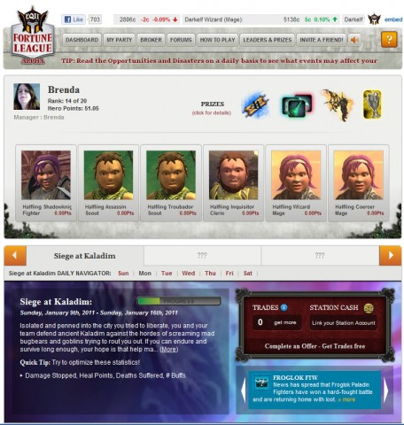

Back to: [West Karana](/posts/westkarana.md) > [2011](/posts/2011/westkarana.md) > [January](./westkarana.md)
# Fortune League, or, Wall Street Raiders

*Posted by Tipa on 2011-01-10 23:50:12*

I was pretty darn excited when I read that SOE was starting up [Fortune League](http://apps.facebook.com/fortuneleague/), a Facebook game based on EverQuest 2, with rewards that would transfer back to your EQ2 characters. You could make just exactly the party you wanted, participate in raids and generally the best parts of your EQ2 experience would seamlessly translate to the social media.

Blogfriend [Eliot Lefebvre at Massively wrote](http://massively.joystiq.com/2011/01/07/fortune-league-brings-everquest-ii-into-the-facebook-realm/) that Fortune League was:

> a game in the earliest stage of testing that will let players adventure in Norrath even when they can't log in to the game proper.

That got me really excited about the game! But I could hardly find anything on the website past instructions on how to create a party and buy characters from the broker. After creating your party, the "How to Play" section gives you one final thought to send you on your way:

> Adventure: Maximize your points over the course of the Adventure for additional prizes and bonuses.

O-kay... right there with ya. Let's go adventure. But how? Was this something where I'd press an "Adventure!" button and then get a report on how my party did -- something like [Legends of Zork](http://www.legendsofzork.com/)? (Where I have 258.8M Zorkmids at the time of this writing, through the miracle of compound interest).

Anyway, the Fortune League website said the new raid, Siege at Kaladim, would begin Sunday. I was right there Sunday with my all-evil halfling party, ready to take on the horde of bugbears, hobgoblins and other assorted meanies but I STILL had no idea what to do.

Today I logged in and found I had made some points. Some people had made a LOT of points. Very few had made fewer. Clearly those with a lot of points had figured out what to do and had done it, and those of us who remained clueless were wondering how we got any points at all.

It struck me this evening -- the game wasn't about ADVENTURING. It was about TRADING CHARACTERS. Chattel slavery, really. See, what happens is you build your party and watch the broker -- the broker for characters. You buy low, you sell high, and alerts during the day give you hints on which class/race combos are rising or falling so that you can make informed character trades.

You get a couple of trades free each day, but more than that will cost you Station Cash -- the SOE RMT system.

So, anyway, there ya go. Fortune League isn't about adventuring in Norrath. Fortune League is a stock trading simulation, where your stock is adventurers. You try to maximize your hand, er, party, and at the end of the week, the player with the best hand wins.

## Comments!

**[Green Armadillo](http://playervsdeveloper.blogspot.com)** writes: I hadn't realized that it cost Station cash. There went my interest in creating a facebook under my pen name to try it. For those of us who don't have paid work experience in or covering MMO's, I maintain that disclosing the info that you play on a page where potential employers can see it without any context on you as a person is a bad idea.

---

**[Tipa](https://chasingdings.com)** writes: I think playing Facebook games isn't a career-killing move.

---

**[stargrace](http://mmoquests.com)** writes: Huh. So that's how you "play" - I gave this game a shot, and by a shot I mean I logged in and stared at a wall of adventurers and stats without a clue of what I was supposed to do next and how to do it. It didn't look fun at all, and I have no idea what those in-game items may be that it claims to reward.

---

**[Bhagpuss](http://Yourwebsite)** writes: Well, I won't be making a Facebook profile for that. 

Also, some of us don't have careers, just jobs. Unless it's something I could get put in prison for (and thereby not turn up to work next day) no-one that employs me cares what I do when I'm not actually on the premises. Or that much when I'm there, come to think of it.

---

**[Eliot](http://www.massively.com/bloggers/eliot-lefebvre)** writes: True story: as I was writing that post, we were also graced with a few screenshots of the game. I took one look and said that I would not include them in the post.

"Why not?" asked my editor.

"Because they look like what people who don't like EVE think EVE looks like."

I don't play EQII, but the screenshots alone made me a little bit leery. Unfortunately, my lack of experience was writ large when I was unable to suss out the particulars of how the game worked. I apologize.

(Also, I've been upgraded to blogfriend now? Keen.)

---

**[Tipa](https://chasingdings.com)** writes: @Eliot -- Yeah, I didn't post the stats/party page either. I wasn't blaming you, there was no way you could have played the game since it only started Sunday. It's the SOE publicity machine that's to blame.

We weren't friends before? :(

@Stargrace -- the prizes are wings and some house items, like a scroll that says you won. You can click on the prize icons for more details.

@Bhagpuss -- I understand being leery about using your real life info to play games. Hell, there's my picture and real name right in the screenshot. I hid behind my character name for years, but now I just don't care. Everyone at work is on Facebook and/or LinkedIn, some of the people at work are gamers. I guess in the end, when I die and someone does a Google 10.0 search on my life, I would like to have left an impression, rather than just be a bunch of anonymous game characters with no real achievements. Gaming is part of my life, but for years that's all anyone knew about me.

Note that I still don't use my real name on my blog. Not that I worry about people I know reading it -- I couldn't PAY people I know in real life to read my blog :)

---

**[stargrace](http://mmoquests.com)** writes: I spent some time playing it, and actually came up ahead. It's exactly like as you described. There are "issues" that come up, like a froglok paladin may be a better fit for a day than your current warrior. Clerics may all be ill, etc. Little hints to spur you on to sell and then buy. As a "free" game you have up to 3 trades (not sure if that's forever, per adventure, or what) and then you're stuck with your party for the duration of .. however long until you're allowed to trade again. The adventures seem to take a week, the current one runs from January 9th until the 16th. 

I would rather actually get to play through the adventure, much like the dungeons and dragon facebook game. Or at least do something aside from buying and selling characters, but maybe that's in the works, since it's an alpha I have no idea.

---

**[Tipa](https://chasingdings.com)** writes: This isn't an SOE game; it looks like a reskin of some other browser game with EQ2 assets. I think what you see here is what you get. 

---

**[stargrace](http://mmoquests.com)** writes: The one major issue I see is that in order to link it to your SOE account to claim prizes, you have to actually put in a support ticket. You can only link brand new SOE accounts with it. Uhm. How many non-Eq2 players did they think were going to play to try to win in-game items? .. 0\_o

---

