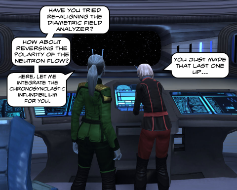

Back to: [West Karana](/posts/westkarana.md) > [2011](/posts/2011/westkarana.md) > [January](./westkarana.md)
# Daily Blogroll 1/12 -- Snow Job edition

*Posted by Tipa on 2011-01-12 06:00:02*

A whole weekend lost in a Rift, but I think what I'll remember most about this last weekend was this jerk in General chat -- named, ironically, Karana -- who was going on and on about how the quests and everything else about the game was a copy of WoW.

Well, heck, I didn't know Thomas Edison was resurrected just to offer his genius insights. But some people just can't see past their own experiences with WoW. Like, the people complaining that every one of the classes will have a 50/16/0 point spec, as if the class-defining abilities of each 'soul' only happen once 50 points are spent on it, similar to WoW's talent trees. ACTUALLY, the class-defining skill is usually given for free, at zero points. Smart players will have a synergistic three soul mix. Anyway, already went on about that, and though I'm loving Rift and have applied to a guild, I'm really tired of reading about it.

Well, let's see if there's some stories from the weekend that aren't about Rift, shall we?

**Star Trek Online**

Just second to the Foundry in Star Trek Online's most anticipated feature list is the return, this weekend, of the weekly Featured Episodes. The first arc dealt with the icy Breen, the villains of the Dominion War that razed Earth. That was followed by the battle against the vampiric Devidians. [This third arc starts with Romulan trouble](http://www.startrekonline.com/feature_episodes). With hints of a connection to earlier episodes, does this continue the deadly marriage of Romulan and Borg technology? We'll find out Saturday. [Thanks to Blue Kae for the heads-up](http://bluekae.com/2011/01/11/featured-episode-series-3/)!

**DC Universe Online**

With today's launch of SOE's PC/console superhero MMO tearing up the interwebs, Slurms of Multiplaying [had a quick poll to gauge the excitement](http://www.multiplaying.net/2011/01/11/oh-dcuo-is-out-today-heres-a-poll/). Sounds like SOE should have given the title a little more publicity. Though with it plastered over every gaming site, I have o idea how anyone could not have known it was launching...

**Champions Online**

On the very day that superhero rumbler DC Universe Online launches, Cryptic announces that their own cape-and-spandex offering, Champions Online, [will go cash shop powered](http://www.rockpapershotgun.com/2011/01/11/champions-online-free-to-playness-dated/) on the 27th of this month. I find the two games very similar in feel, but only one of them is playable on the PS3.

Anjin of Bullet Points [goes into some detail](http://bulletpointsblog.blogspot.com/2011/01/news-filter-champions-online-f2p-starts.html) on what you will and will not get for your free play in Champions Online.

**Dark Age of Camelot**

You almost never hear anything good about "zerging" -- throwing players at a problem, replacing strategy with sheer numbers. Maybe it's gotten a bad rap; Keen makes some excellent arguments as to [why you should love the zerg](http://www.keenandgraev.com/?p=4679) and how it made DAoC the premier PvP MMO of the decade.

**EverQuest**

EQ means a lot to us old MMO gamers. I played way too much, but I did come away with some great memories and good friends. [Kaozz reminisces about the game](http://www.ectmmo.com/2011/01/digging-through-past-everquest.html) a bit and points out that [EverQuest will be opening a new progression server later this March](http://eqplayers.station.sony.com/news_article.vm?id=52135). The server will open with no expansions available, then slowly open up expansions as time goes on.

This would be a PERFECT opportunity for gamers to [take up the MMO Challenge](../../../index.php/2011/01/11/the-mmo-challenge-revisited/) and dive into the game that shaped modern MMO gaming.

By the way, I was thrilled and humbled to be asked to [share my own EQ memories](http://massively.joystiq.com/2011/01/11/the-game-archaeologist-and-the-neverending-quest-the-vets/) in Justin Olivetti's "Game Archaeologist" column on Massively. I hope some of my old Crimson Eternity guildies recognize their characters in those screenshots :)

**Pirates of the Burning Sea**

Zoso at KiaSA writes about [his adventures in Flying Lab's "Pirates of the Burning Sea"](http://www.kiasa.org/2011/01/11/the-existence-of-the-sea-means-the-existence-of-pirates/). He loved the naval battles and was not so wild about the avatar combat... pretty much the same player verdicts since the game's launch.

**Mythos**

[Thanks to Jef Reahard](http://massively.joystiq.com/2011/01/11/mythos-quest-system-detailed/), who's become a regular link on this blog, news that Frogster is ramping up its [coming launch of the embattled action MMO across Europe](http://www.mythos-europe.com/en/index.html). 

[I wrote last week](../../../index.php/2011/01/07/daily-blogroll-17-better-than-life-edition/) that the North American release of Mythos seemed to have fallen off a cliff. That silence was broken Monday with [a post from community manager Mundo](http://forums.redbana.com/showthread.php?t=34237) on the Redbana forums about the state of the NA beta. Seems Hanbitsoft is totally focused on the European launch, and has no dates for its introduction to the states.

At least they allow people to discuss the European release on the forums, now.

**LEGO Universe**

Speaking of games that seem to have dropped off a cliff; when NetDevil's LEGO Universe launched last fall, everyone was shedding ink talking about its wonders. Since then, silence. Oz of Kill Ten Rats explains what's been going on inside the game all this time and -- not very much. [Not the amount of new content promised](http://www.killtenrats.com/2011/01/11/lego-universe-commitment-challenge/), not by a long shot.

Real question: Are 8 year old kids noticing?

**EverQuest 2 Extended**

After her break-up with EverQuest 2 over the intrusiveness of its cash shop and other issues a few weeks ago, MMOQuest's Stargrace finds that [EQ2X's housing](http://mmoquests.com/2011/01/11/eq2x-and-my-rambling-eq2x-eq2/) may just possibly be enough to bring her back to the game in some (free) capacity. Well, the EQ2 "live" game isn't doing that well; maybe it's time to get with the program and join the F2P side.

**Rift**

No getting around it, the blogerati have been drinking in the Rift betas. This last weekend focused on instanced battlegrounds -- "warfronts" -- and the level 20-27 adventure zones for the two factions.

Tramell of Steel Harmony tried out [both warfronts](http://steelharmony.com/archives/1754) and the Stonefields, a Defiant-controlled zone under attack from the Plane of Earth. I think he got Black Garden and Codex mixed up.

Is Rift a throwback to an earlier era when MMOs required grouping to progress? Pete of Dragonchasers admits that there are many things you will need other players for; but [you don't really need to be grouped for most of them](http://dragonchasers.com/2011/01/11/twitter-brawl-grouping-and-rift/).

**Is Blogging Journalism?**

Massively's Jef Reahard, who stirred some controversy last week with his dismissive summary of Rift, is back to address those readers who played the "journalist" card. TL;DR version: [Bloggers are not journalists](http://massively.joystiq.com/2011/01/11/the-soapbox-game-journalism-is-not-journalism-yet/), and GAME bloggers are far too cozy with game developers to get the necessary distance to allow real reporting. Particularly ironic is his condemnation of pro blogs that happily retype game company press releases and call it news. The irony being that Massively.com would be a far slimmer site if reworded press releases were removed.

Oh, I think that's enough for now. No big Lucent Heart news on the horizon.
## Comments!

**Longasc** writes: I am afraid the massive (undeserved) flak Reahard got for his opinion on Rift must have unhinged him. This Soapbox was a bit strange.

There are so many blogs where people blog about things they like to talk about, which is in some cases gaming/MMO gaming.

I would even say most don't even consider becoming game developers or journalists at all. I personally believe the blogs I read are not written by wannabe journalists or game devs.

I wonder if Mr. Reahard considers himself to be a true journalist, in this case my condolences for not having found a proper journalist job and having to write for a pseudo-journalistic blogger conglomerate like massively...? :P

I would like to agree to some extent that bloggers turned into journalists usually make for poor journalists though.

---

**Azyrie** writes: Oh wow, you've applied to a RIFT guild already?

Which server will it be on? I wouldn't mind bumping into you sometime come release day!

---

**[Tipa](https://chasingdings.com)** writes: I find I can't really enjoy playing a MMO by myself. I can do another run through of Dragon Age and get all the fantasy stuff. So i figured I'd better look for a guild. I went to the Rift forums and found a crossover LotRO guild comprised of adults who wanted to gear up for casual raiding eventually, but before that, lots of dungeons and rifting. This is everything I want -- plus they were on the Defiant side. Hoping it will be a great match.

They are Black Company on the Belmont server, assuming the beta servers make it into launch.

---

**[Tramell](http://steelharmony.com)** writes: Nope had it right. Codex was the matryrdom map and Black Garden was the domination map :P I have SSs to back me up :D. Gotta send me a link to the guild you applied to. Cheer connecticut, don't bike in the snow! Wonder if they make snow bikes

---

**[kaozz](http://www.ectmmo.com/)** writes: I always miss Everquest when I'm gone for too long. That was a really good read on Massively! I always enjoy hearing about your EQ adventures and thoughts. 

I'd like to start on the progression server but I am crossing my fingers the transfers to FV will open up soon so I can have all my characters on one server... Hope I have enough slots!! I am sure at some point I'll be checking out the new server just to experience it a bit too.

---

**[Blue Kae](http://bluekae.com)** writes: Thanks for the link! I should probably look into finding a guild myself, like you I'm much more likely to stick with the game that way. Black Company sounds great (especially with the Glen Cook reference) except I had my heart set on the PvE-RP server.

---

