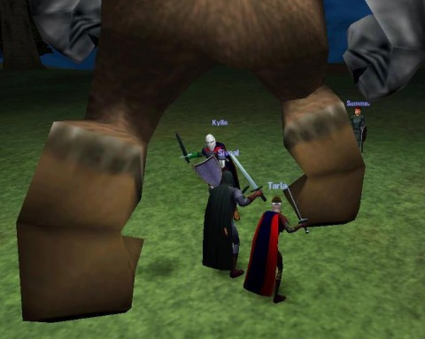

Back to: [West Karana](/posts/westkarana.md) > [2011](/posts/2011/westkarana.md) > [January](./westkarana.md)
# The MMO Challenge, Revisited.

*Posted by Tipa on 2011-01-11 22:41:19*

*I still have lots of good memories from DAoC's beta!*

About three years ago, I was drifting around from MMO to MMO, looking, but never finding, a game that would give me that same feeling of adventure and connection that I'd felt with EverQuest. After thinking for awhile, I had an epiphany; I knew what had changed. It wasn't the games; it wasn't even me. I had then and still have plenty of enthusiasm left for gaming, as much or more than I had in 1999.

The problem was **choice**. There was too much of it. Ultima Online wasn't the first online MMO (not by a long shot), but it was by far the most popular. When EverQuest came along, now you had two serious, state-of-the-art MMOs. MMO gamers either played UO or EQ, and if you hung out in a game store, you'd hear people arguing about them. The success of those two led to Dark Age of Camelot and Asheron's Call soon after, and then things REALLY took off in what I think of as the MMO Bronze Age.

World of Warcraft forced a major reset, outright killing most weaker MMOs and forcing those that remained to heavily retool. Choice was pretty much eliminated. WoW was the game. People who didn't play WoW were fringe gamers.

We're coming into the Golden Age of MMOs. Really, truly, unarguably innovative games are coming out all the time. I'm not talking just about Rift. Wizard101 had a startlingly new battle mechanic hidden beneath the candy-colored graphics. Guild Wars and Star Trek Online explored hireling dynamic.

This year alone sees the launch of Rift, TERA Online (we think), Star Wars: The Old Republic, Lucent Heart and probably Guild Wars 2, all major titles.

And so I come to my MMO Challenge. Three years ago, I realized that to grab back that "my first MMO" feeling, the feeling that made us fans of the genre in the first place, I would have to [choose one single game and stick with it a full year](../../../index.php/2008/04/07/the-mmo-nostalgia-challenge/).

Since then, I have devoted myself to a bunch of games, some for shorter, some for longer. That very year, I accepted my own challenge and threw myself into Wizard101. I later did the same for EVE Online, Chronicles of Spellborn and Star Trek Online. I might not have gotten a year out of them, but I did get that focus and clarity you get from playing just one MMO.

This year, I am taking up the gauntlet again and plan to devote myself to Rift as my main game, the one I log in to whenever I sit down for gaming. If SWTOR or GW2 comes out, well, cool. But they will just have to wait. You can't immerse yourself in two MMOs.

I'll still play Sunday night DDO, and the STO feature episodes. But most nights, I'll be exploring Telara.

Now, I'm passing on this challenge to my reader(s?). Pick one of the new MMOs coming out this year, or any MMO you have not yet played but think you would enjoy, and just make that your main MMO for an entire year. You will make friends and memories. You will see everything in the game and get a unique perspective that people who dabble can never have.

If you do this, and have a blog, write up your adventures! Even really popular games are new when a new player plays them. If you don't have a blog, consider making one (really easy!) and send me the URL so I can read about your experiences!

[Syncaine of Hardcore Casual](http://syncaine.wordpress.com/) is the master of this kind of challenge. With his laser focus on PvP games like Darkfall and now strategy games League of Legends, Mount & Blade: Warband, he halfway gets me to buying and playing games I'd have thought I had no interest in. I know I'm always going to get a great story when I go to his site.

[Saylah of Mystic Worlds](http://notadiary.typepad.com/mysticworlds/) is that same kind of writer. I first got hooked on her WoW adventures, stuck with her through Runes of Magic, Wizard101, EVE Online and now Rift, and every time it was an amazing read.

[Stingite at The Friendly Necromancer](http://thefriendlynecromancer.blogspot.com/) does this sort of thing so well, he's right at the center of the Wizard101 community, always finding new and clever ways to play. Most recently playing through the game without any gear -- just to prove a point that skill and strategy trump expensive clothing and jewelry.

You can dabble in a half dozen games and never make an impression -- or you can be like these fine bloggers and make a commitment and some memories. If you're thinking about trying a new MMO out anyway, why not make a decision to make it your ONLY MMO until you've wrung everything you possibly can out of it?

## Comments!

**[pasmith](http://dragonchasers.com)** writes: I find it really tough to stick to just one game, but I want to accept your challenge. It'll be boring for you because I'm choosing the same game you are (Rift) and I think accepting a year challenge would be setting myself up for failure, but I'm going to accept a 6-month challenge. Rift will be my Main Game from Feb 24 to September, when that 6-month sub runs out.

---

**Barakah** writes: I'm taking the challenge with Rift. The founder pricing makes it easy, so I will start off with a six month sub and run from there.

---

**[Tipa](https://chasingdings.com)** writes: It won't be boring for me :) I love reading what other people are doing in the games I play. And besides, I'm playing Defiant -- you'll be Guardian, so it will be great to see the game from different perspectives.

I don't know if Rift has a year of content in it -- and I'm hoping SWTOR comes out in the fall so I won't have to miss its launch because of Rift. But I understand that, for me, if I really want to enjoy an MMO, the only way that works is to make it my main, if not only, game. Good with the bad. Come what may.

---

**[Tipa](https://chasingdings.com)** writes: @Barakah Cool! See you there :)

---

**[Ziboo](http://mmo2go.blogspot.com)** writes: That is so true. I've been hopping between toooo many games the past year and it is a bit aimless at times. Giving up EQ2 and WoW will be hard (and I'm sure I'll visit!), but from what I've seen so far, Rift will be my MMO of choice too.

Maybe if I was rich and retired, I'd be able to manage a couple, but time-wise, one played well is a much better idea!

---

**Igneous** writes: I would really enjoy doing something like this, but I can't decide between Rift and Guild Wars 2. Both sound amazing, and I really like the flexible class systems in both. I simply can't make a decision.

---

**[Tipa](https://chasingdings.com)** writes: It would perhaps be easier if we knew when GW2 was being released... Is it even in beta yet? I'm thinking, in this particular case, do one and then the other.

---

**Mbp** writes: In a way Tipa you are trying to turn the clock back to a time when there were fewer games to play. I think a more common response to the plethora of mmorpgs on offer is to play one game exclusively for a period of a few months and then move on. This is a major shift in player habits and it means that there is a new criteria for a successful game.A game doesn't have to hold on to players forever if it can keep attracting former players to return once a year or so for another few months. World of Warcraft is very good at this, so is Eve and so is Lotro. A major advantage of f2p payment models is that they lower the barrier for returning players.

---

**[Eliot](http://massively.joystiq.com/editor/eliot-lefebvre)** writes: Personally, I play multiple games for two reasons. The lesser reason is that it's my job, but the more tangible one is that I learned my lesson a long time ago about how much I expect out of a given game.

If I want something sandboxy and open, replete with RP and lulls between action, I can pick up FFXIV. If I want a themepark that directs me from point A to point B and pulls me along with some semblance of a story, I can pick up WoW. If I just want to get in and smash things, CoH lets me do so with no regrets. And over the course of a given week, I find I have no real certainty about which of those I will want. From my experiences, I've enjoyed the games I'm playing more if I let each one focus on what it does best rather than trying to scratch all my itches in a single game.

That having been said, I'm curious how your year in Telara will go. You did manage to sell me on STO back in the day.

---

**[Daily Blogroll 1/12 &#8212; Snow Job edition - West Karana](https://chasingdings.com/index.php/2011/01/12/daily-blogroll-112-snow-job-edition/)** writes: [...] would be a PERFECT opportunity for gamers to take up the MMO Challenge and dive into the game that shaped modern MMO [...]

---

**[Bronte](http://arewenewatthis.wordpress.com)** writes: Wow dude, very well said indeed. I think that is the problem I was having with WoW. Every time I take a break from WoW, I drift from MMO to MMO, looking for that perfect game, getting bored in a month or so, and moving on to the next think. For me, WoW isn't the "go to" game because it is so much better than the competition, it is my go to game because I have played it the longest and I am most comfortable with its systems. So every time I tend to drift, i eventually end up back at WoW because it feels the most like home.

---

**[RJO](http://www.adventuresoftaas.com)** writes: Alright, I'm in - Rift.

---

**[Tipa](https://chasingdings.com)** writes: Cool! See ya there!

---

**Friendly** writes: Hey! Thanks for the mention Tipa! At this point it would be extremely difficult for me to pull away from Wizard101. It's been two years plus now. I've met hundreds of people because of it. 

I would like to fall in love with another mmo, but I'm still debating it. Either way, I'll for sure be following your adventures, and thanks for the support. :)

---

**[Bhagpuss](http://Yourwebsite)** writes: I generally agree with pretty much everything you write, Tipa, but I have a slightly different take on this. While it's possible to make an intellectual decision to play just one MMO, I don't think that alone can get you to where you want to be - immersed, absorbed, fascinated, compelled.

I think it works the other way round. It's the particular game that grabs you emotionally and won't let go, so that when you sit down in front of the monitor each day it's all but impossible to click on any other icon but the one that will open that door to that world. That's magic that you can't control or create with willpower.

It's happened to me on five separate occasions with Everquest, where each time after the first a simple visit back led to me playing little else for months at a time. It happened with EQ2 after the Scott Hartsman revamp (but not before, when I virtually had to force myself to log in). It happened like a forest fire with Guild Wars, and like a forest fire burned out fast. It happened most recently with Vanguard. 

I have preordered Rift with the 6-month sub. If the magic happens this time, that six months will be almost all about Telara. But I can't make that happen by wanting it, or willing it.

---

**[Saylah](http://notadiary.typepad.com/mysticworlds/)** writes: Thanks for the mention. I love your blog and writing so the compliment means a lot. I'm half embarrassed to I pre-ordered today based on the one beta event. Like I wrote in my impressions, it's not 100% new innovative or unique nor does it have to be in order to be entertaining. I've read some of my most favorite books a dozen times or more and the same for favorite movies. There are certain series I'd follow to the ends of the earth if they'd just keep pumping out more.

Rift is like the continuation of a good book or movie. It has more diversity than the PQs I enjoyed so much in WAR and better over all PVE. It ranks up there with some of my all time favorite classes - two were in WAR, one from AOC, one from AC2 and the three from WOW. Good PVE with a really fun class is enough to make a good run in any MMO, plus the rifts, PVP when you want it and average crafting.

It's also not WOW. No matter how amazing I found the changes in Cata, I just can't make myself do it again with Blizzard. Tri-box the low content when I'm in the mood, yes. Make another trip to the top, given that I'd have do Wrath first, sadly, I just can't motivate myself to do it.

Besides which, OMG the steam/techno/cyber punk on the Defiant side is enough to make me level to see more. I have a story I'd been working on here and there that it reminds me of which made me smile ear to ear.

I'll still be in EVE because my plans are easy to walk back and forth with but I'm hoping - really hoping, that Rift can be my fantasy MMO.

---

**[kaozz](http://www.ectmmo.com/)** writes: I'd like to step up to the plate and try. I just have to figure out what I will go with. EQ maybe? Hrmm... Lots of content. Then again Rift is due out soon. I wish GW2 would hurry up! I'll have to consider my options.

---

**[Deliciously Random &laquo; Hardcore Casual](http://syncaine.wordpress.com/2011/01/14/deliciously-random/)** writes: [...] Tipa over at West Karana is at it again with her MMO challenge, something I fully support. I think there is a rather sizable population of MMO players who have [...]

---

**[Tesh](http://tishtoshtesh.wordpress.com)** writes: Considering that I can't even play a single player game to the exclusion of others, or read one book at a time, for a variety of reasons, I'm not going to go on an MMO binge. I think you're right, a singular focus will give a different experience... it's just not something I *do*. That said, here's hoping it's fun for you. :)

---

**[/AFK: I Am Disappoint Edition &laquo; Bio Break](http://biobreak.wordpress.com/2011/01/16/afk-i-am-disappoint-edition/)** writes: [...] West Karana — The MMO Challenge, Revisited “Now, I’m passing on this challenge to my reader(s?). Pick one of the new MMOs coming out this year, or any MMO you have not yet played but think you would enjoy, and just make that your main MMO for an entire year.” [...]

---

**[Scott](http://pumpingirony.net/)** writes: Does it count if I just stick to the same "main" MMO that I've had for the past 4 years? =D

We're still allowed to dabble, though, right?

---

**[Tipa](https://chasingdings.com)** writes: Pfft, that's the way MMOs are SUPPOSED to be played -- as your main focus! My challenge is for those of us (like me!!!) who just feel constantly pulled to one game and then another. There are SO MANY really good MMOs out there that reward focused gameplay; it's really a disservice to the entire genre to play them in drips and drabs over time. I know for certain that I would enjoy WoW a LOT more if I just stuck with it.

---

**[Failing the Challenge | Ardwulf&#039;s Lair](http://ardwulfslair.wordpress.com/2011/01/18/failing-the-challenge/)** writes: [...] at West Karana reminded us last week of her MMO Challenge. Which is, in short, to pick one MMO, stick with it for a whole year, and [...]

---

**[Se7en Tidbits: &#8220;Words of Advice&#8221; or &#8220;Actually It&#8217;s 9ine Tidbits&#8221; &laquo; Are We New At This?](http://arewenewatthis.wordpress.com/2011/01/18/se7en-tidbits-words-of-advice-or-actually-its-9ine-tidbits/)** writes: [...] admonishes that you pick an MMO in 2011, and stick with it. [West [...]

---

**[Challenge: Accepted &laquo; Combat Archaeology](http://combat-archaeology.net/2011/01/20/challenge-accepted/)** writes: [...] Roughly every year for the past three years, Tipa of West Karana has done a personal “MMO challenge” — she’s chosen an MMO she’s never played before and makes that her main game for [...]

---

**[Adventurer Historian](http://combat-archaeology.net/)** writes: Alright, [I'm in](http://combat-archaeology.net/2011/01/20/challenge-accepted/).

---

**[bonedead](http://bdadv.wordpress.com)** writes: I don't think I've ever played one MMO for a year straight. But, it does sound like a perfect world. After a month or two in one game I always find myself thinking about that one MMO that I've played 5 months over 5 years or the one I usually play after that or... etc etc. I'm seriously going to try this and I'm looking forward to it.

---

**[Andrew](http://systemicbabble.com)** writes: *"Three years ago, I realized that to grab back that “my first MMO” feeling, the feeling that made us fans of the genre in the first place, I would have to choose one single game and stick with it a full year."*

And therein lies the reason that MMOs don't do it for me anymore... to play them to satisfaction you need to dive in to the exclusion of nearly everything else, and thus miss many many excellent games. Screw that - variety is king when it comes to being a gamer..... it's counter-intuitive to only play one game.

---

**[Tipa](https://chasingdings.com)** writes: Very true; MMOs ARE games that require a fair amount of commitment.

---

**[DrkAdonis](http://drkadonis.unixium.com)** writes: This may be a bit of a necro-post, but I'm catching up on my Google Reader, sorry!

I love this idea. I have felt the same kind of thing recently - burning out on too many games all at once. I just canceled my accounts decided to wait patiently for SWTOR. I have some F2P games I can engage in with my friends in the meantime, but TOR is going to be the mainstay.

I accept your challenge! I will take up the mantle of "only TOR" for a year, and I will love every moment of it!

I have a small blog that I've tried to get started, but making the time to post always seems an issue to me... but I've been doing better lately! Come check me out!

---

**[Call and Raise | Blue Kae](http://bluekae.com/2011/03/03/call-and-raise/)** writes: [...] not planning to go all in like Tipa has and commit to Rift as my primary game for the year, but I did switch to the six month [...]

---

