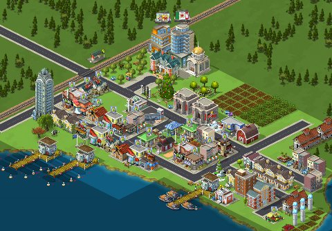

Back to: [West Karana](/posts/westkarana.md) > [2011](/posts/2011/westkarana.md) > [January](./westkarana.md)
# Facebook's Least Popular Games

*Posted by Tipa on 2011-01-13 21:13:04*

I read today that [Zynga's CityVille now has over 100 million monthly active users](http://news.cnet.com/8301-13506_3-20028436-17.html), making it the most popular game on Facebook, outstripping all the other Zynga games and, of course, every other game in the world.

Eat THAT, World of Warcraft.

Among my own CityVille neighbors are players from Thailand, Japan, China, India and all across Europe. A lot of South America. Its clicky nature is also its biggest strength. Deciding to break the Zynga stranglehold on SimCity variants, I logged on to Steam and bought SimCity 4 and its expansion that lets you go on driving missions in your cities.

I lost an entire day to that game. I have no idea what happened, but I ended the day with three self-sufficient cities -- the last built around a really high mountain, just to make things interesting. It had also withstood meteor attacks and a TV robot. Anyway, I really can't afford to lose entire days. Zynga limits how long you can play CityVille. I love Sim-games too much to actually play them uncut.

Anyway, so if CityVille was Facebook's most POPULAR game... what is Facebook's LEAST popular game? A game that is played by at least one person, that is -- there are hundreds of FB games nobody plays.

These are actual, real Facebook games. Clearly there's a pretty low barrier to entry. So if you've ever wanted to be a game developer, well, could you be the next Izal Aya from the [Indonesian Hacker Team](http://www.indonesianhacker.com/)!

* 67920: [Doughnut Fight](http://www.facebook.com/apps/application.php?id=385016341773) *Declare a yummy war on all of your friends! Shoot with sprinkles, and cream their faces with chocolate. All is fair in donuts and war.*

* 67923: [WarCrusade](http://apps.facebook.com/idolkosaytan/) *WELCOME TO WAR CRUSADE THIS GAME IS VERY IF YOUR ACTION POINTS IS 0 DON`T WORRY GO TO THE BATTLE ARENA AND BATTLE OTHER PLAYER NO STAMINA ITS FREE*

 * 67954: [Gates vs Jobs - The Game](http://apps.facebook.com/gates-vs-jobs/) *With this app, it is up to you which side you are fighting the Empire, whether Jobs or Gates, you have the choice!*

* 
69975: [Know Your Contemporary Canadian Poets](http://apps.facebook.com/trv-know-your-ftuzj/) Um, Rod McKuen? Neil Young?

* 70006: [Wot will ur kid look like when they start skooll?](http://apps.facebook.com/what-will-ur-bddajhc/) Her follow-up app was "I will tutor ur kid when they start skool!"

What's YOUR favorite unpopular Facebook game??? [Check them out here](http://www.appdata.com/leaderboard/apps?page=1698)!
## Comments!

**[Tesh](http://tishtoshtesh.wordpress.com)** writes: I haven't played any Facebook games, and I have no plans to do so. I did, however, buy Civilization Revolution for the XBox last night. Gotta break Zynga!

---

