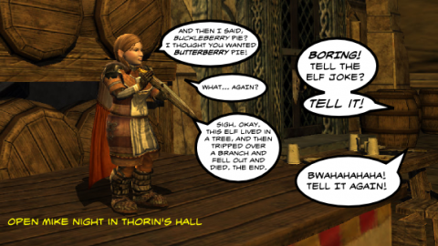

Back to: [West Karana](/posts/westkarana.md) > [2011](/posts/2011/westkarana.md) > [January](./westkarana.md)
# Daily Blogroll 1/14 -- Old Character's Home edition

*Posted by Tipa on 2011-01-14 06:00:42*

Who owns your MMO character? The game companies say they do, but they didn't put hundreds of hours into turning the character from an animated paper doll into a person with relationships, memories, friends, victories, stories and history. But it's precisely because you HAVE taken the time and done all these things that the companies can keep running their game. But as long as game companies control access to your character, you're paying them so that you can add value to their game.

There's no technical reason why you can't take your character out of the game and put it somewhere else -- Second Life, for instance. There's LEGAL reasons, based on the assumption that you don't own your character, but technically it's possible. Take a video while spinning the camera around your character and you could have enough info to make a 3D model and then do whatever you like with it.

This issue comes up again and again, I know. But, darnit, it may be their game but it's MY character!

Anyway. News after the break.

**Earth Empires**

Just when you thought it was safe to be an MMO player, giving your mom advice on gearing up her holy paladin, chatting with strangers on the bus about your latest boss kill in Cataclysm... and then some whack job goes nuts and slaughters a bunch of people in Tucson and word gets out that ... [HE WAS A MMO PLAYER, TOO](http://www.aolnews.com/2011/01/12/earth-empires-5-facts-about-the-mmorpg-where-jared-loughner-pos/).

Helpful hint: If you play EARTH EMPIRES, just keep it to yourself for awhile.

**EverQuest 2**

This just in from superblogger Stargrace: EverQuest 2's next expansion, Destiny of Velious, [has been delayed a couple weeks](http://mmoquests.com/2011/01/14/destiny-of-velious-postponed-pre-orders-announced-eq2/) until February 22. Reminder: If you're a subscriber, purchasing and registering this expansion is the last piece of the puzzle to get you your own bloodsucker to play with.

**Cryptic's Secret Project**

[Via Gaming Blend](http://www.cinemablend.com/games/Cryptic-Studios-Making-Secret-Game-29364.html), word that [Cryptic is working on a FOURTH MMO](http://www.crypticstudios.com/in_development). No hint of what it is. This will be their second game for Atari, after announced but not released Neverwinter. With their first game, Champions Online, due to go Free2Play soon, and [heavy speculation](http://biobreak.wordpress.com/2011/01/12/weird-question-of-the-day-8/) that their second game, Star Trek Online, will soon follow, Cryptic certainly isn't sitting back and resting on its laurels.

I have no good guesses on what the new game could be. The Atari of today is not the Atari we grew up with, so I don't know what kind of intellectual properties they control. If I had to guess, I'd guess [Star Raiders](http://www.atari.com/starraiders).

**Rift**

Via Massively, et al, [a cool video showing the "souls" system in action](http://massively.joystiq.com/2011/01/13/rift-reveals-warrior-build-your-class-video/) to instantly change a warrior from a solo spec, to a tank spec, to a PvP spec, by mixing three souls together in interesting ways. Everyone in WoW who isn't a hybrid shares a little bit of envy for the paladins, druids and shaman out there who move easily among different roles. Well, in Rift, you can more or less do that same thing with any class. The video shows a warrior switching from a dual-wielding pet class, to a sword-and-board tank, and then to some sort of vampiric killing machine thing for PvP.

On my Rift guild's forums, we've come up with the perfect (we think) rogue spec... here's hoping Trion does one of these videos for every calling so we can see if they agree. And damn, that video makes me want to level up and see these places. Those raids look like FUN.

Pete Smith of Dragonchasers tries to explain [how the soul system is NOT like WoW talent trees](http://dragonchasers.com/2011/01/13/choice-game-design-and-mmos/), once again...

Ravious at Kill Ten Rats kinda likes the single group rift sealing, and kinda likes the zone wide invasion fights, but there's that mushy spot in the middle where things seem like a big deal but nothing you can do seems to help? Well, [all his fears have been laid to rest](http://www.killtenrats.com/2011/01/13/rift-cthulhu-toolkit/) (but we'll see). There were complaints of maybe too many rifts from those dedicated souls who just wanted to finish their quests in peace!

Hint: that's Rift's way of telling you you don't need to quest as much as you think you do.

Zam's [got the scoop on the fifth beta test](http://rift.zam.com/story.html?story=24782). This one raises the level cap to 30 and adds a new zone and dungeon -- and it's SOUNDING like this will be the first contested zone, with Guardians and Defiants mingling. Could be some hot open world PvP action going on. Too bad it's in the middle of the week.

Brannagar at Horriftic Intentions has been reading the RIFT forums and has decided that WoW players have just two fundamental issues with the game. The first is, it is too much like WoW. The second is, [it's not enough like WoW](http://horrifticintentions.wordpress.com/2011/01/12/i-dont-think-the-rift-community-wants-that/). Geez, even Tyler Durden plays WoW?

I'm with Brannagar. Flying mounts, Dungeon Finder, and Arenas would decimate Rift. If people really want to play World of Warcraft, it's RIGHT OVER THERE! GO!

**Earthrise**

Rift hasn't convinced EVERYONE of its obvious superiority to every other game (kidding!). Sente of A Ding World [is eying Earthrise](http://adingworld.wordpress.com/2011/01/12/next-game-to-try-earthrise/), the new post-apocalyptic MMO from Masthead Studios which announced its early February launch date a couple weeks ago.

Whatever. Nothing but a Fallen Earth clone! :) Earth falls, Earth rises... come on, could you get more blatant?

**Goodbye, Adventure Historian**

After a year as a blogger, [the Adventure Historian is hanging up his blogger spurs](http://combat-archaeology.net/2011/01/12/going-home/). You'll be missed! It was great playing with ya in Star Trek Online! Good luck wherever gaming takes you!

**World of Warcraft**

Wasdstomp's [got a bone to pick with lazy players](http://www.wasdstomp.com/2011/01/mmorpg-players-are-lazy.html), by which he means World of Warcraft players. With those add-ons and dungeon finders and Youtube strat videos and just hanging out in a capital city for your next instant group... Hey, that's not fair, is it? NO! [Go give him a piece of your mind](http://www.wasdstomp.com/2011/01/mmorpg-players-are-lazy.html)!

**He forgot VAMPIRE$!**

Justin Olivetti of Massively did [a great look at ten "unconventional" fantasy races](http://massively.joystiq.com/2011/01/13/the-perfect-ten-best-non-traditional-mmo-fantasy-races/). He may have forgotten EQ's Iksar, Vah'shir/Kerrans, Frogloks and Drakken (and EQ2's version of the touched-by-magic Erudites), BUT! he remembered Horizons! Why did that game sink like a rock once launched? Mainly because the game they launched wasn't the game they said they were making. I was always a little dubious about the dragons as a race, anyway, once the devs said that dragon players could pick up players of any other race, fly up a mile, and drop them to their inevitable deaths.

**Wizard101**

The Friendly Necromancer scored [a cool interview with KingsIsle's "lore guy"](http://thefriendlynecromancer.blogspot.com/2011/01/interview-with-jason-durall.html) and got some answers about the story behind the Spiral, hints at the continuation of the Lady Morganthe plot (she's the new big baddie you meet briefly toward the end of Celestia). And it's not a "podcast" or a "video", it's all words that you can just go and read! Words are good!

**Scared of the Dark**

This isn't about an MMO (yet), but Ars Techica ran a story today about Papa Sangre, [an audio only game](http://arstechnica.com/gaming/news/2011/01/scared-of-the-dark-a-look-at-the-audio-game-papa-sangre.ars) -- no graphics, nothing to see here. You have to navigate around a world you can't see.

Imagine that in an MMO.

They are going to have a "big field" mode -- go out and stand in a big field, put on a blindfold and some headphones, and try to keep away from the monsters.

THIS is something I want. Though I guess if someone CATCHES you wandering blindfolded in a field waving a stick-sword and screaming about monsters...
## Comments!

**[Stupid Elves &laquo; Bio Break](http://biobreak.wordpress.com/2011/01/14/stupid-elves/)** writes: [...] okay, the elf joke in Tipa’s post made me laugh out loud.  I’m a petty man. This entry was posted on Friday, January 14th, [...]

---

**[Larhanya](http://my.lotro.com/larhanya)** writes: That cartoon is awesome! My main is an elf and I still LOL'd.

---

**[pasmith](http://dragonchasers.com)** writes: *ahem*

http://twitter.com/#!/pasmith/status/24866753129480192

---

**[Tipa](https://chasingdings.com)** writes: Sorry, Pete! I did not catch this Twitter convo. You rock!

---

**[pasmith](http://dragonchasers.com)** writes: Heh, I was just being goofy with my comment. For all I know a dozen people suggested the same thing, or he'd already decided on that one. But I really enjoyed Horizons for a while. Did you play? Do you remember the huge crafting projects that each server would have to complete (certainly done in other games now but back then I think only Asheron's Call had touched on the same idea). I remember there was a huge mineshaft that would unlock some content, and a giant bridge to another land-mass. Both required that the crafters of the server work together to build, while adventurers protected the crafters from nasty beasts that just so happened to live where the project sites were...

This idea of the player population having to pull together that I love in Rift has been something I've always enjoyed in MMOs, right back to when the GMs would (rarely) spawn ettin attacks on the towns in Ultima Online.

Sadly in the case of Horizons, I spent an entire vacation week grinding crafting to make enough money/resources/whatever-we-needed to buy a plot of land and build a house. By the time I was able to buy, all the plots had been sold already (or at least, I couldn't find one). I got so discouraged (and angry with myself for spending a whole holiday vacation week sitting at the computer!) that I quit. 

Er, sorry...didn't mean to ramble on for so long!

---

**[Tipa](https://chasingdings.com)** writes: Nah, I didn't play. I was hooked by the original game design of 14 separate and all very unique races each with their own unique advantages and disadvantages caught in a shifting web of enmity and alliance. The game that was released bore only passing resemblance, so I stuck with EverQuest.

I did read about all the crafting to unlock content, sounded cool, but not cool enough to take me from EQ!

---

**[Bhagpuss](http://Yourwebsite)** writes: I was in the Horizons beta and it was obvious it wasn't ready to launch. A friend of ours from EQ was gung-ho on playing , though, so against our better judgment Mrs Bhagpuss and I bought Horizons at launch.

It was dull. The crafting system led to cartels within days so it was hard to get gear if you weren't connected. Large areas were empty of any kind of wildlife. Maggots replaced rats as the entry-level mob, which I found pretty unpleasant. The huge social crafting projects to open content took much, much longer than was fun for almost anyone. 

The real gamebreaker, though, was the extreme, unplayable lag in the main city. I couldn't even go through the gates. Mrs Bhagpuss and I lasted til the end of the free month but we didn't subscribe. Our friend stayed there and we haven't seen or heard from him since.

---

**[Adventurer Historian](http://combat-archaeology.net/)** writes: Thanks for the nice link, yo! I'm thinking about what comes next, and if that will entail me keeping some sort of blog. For my own edification -- where do you host yours?

---

**[Tipa](https://chasingdings.com)** writes: I host this one on digitalspace.net. I wouldn't recommend it; I mainly chose it because it was kinda sorta local to where I used to live in California. I'm actually looking for a host for a Drupal installation; I program better in Python than PHP.

---

**[Alexhr](http://www.women-golfers.com/)** writes: Hmmmm, I'm a wow player and the game is really addictive. It's not only about hanging out in capital city, there a lot of skill and strategy necessary, especially in PVP.

---

**[Tipa](https://chasingdings.com)** writes: PvP is playing against other players; that's going to be exciting and strategic no matter what the game, and has very little to do with WoW. In instances and raids, there's no skill or strategy; it's just having the correct gear and knowing your place in the script.

---

