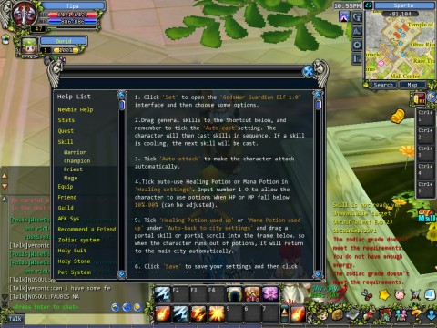

Back to: [West Karana](/posts/westkarana.md) > [2011](/posts/2011/westkarana.md) > [January](./westkarana.md)
# GodsWar Online -- the easiest MMO you'll ever play

*Posted by Tipa on 2011-01-16 10:00:14*

 I'm a sucker for Facebook games; it's my not-so-secret dirty little secret. Especially RPGs. ESPECIALLY MMOs! That's just gonna be made of win for me. There's been a little pirate panda sitting on my ad bar for a couple of weeks now. First 3D Facebook MMO, hmm, okay. I went to the page and it said this about the game:

> [GodsWar Online](http://apps.facebook.com/godswar_online/) is the first fully IGG designed and produced 3D MMORPG. Journey back in time to the land of heroes and legends. Choose sides in the epic battles between Athens and Sparta, fight glorious campaigns alongside demigods and complete quests that will take you across the ancient world. Remember, history is written by the victors, will that be you?

In typical Facebook misleading ad style, we find out that this is actually the first *IGG* 3D MMO. IGG being a Korean game development house, and [GodsWar Online](http://apps.facebook.com/godswar_online/) being a MMO designed to run with [the Kalydo browser plug-in](http://en.wikipedia.org/wiki/Kalydo). Like Pirate Galaxy, it mostly uses Facebook for authentication but can be played entirely separate from Facebook if desired.

Second, you might expect a "We Are SPARTA!" kind of aesthetic to the game, but the ancient Greece setting is just used for place names and little else.

Lastly... pirate pandas? Were they in ancient Greece?

Sure, why not.

In GWO, you choose to play for either Sparta or Athens, a choice which has no affect on gameplay, though I expect at some point you get sent into battle against the other side. You choose as your class either Warrior, Champion (aka hoplite), Priest or Mage. All four classes play pretty much the same; you purchase skill books or find them in battle, and these books will include both ranged, AE and close attacks.

A fairly comprehensive tutorial has you running around your capital city for awhile. Like many Asian point-and-click games, you can speed your way by selecting your destination from a list, clicking a link in a quest, or clicking on a map. There's few times in GWO where you need to do the click-move-click-move dance to get around. In this way, it reminds me quite a lot of Dragon Oath, which used very similar mechanisms for questing and movement.

The AFK system puzzled me most of all. This interface button doesn't just mark you "AFK" so that griefers can find you more easily; it's a fully functional autoattack system. Set the spells or abilities you want to automatically use in battle, set when your character should use health or mana potions, plant yourself in an area and start up AFK.

Your character will instantly start looking around for things to kill, and when it finds one, it will get to the killing. Yes, you'll occasionally attack other people's mobs, and they yours. As I type this, my level 49 mage is finishing a "kill 50" quest. Almost every bit of that experience has been obtained AFK. I've been "playing" all day.

The sheer number of mechanisms in the game is overwhelming. There's the Zodiac system, which allows to upgrade your connection with your zodiac sign (no, Ophiuchus is not among the choices). There's the gear upgrade system, which uses gems and crystals dropped by monsters or bought in the cash shop. You can drill augment slots in gear for more upgrades. Once you reach level 70, you can store some of your experience in Holy Boxes and then use that to upgrade your armor into a Holy Suit. Later, you can further upgrade that. You get a mount at 40, which can also be upgraded and can wear its own complete set of gear. There's the pet system, where you can capture pets, train them, and then put them to work for you or send them off to do quests on their own.

There's a training system to improve your stats, upgrades to your skills, the usual "store" mode, several schools of crafting...

There's quiz system; the marathons you can run for gold; the gear assessment system; guilds of course, but guild officers can set quests for the membership to do to level up the guild. About the only thing I haven't seen yet in this game is housing, but I wouldn't be surprised to learn I just haven't found it yet.

Gosh, such a wonderful game!

Well, not so fast. There ARE some downsides.

The community is, as you might expect from a F2P browser-based MMO, creepily immature. If you're a 12 year old boy, this might actually be an upside. The rest of us might be wishing for a way to shut the chat window entirely. It would make for better screenshots, if nothing else.

While you don't need to use the cash shop to level, like many F2P games, your progress will become much easier if you do. You'll be able to instantly upgrade your gear instead of slowly farming gems and crystals for a lesser effect. The other things in the mall are similarly things to help level faster and more safely, or purely cosmetic items.

Though the game is technically 3D, you view everything from an overhead isometric vantage. You can close in a little bit. They recently added the ability in some regions of the world (including the main cities, fortunately) to rotate the camera around your character.

Even given the tutorial and the in-game help, most of the help is so badly translated that it's nearly impossible to figure out what some of the systems are even meant to do. The Zodiac system is supposed to let you upgrade your defenses and other things, but I swear after poking around with it for awhile, I still am not sure. You will want [the IGG GodsWar game guide](http://gw.igg.com/main.php) open in another browser tab at all times.

I also had some connection issues getting back into the game, once.

I've only reached level 49 of 125 in the game, so I can't claim to have seen everything. I've never gone to any of the instances, and I only just recently figured out the gear forging system. Levels move fairly quickly, quests move you from hub to hub at a decent rate, and if you want to do some extra grinding, you can get some extra grinding quests which give astounding XP for an astounding number of mob kills (up to 100 so far). But since you can just put up the AFK system, not such a huge drawback, that.

I find it hard to come right out and recommend GWO, but it definitely has had a significant amount of development. How many games can you play in the background while playing another game in the foreground?

Plus, play now, get a free pirate panda pet!

## Comments!

**ffox** writes: i guess for asians european history is like a fantasy. Hence - pretty good for a setting. Judging from "Hero" and "Flying daggers" we're just the same.

---

**[Tipa](https://chasingdings.com)** writes: Those were both arguably Chinese films, though, Chinese director and filled in China (et al). Hmm. The Last Samurai, now there was a film exploiting Asian history to fit American preconceptions.

---

