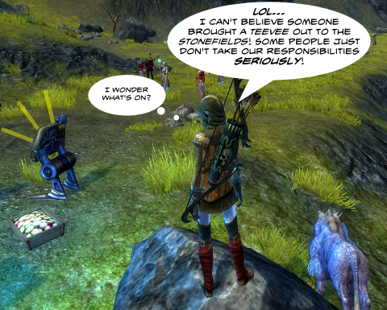

Back to: [West Karana](/posts/westkarana.md) > [2011](/posts/2011/westkarana.md) > [January](./westkarana.md)
# Daily Blogroll 1/16 -- Lazy Sunday edition

*Posted by Tipa on 2011-01-16 06:00:18*

Yeah, I like TV. I can say that now; for years I refused to watch it. Rotting my mind and all. But having just come off a marathon 30 Rock Season 2 bender, I find I really want to get back to playing MMOs because they are LESS addictive than television. With MMOs, you chat with people, group with them, make friends. With TV, it's just sitting with the cat and a bowl of popcorn on a lonely couch. So, you know, on the scale of pathetic leisure time activities, MMOs are way above television.

But I still like it! The GOOD shows, I mean. Since you and I like only the good shows, I don't need to list them, but I think we know Brennan and Booth are gonna get together.

In MMOs, though, well... we're not in Azeroth anymore. Unless we are.

**Earthrise**

When a studio thinks critics won't have anything nice to say about a movie, they tend to not let the critics in to see it early. The same thing happens with MMOs; when a game studio is unsure about their game, they might be reluctant to let the *hoi polloi* in if they're just gonna badmouth it all over the forums. That's what Sente of A Ding World [thinks might be going on with Masthead Studios' Earthrise](http://adingworld.wordpress.com/2011/01/16/earthrise-or-fall/). Watching the video, I'm reminded a lot of Tabula Rasa, but the clip showing a group of three killing a boar doesn't make me leap out of my chair to buy it.

**Aion**

Aion end-game raiders are morons. No, it's true. I know because [I read it on the Internet](http://mmohatersgonnahate.wordpress.com/2011/01/15/aion-endgame-players-are-morons/)!

**DC Universe Online**

It's been an exciting week for DC Universe Online, SOE's latest entry in the men with tights genre -- this one being the first MMO for the Playstation 3. As the platform leader for the upcoming The Agency and [EverQuest Next](http://www.mmo-symposium.com/2046/eq3-ps3/), there's a lot riding on these primary-colored shoulders.

And what a week! Entertainment Weekly is openly wondering [if DCUO could possibly be the WoW killer](http://popwatch.ew.com/2011/01/11/dc-universe-online-world-of-warcraft/) everyone's been looking for. An LA Times article points out that [DCUO is one of the ways DC is trying to build enthusiasm](http://herocomplex.latimes.com/2011/01/11/dc-universe-online-50-million-gamble-aims-for-audience-that-world-of-warcraft-cant-touch/) for its screen properties, like summer's Green Lantern. Just Push Start claims [SOE has had to rush new servers onlin](http://www.justpushstart.com/2011/01/15/more-servers-coming-to-dc-universe-online-to-meet-demand/)e to meet the European demand for the game.

[Via Tobold](http://tobolds.blogspot.com/2011/01/anyone-playing-dc-universe-online.html) comes news of some possible kryptonite in the coffee... [Gamespy didn't give it a stellar first impression](http://pc.gamespy.com/pc/dc-comics-mmo/1144175p2.html). The real test comes a year down the line, but my take is that the game wasn't meant for PC gamers.

**EverQuest 2**

Stargrace has the skinny on [the features coming with Destiny of Velious](http://mmoquests.com/2011/01/15/details-on-destiny-of-velious-eq2-everquest2/). Yeah, it kinda bugs me that the epic scope Velious had in EverQuest is being vastly reduced for EQ2. EQ's Velious brought a truly vast continent, almost as large as Kunark, with THREE NPC capital cities, with which you could build favor or choose to tear down; the legendary Sleeper's Tomb, the Dragon Necropolis, the three-dungeons-in-one Temple of Veeshan, the iconic Tower of Frozen Shadow, a huge collection of outdoor contested nameds... it would be nearly impossible to match that.

I have no idea how SOE manage to knock those out year after year.

Well, this one DOES include the end of the world, so that's something, I guess.

Ferrel of Epic Slant [pretty much nails the features Velious SHOULD provide](http://www.epicslant.com/2011/01/on-the-eve-of-velious/).

**Blue Mars**

The virtual world that was going to be an upscale shopping and resort destination for those that had tired of the unmitigated chaos of Second Life has fallen on hard times. Tateru Nino examines the reasons why Blue Mars failed to excite virtual worlders, and [its perhaps dim prospects in its afterlife on the iPhone](http://dwellonit.taterunino.net/2011/01/15/the-bluest-mars-what-went-wrong/).

I dunno. Maybe people don't really feel the need for a virtual world for shopping? Hard to do online shopping better than Amazon and eBay.

**EverQuest**

[Kaozz is returning to EverQuest](http://www.ectmmo.com/2011/01/ready-set-everquest.html)! But she won't be startling Fippy Darkpaw outside the gates of Qeynos; she's returning to her old home on Firiona Vie, the roleplay server. When SOE makes a roleplay server, it's more than just a (RP) after the name. All races speak their own language and don't understand anyone else's without training. Items that are no drop on other servers can be traded on FV (mostly). There used to be a one character per account limit, but apparently that's been removed.

If you're not up for starting completely over on a totally new server, could do worse than to check out FV. You can buy everything there, for a price. A really HIGH price. The Legends server people used to use FV to traffic no drop items between servers, and that really ruined the FV economy.

EVE wasn't the first MMO to legitimize shady activity, not by a long shot.

**Guild Wars 2**

Ravious at KTR has written [a nice guide to the main features of Guild Wars 2](http://www.killtenrats.com/2011/01/14/world-of-warcraft-players-guide-to-guild-wars-2/) -- "A World of Warcraft Player's Guide to Guild Wars 2". I see these kinds of guides all over for various games, and it's always tuned to the WoW player.

It's been my limited experience that people who have WoW as their first MMO, and a really huge percentage of those that came to it later, really have two complaints about any non-WoW game. The first, that it's too similar to WoW. The second, that it's too different from WoW. The only solution to this paradox? Just play WoW!

I just feel it's pointless to even try to snare the WoW player to a new MMO. At least, I've had no luck getting any of the WoW players in my own family to try anything else.

**Vanguard**

[TAGN pointed out this rare quote](http://tagn.wordpress.com/2011/01/15/john-smedley-on-the-expectations-you-can-have-with-a-monthly-subscription-fee/) from SOE's John Smedley on the obligations a game developer feels when charging a subscription for a game:

> The monthly subscription fee means players can expect a lot of new content from us. And I say a lot — I really mean that. This is something that we feel obligated to the players, because they are paying monthly sub fee…”

Subscription game Vanguard hasn't had an update since 2009. They still charge a monthly fee.

So... yeah.

Tired now. More later. Just want to point out: No Rift news!
## Comments!

**[Bhagpuss](http://Yourwebsite)** writes: Is that a Rift screenshot? Did you take it and if so, how? I've spent a good deal of time in-game trying to find some way of taking screenshots, and asked several times in chat. No-one knew a way other than to install FRAPS and use that.

Mrs Bhagpuss and I both stopped watching TV in 1999, when we installed Everquest. It wasn't intentional, there just wasn't time any more. We don't even own a TV now. We do buy and watch the best stuff on DVD, though, and we use the BBC iPlayer sometimes.

See my comments on Tobold re DCUO. Short version: it's great fun and very easy to play for PC players who've no console experience.

---

**[Tipa](https://chasingdings.com)** writes: Yes, it's Rift, but I have to admit that I used FRAPS. I don't know if Rift has its own screenshot function...

You don't own a TV -- you watch DVDs on the computer?

I don't subscribe to cable; almost all the TV watching I do is via Hulu or Netflix. FOX is the only on-air channel I can get consistently, so I do try to watch Glee and American Idol live :)

---

**[pasmith](http://dragonchasers.com)** writes: Bhagpuss - I've been using WeGame to take Rift screenshots & videos. (http://www.wegame.com/) It's free, which is what I like about it. It tries to be some kind of social gaming tool and blah blah blah too, but I just run it to take screens and videos of Rift.

We've got a TV in the living room and a TV right between our two monitors here in the office. Yesterday I escaped into the late 19th and early 20th centuries with Lark Rise to Candleford and Downton Abbey. TV can take me away from my troubles in a way that games sometimes can't, I think *because* they are so non-social (and this no one interrupts the immersion).

I'd ditch cable if I could convince Angela to go along with it; I could easily get by on Netflix Streaming and the odd purchase from Amazon VOD. But she works from home and has the TV on all the time 'for company' (which would drive me crazy).

---

**XyzzySqrl** writes: I started with WoW, actually, but it just didn't stick. Wound my way through six dedicated years of City of Heroes, and time spent in Everquest, Everquest 2, WoW, Shin Megami Tensei Online, Champions, Guild Wars, Phantasy Star Universe, Vanguard...

Invariably I come back to either EQ2 or City of Heroes. 

Next I'm trying Rift, and I hope I can summon up the dedication to give it the time it clearly deserves.

---

**[Bhagpuss](http://Yourwebsite)** writes: Yep we watch DVDs on the PC. We actually have an older PC in the living room where the TV used to sit and this Christmas when two of the three (grown and left home) kids were here we had it operating as if it was a TV, running the iPlayer. I actually tend to transfer most of my DVDs onto my iPod touch and watch them on the journey to and from work, though.

I have FRAPS installed, I think. I used it for a while last year. I'll fire it up for the next Rift beta test. Be a shame not to have a record of those characters before they get wiped.

---

**Drew** writes: WoW was my first MMO and I've played lots of other MMOs since, and I have no WoW-like complaints about them . . . well, except maybe Aion. Because that game seems to try really hard to be like WoW, and at the same time try really hard to be different. Turns out it was mostly the differences I liked, but the thing that turned me off the most was the forced (non-optional) world PVP, which I just hate. From what I can tell, end-game raiding in Aion is cooperation world pvp, which does not interest me at all. I did enjoy the instances quite a bit, limited though they were in quantity.

---

**Jonathan** writes: Mmm.... I don't know. Not even WoW is WoW anymore. Each WoW expansion (well, less so with Burning Crusade, the first one) felt like a new game with content from the old ones and a bonus "leg up" if you had a character already. Cataclysm is just plain a different game from Wrath, and both have very little similarity outside of model and lore to the original. I started MMOs with WoW, but am not real happy with the changes in Cataclysm. Your blog brought me over to EQ2, which for me feels very much like "Advanced Classic World of Warcraft."

Right now I raid with my WoW guild, play for fun with my family on EQ2 (still leveling, now in Butcherblock), and am looking forward to GW2. Far from all of us are married to WoW... at least half of my old friends are elsewhere (LotRO mostly.)

---

**Rick** writes: Bhagpuss, last beta I was spamming every so often on how to take a screenshot. Eventually someone answered and basically said, take a print screen and then paste it into MS Paint. That did work but obviously is not the optimal way to do it - hoping they change that for launch.

---

