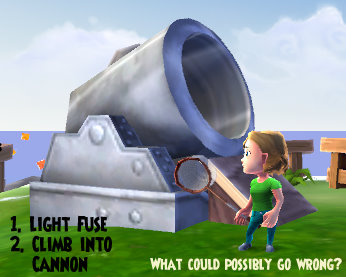
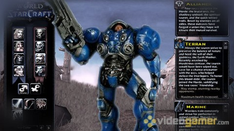

Back to: [West Karana](/posts/westkarana.md) > [2011](/posts/2011/westkarana.md) > [January](./westkarana.md)
# Daily Blogroll 1/19 -- Game of Mass Destruction edition

*Posted by Tipa on 2011-01-19 06:00:58*

I absolutely would love to know how many people people are REALLY playing World of Warcraft vs Lord of the Rings Online vs Warhammer Online vs Total Global Annihilation (Online) and so on. Heaven knows its not in the interest of gaming companies to tell us. To me, it means they have something to hide. Every company is all so excited to reveal their numbers when they are trending up. When they are silent, that can only be bad news.

So I'm a big fan of Openedge's "[XFire Game](http://simple-n-complex.blogspot.com/search/label/XFire)" that he runs most Mondays. By tracking a game's performance week to week, you can get a sense for how well its doing. But there's a LOT of variables! XFire doesn't track every online game -- if it did, Farmville and Scrabulous would be knocking the gnome out of World of Warcraft. Most players don't have XFire installed. Competing game time trackers like Raptr could be draining numbers from XFire across the board. Some players could decide XFire really isn't doing much for them and abandon it. Games with both an Asian and Western presence could find their true numbers under-reported. Games that are popular on non-PC platforms, such as DCUO for the PS3, might find their numbers VASTLY under-represented.

We really need a better metric for this. Something like a Nielsen ratings for MMOs, with a bit of code attached to each game that "phones home" when run.

I'm sorry, did I say that DCUO is doing well? It's going gangbusters! Check it out after the break!

**DC Universe Online**

This is what every publisher hopes will happen. They take a chance on a new platform -- the PS3 -- where there has not yet been an MMO. If the game fails, the entire division is standing on shaky ground. Success means the games in the pipeline -- The Agency, EverQuest Next, Planetside Next, Final Fantasy XIV Online -- can move forward with optimism.

Well, saith Smed, [the game was sold out in a lot of stores](http://twitter.com/j_smedley/status/26715803629920257), [they are adding new servers](http://playstationlifestyle.net/2011/01/13/dc-universe-online-experiences-a-successful-first-week-of-stardom/), and it even [topped the PC digital download charts](http://technology.xin.msn.com/gaming/article.aspx?cp-documentid=4584294) on Steam and Direct2Drive. So, grats to SOE for a great launch!

I don't have any snark for this! But [Zoso at KiaSA does](http://www.kiasa.org/2011/01/19/i-do-not-judge-the-universe/)! He's Super Cynical Guy!

**EVE Online**

CCP dropped its latest expansion for EVE Online, Incursion, today. Along with an invasion by the wicked cool spiky Sansha faction, planetary mining was given a rather huge update, and there's a new character creator. Wilhelm of The Ancient Gaming Noob [leaped in with both feet](http://tagn.wordpress.com/2011/01/19/five-minutes-with-the-new-eve-character-creator/) and created that paragon of interstellar bad-assery, [the gay cop from Reno 911!](http://en.wikipedia.org/wiki/Characters_on_Reno_911!#Lt._Dangle).

Not that there's anything wrong with that.

**Battlestar Galactica Online**

Just weird to think that in the BSG Universe, MMOs would be impossible, it being a crime for the humans to connect computers together into a network. And the Cylons can build interactive, sharable fantasy worlds in their minds. Beau Hindman @ Massively [got a peek at the upcoming BSG Online](http://massively.joystiq.com/2011/01/18/first-impressions-battlestar-galactica-online/), the browser-based MMO where you can face off against either the robotic Cylons or the human Colonials and go pewpew boomboom. People wonder whatever happened to Jumpgate Evolution and info is scarce on Black Prophecy, so who knows, maybe this is the space dogfighting game we've been waiting for.

**World of Starcraft**

In what might be the ultimate Starcraft 2 mod, [level designer Ryan Winzen modded SC2 into an MMO](http://www.worldofstarcraft.proboards.com/index.cgi?board=visit&action=display&thread=42). Fan reaction is swinging between fascination and alarm -- with many people (including the designer) [worrying that Blizzard will stomp all over it](http://www.reddit.com/r/gaming/comments/f4a2s/world_of_starcraft_a_reality_thanks_to_fans/).

C'mon, it's a mod, they are by definition legal if you use the tools and artwork given. Blizzard's "Titan" has always been based on a new IP, so it is not itself World of Starcraft.

It's a fantastic effort.

**World of Warcraft**

What if someone designed a fantasy version of World of Starcraft? What could that be like?

Tobold and Scarybooster have been having a bit of an argument about the role of DPS in random dungeon groups. Scarybooster, who plays DPS, feels a 40 minute wait to get into a group [shouldn't be rewarded with a swift kick out of the group](http://www.scarybooster.com/?p=778) (to get an instant replacement) if the tank or healer doesn't like him. Tobold, who plays a tank and a healer, [considers it socially irresponsible to play a DPS](http://tobolds.blogspot.com/2011/01/social-responsibility.html). If they wanted to find groups easily, play a class someone WANTS, right? DPS are just lazy bastards playing on E-Z mode. Spinks tries to bring some sense to the discussion by wondering [what's wrong with people playing the class they want to play](http://spinksville.wordpress.com/2011/01/19/antisocial-that-word-doesnt-mean-what-you-think-it-means/)?

It's a GAME fercrisesakes. As Spinks point out, if you're making someone do something that's not fun in a GAME, they will go play a game where they DO have fun. They are waiting 40 min for a group because waiting is MORE FUN than tanking or healing a heroic instance.

Sitting back, eating the popcorn. It's discussions like these that make plain just how far WoW has gone from the mainstream, assuming you can have a mainstream that does not include the most popular MMO in the world.

Every WoW expansion brings with it the inevitable backlash once everyone has finished with the new content, which here took about a month. Yeah, Cataclysm, two years in the making, more or less finished by everyone in a month (including their goblin or worgen alt), Now that the wait has started in earnest for the next expansion, bloggers everywhere are looking back on Cataclysm's towering legacy.

Ionomonkey of Screaming Monkeys [doesn't really appreciate the high amount of handholding and raildriving](http://screammonkey.wordpress.com/2011/01/18/the-cataclysmic-wow-disease/) in Cataclysm. If there's no choice in how you devour the content, is it really an MMO? Well, it's WoW, it's its own "thing".

But is Cataclysm the worst expansion in WoW's history? [Wolfshead thinks so](http://www.wolfsheadonline.com/?p=5347).

> The problems we see in Cataclysm didn’t transpire overnight. Like some deranged madman bent on suicide, Blizzard has destroyed everything that was good and noble about MMOs and seemingly wants to take the entire genre with it into existential oblivion.

Wolshead thinks the Worgen look like Scooby-Doo on his hind legs, considers leveling to max by picking flowers and digging for bones ludicrous, and doesn't think the sudden shift from flower picking for epic gear to heroic instances that KILL YOU to be very fair. I'd always heard that Burning Crusade was the worst expansion but I dunno. From where I stand as someone who is only occasionally a WoW player, I liked Cataclysm for acknowledging that the overworld is really a single player RPG environment. If you think of WoW as a SRPG with multi-user dungeons, it all suddenly makes sense.

As Potshot notes, in Cataclysm, [you get your quests at the dungeon entrance](http://potshot.wordpress.com/2011/01/17/musings-on-azeroth-lost/), they complete by the time you finish the dungeon, and then at the end you get your reward and can go queue up for the next instance. There's no longer any feeling of an epic plotline that your efforts in the dungeon will somehow advance. It's just -- a ride.

Are raids any tougher? [Here's a quick chart you can keep handy](http://i.imgur.com/zUZA5.png) to tell you how to win your raid.

**Star Wars: The Old Republic**

Wasdstomp thinks that [the fully voiced quests will be the thing that keeps him away](http://www.wasdstomp.com/2011/01/swtor-officially-falls-off-my-to-buy.html) from Bioware's mega-blockbuster MMO due out sometime this year. He doesn't understand how guilds that run on voice chat can possibly deal with an MMO which is always shouting -- literally -- for your attention.

THAT got me wondering -- what is the POINT of guilds in a MMO that really is just a single player RPG that you have to subscribe to and play online? You won't be just a bounty hunter, but the BEST bounty hunter. You have your companions, you have your space ship, the one everyone in your class has. What does being in a guild really buy you? The chance to get people in your group who screw up your conversation trees?

I dunno. Maybe there are raids full of identically clothed Jedi killing stuff.

**EverQuest II**

Details about the items that come with the Destiny of Velious collector's edition just dropped into my mailbox:

 * Loyal Snow Hound - Siberian Husky Puppy

 * Four Different Velious Portal Paintings - Paintings with teleportation powers

 * Tserrina's Wedding Present - Tower of Frozen Shadows house item with special ability

 * Cryomantic Armor Crate - Magical ice appearance armor

 * Everfrost Summer Home - Menagerie Prestige Home

 * Stormfeather Brood Guardian - Alternate griffon mount appearance

 * Free 30-day subscription for new accounts

The pet sounds like those annoying Ice Wolves that used to randomly attack you for no reason; Stormfeather was this epic camp for the key piece to the pirate's eyepatch which, I think, was a decent melee haste item. I expect the sight of someone on a snow-white griffon will send old EQ-ers into fits. Appearance armor, another home, portal pictures and OMG TOWER OF FROZEN SHADOWS HOUSE ITEM!!! Is this like a MODEL OF TOFS? THAT WOULD BE SO AWESOME!

Ferrel has [a more comprehensive look](http://www.epicslant.com/2011/01/velious-features/) at all the Velious features.

It's not a big mystery what old EQers want. They want all the same dungeons and mobs as in EQ -- updated. In fact if you really wanted to kill off EQ, what you would do is make a copy of EQ with better graphics and mechanisms, but with mostly the same content. I'm hoping that's what EQ Next turns out to be.

Well, I guess that's enough for one day...
## Comments!

**[Zoso](http://www.kiasa.org/)** writes: Sorry, as a Brit I have a genetic predisposition towards cynicism. Bit like that Gervaise bloke, but I haven't found a way of using those superpowers to get an award hosting gig...

---

**[Tipa](https://chasingdings.com)** writes: MMO journalism needs more Ricky Gervais...

---

**[Victor Stillwater](http://iamstillwater.wordpress.com)** writes: "It’s a GAME fercrisesakes. As Spinks point out, if you’re making someone do something that’s not fun in a GAME, they will go play a game where they DO have fun."

--- Truer words were never spoken. Well, aside from the death and taxes thing.

---

**yunk** writes: BSG online, I can see it now: cylons will rez in the rezship, and humans will get permadeath.

---

**[Tipa](https://chasingdings.com)** writes: Asking for a sense of civic duty and social responsibility to do things in a game you don't enjoy doesn't work for me. I think you have to be pretty invested in WoW if you feel obligated to do something just so random groups will firm more quickly. Blizzard should be hiring people to tank and heal if that was a real concern!

---

**[Tipa](https://chasingdings.com)** writes: @yunk -- That would be SO COOL! 

---

**[pkudude99](http://nomadicgamer.com)** writes: I'm still curious how anyone could read Tobold's post and not take it as being satire?

---

**[Bhagpuss](http://Yourwebsite)** writes: Tobold's English is excellent but I often have trouble working out if he is being ironic because he doesn't always get the register quite right. Even natural English speakers often have difficulty conveying irony in print. 

I took his comments at face value and thought the idea of "social responsibility" as an innate part of MMO play to be one of the most ludicrous assertions I'd ever read.

---

**[Ferrel](http://www.epicslant.com)** writes: "t’s not a big mystery what old EQers want. They want all the same dungeons and mobs as in EQ — updated. In fact if you really wanted to kill off EQ, what you would do is make a copy of EQ with better graphics and mechanisms, but with mostly the same content. I’m hoping that’s what EQ Next turns out to be."

Exactly! Just take the exact same thing, update it, put in a twist or two and move on. That is why classic, Faydark, and Kunark are so beloved and most of the other expansions are okay. No one really cares about taking a huge "what if" this happened in Ro! It didn't! The Oasis of Marr didn't turn into the Arabian Nights!

---

**[Eliot](http://massively.joystiq.com/editor/eliot-lefebvre)** writes: @Bhagpuss: If Tobold is being ironic, it's a very subtle and long-stated irony that would make him the Stephen Colbert of the MMO blogosphere. I'm not inclined in that direction.

@Tipa: One of the things that my shell in FFXIV established very early on is that whatever happens in the main storyline quests is separate from what we experience as a group. Yes, in the storyline you are a rare and unique snowflake, but instead of dealing with the implications of that, let's focus on the actual mechanics of the world we're living in.

As it turns out, FFXIV does handle the snowflake thing as well as it could be. You're unique, but not because you're the best [class] ever, just because you happen to possess a rare trait that gives you unusual amounts of information to access.

Why play if you're going to be solo a lot of the time, or if people can screw up your dialogue trees? Man, people screwing up my dialogue trees is part of what I'm looking forward to. Emergent gameplay right there, and the sort of thing that really drives you into your character.

(Also, no sooner is WoS spread about than Blizzard starts up the C&D letters. Oh well.)

---

**[spinks](http://www.spinksville.com)** writes: He's german, it may not have been satire ;)

---

**Zygwen** writes: I think Tobold is describing reciprocal altruism as a solution to the long DPS queues. I think people are getting hung up over his choice of words to describe the solution.

In my opinion, there is nothing wrong with insisting on playing DPS exclusively if you are willing to deal with the consequences. In many ways this is no different then choosing the over populated PvP faction in WoW, WAR or Rifts and having longer wait times or playing the under dog and getting steamrolled in RvR. I think the problem is that a lot of people prefer bitching and moaning about the unanticipated consequences of their actions rather than finding constructive ways to resolve the issue or accepting that that is the price to pay for making their choice.

---

**[Tipa](https://chasingdings.com)** writes: Well, he got a job at Riot Games so all's well that ends well.

The storyline missions in FFXIV were so spread out for me that they didn't really impact my gameplay, which, for me at the time, was just repeating Guildleves again and again. If SWTOR's voiced missions are as rare, then I probably will have to admit it's not a barrier. I know Bioware has said there will be plenty of other stuff to do besides the story missions.

---

**[Tipa](https://chasingdings.com)** writes: You can do all you want to help the WoW community, but it will never reciprocate -- nobody will ever lift a finger to make YOUR life easier. It will just be the standard refrain of intimidation and abuse that makes WoW so much fun.

---

