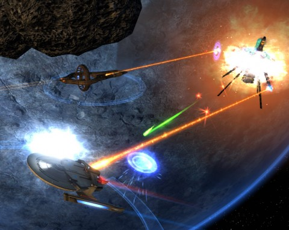

Back to: [West Karana](/posts/westkarana.md) > [2011](/posts/2011/westkarana.md) > [January](./westkarana.md)
# Star Trek Online Foundry: The Space Between

*Posted by Tipa on 2011-01-24 00:35:48*

So Saturday, I had this wild idea that it would be fun to make an STO mission in the game's User-Generated Content system, the Foundry. See, I wanted to get a preview of the new Vulcan science ship that's hitting the store next month. Making a mission that included it would be one way to do that. Playing other people's missions based around the same general idea would be an even better way :)

I'm not a level designer. I started a really long mission in City of Hero's Architect system once, but never finished it. It wasn't the tools, it was the inspiration. I love Star Trek, though. If I were ever going to do it, it would be here.

I read everything I could find on the Foundry and got a lot of good tips, but what I could find online was maybe a tenth of what is needed to learn how to put stuff together. Your basic flowchart is to sketch out your mission by creating the maps you need first (Maps tab), then create NPC and non-player ships in the Costumes tab. Interact with NPC and Reach Waypoint actions connect maps.

Once you have your maps made and connected, then you add the visual sugar, the plot, the enemies and situations, playing each map through a hundred times, throwing it away and starting over...

Anyway, Sunday I threw away everything I did Saturday and started over with a new episode. You can play it -- it's called "The Space Between" and it's on the Tribble server. There's a story I was trying to tell, but I didn't tell it as well as I could have. I'll probably keep fiddling with it; there's a map that shouldn't have any combat on it. It gets in the way of the story, and the mobs keep killing the NPCs that are trying to tell it. That whole map needs to be a puzzle.

When I figure out how to make branching dialog chains, things will get really fun.

A couple of people have pointed me to their own stories. I've been so busy working on mine that I haven't had a chance to play anyone else's. I hope to play them all this week :)

Got a mission on the Foundry of your own, or a favorite of someone else's? Post it here! There's a zillion player missions on the Foundry already, everyone needs help finding the good ones.

## Comments!

**Longasc** writes: Alternatively, you can go to "custom" and search for missions created by "Tipa".

STO always was a pretty game, but Tipa picked some of the most beautiful sceneries I have seen, or not seen before, I cannot recall two certain maps, I have not seen the cave or the final ground map before.

Apparently she also found the Vulcan Science Vessel in the ship library, I did not so far. While the editor is pretty user friendly, there are numerous points where you wonder why this does not work or what you are supposed to add, so take your time to learn the ropes!

The mission itself is not only really good, I am again surprised what wonderful episodes players can create with the Foundry!

---

**[Tipa](https://chasingdings.com)** writes: It is definitely not easy to find things. To get the D'Kyr model, you have to create a new ship costume, and y ou can choose the D'Kyr as a base look.

---

**Longasc** writes: I just published my mission "Damsel in Distress" on Tribble.
It is about saving Commander Amordant and her ship, the U.S.S. Agiat from a Hirogen trap.

If the map is too bright, you can adjust "bloom" intensity below 100%.

---

