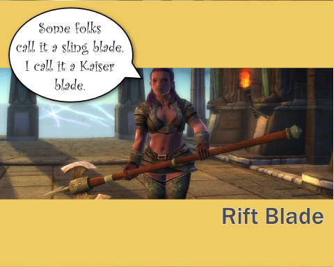

Back to: [West Karana](/posts/westkarana.md) > [2011](/posts/2011/westkarana.md) > [January](./westkarana.md)
# Daily Blogroll 1/27 -- Inevitable Backlash edition

*Posted by Tipa on 2011-01-27 06:00:43*

Yeah, I've been MIA for a couple weeks now. Work time is creeping into home time. It's so cold when I get home that I find myself cuddling up with blankets and a cat on the couch, watching Netflix (tonight: the Canadian comedy "[Slings & Arrows](http://en.wikipedia.org/wiki/Slings_and_Arrows)", season 1). I'm not wild about this "winter" thing in general. I haven't been able to get on the bicycle for a few weeks now, and it's really making me antsy.

Anyway, Rift beta 5 is underway. I logged in last night and made a warrior on the Belmont server and met my guild, Black Company. Played up through level 9, got caught up in some rift fights, had a little fun, but you know... I'm losing enthusiasm for the game.

Does that sound bad? I vowed to play Rift up to the level cap in the company of a guild and see all there was to see. Shouldn't I be really excited?

I was really excited when it was me discovering a world of mystery. I was pretty damn pleased to try out different souls and make my own unique class. I was jumping for joy when I realized one didn't need to grind quests with the rifts opening everywhere, just handing out adventure and experience.

But now, you can get a dozen decent build suggestions everywhere you look. There are guides for all the dungeons, all the quests, all the warfronts. By the time the game ships, the game will be completely known and over-examined. It will be SPOILED.

I'm still going to play Rift, and enjoy it. I just see that it's going to become the same damn thing as with WoW, where my refusal to learn anything about the game other than what I discover for myself makes me look like a raw clueless newbie to everyone unfortunate enough to group with me. I really hate that feeling.

**Rift**

Lots of people writing about the Rift beta 5 event, but why help ruin the game? I'll be writing about it when I play through it when it goes live. But, I DO want to point out what must be the most underwhelming rendered official movie for Rift that I've seen so far:

Courtesy IGN [via Rift Junkies](http://www.riftjunkies.com/2011/01/26/rift-cgi-trailer/). Poorly animated and really, it reminds me a little too much of EverQuest II's pre-release trailer -- [and not in a good way](http://obeygiant.com/headlines/mr-brainwash-life-is-beautiful-exhibition). Perhaps because the EverQuest II launch trailer was SO MUCH BETTER at setting up the world.

So, yeah. Yank that video, Trion, and put up a better one.

The Superblogger known as Elementalistly has been expanding his MMO tracking from just XFire to Raptr and beyond. He's stopped trying to guess sub numbers from the XFire/Raptr figures and so it's much cooler now. [New this week](http://simple-n-complex.blogspot.com/2011/01/rift-champion-of-raptr-and-x-fire.html): Rift and the newly F2P Champions Online.

And a note for Rift bloggers: You don't have to paste the patch notes on your blog. We get it, you see the patch notes and figure, hey, free post. Just post a link to them on the official site if you must, but it would be better if you took some time to explain the impact of the changes.

**The Blogosphere implodes**

[A bunch of bloggers and other interesting people](http://biobreak.wordpress.com/2011/01/26/bloggers-breakfast-at-pax-east/) are getting together for breakfast outside of Pax*East this spring. So much geekery in one place could suck Boston itself into a black hole of awesome :)

**Quest Hubbing**

Way back when, the ever ironically-named EverQuest actively made it difficult, [if not flatly impossible](http://oldunsolvedquestsineverquest.yuku.com/forums/1/Unsolved-quests), to do and complete quests. It could take MONTHS to solve some of the epic quests -- to even figure out what the steps were, much less finish it.

When World of Warcraft introduced the whole concept of quest-oriented adventure, where NPCs would tell you with no hesitation all about their quests and exactly what they required with no puzzle solving needed, it was seen as a revolution in gaming. Continuing on with that tradition, WoW now often will provide you transport to the area to save on having to spend any time not focused on fulfilling the quest instructions.

Melmoth of KiaSA thinks that, maybe, [the whole quest hub thing has just gotten out of hand](http://www.kiasa.org/2011/01/26/stepping-off-the-conveyor-belt/), and that now, games seem entirely unable to conceive of a method of in-game storytelling which doesn't involve clicking through a quest, killing stuff, and returning for a reward. Unfortunately, his proposed solution is essentially the Warhammer Online [kill collectors](http://warhammeronline.wikia.com/wiki/Kill_Collector), famously described in Paul Barnett's "[Bears Bears Bears](http://www.youtube.com/watch?v=jJOrSr6Q3_o)" video.

**The Death of the MMORPG Genre as We Know It**

Sure, everyone knows what an MMORPG is. It's a game like WoW, right? But then, some people consider Second Life, a virtual world, an MMORPG. It's been claimed that game portals like Clone Wars Adventures are MMORPGs. It's gotten to the point that any online game in which you might encounter another player is called an MMORPG. [Ardwulf laments the blurred focus of the term](http://ardwulfslair.wordpress.com/2011/01/25/words-fail/), but doesn't offer any suggestions.

Here's mine. For me, an MMORPG allows me to create a unique character in an online, shared world. There is a story of some sort which my character experiences through adventures which gradually make my initially weak character powerful enough to take on advanced challenges. Unique character, shared online space, progression through a story, and some variation of the "[Hero's Journey](http://en.wikipedia.org/wiki/Monomyth)".

Outspark's [Fists of Fu!](http://fistsoffu.outspark.com/landing/007) requires me to choose one of the four pre-made characters. NOT an MMORPG. Second Life has no story or character progression -- NOT an MMORPG. DDO has story told through "modules". It IS an MMORPG, likewise Guild Wars. The only advancement in Clone Wars Adventures is paying for a subscription to become a Jedi. NOT an MMORPG. EVE Online definitely has character progression and a story, though most people are only vaguely aware of what that story might be. It IS an MMORPG.

Now if I can just get everyone else in the world to agree with me...

Keen was wondering a few days back [if short MMOs can be good MMOs](http://www.keenandgraev.com/?p=4694). Which is kinda weird because one of the shortest MMOs I have ever played is the most popular MMO on the planet. One of the things I really liked about WoW back in the day was that I could finish it -- new character through to clearing Molten Core -- in just a couple of months. Compare that to the year to 18 months in EverQuest to go from new character to end game raider.

So -- an MMO even shorter than WoW? That's pretty hard to imagine. Maybe DCUO is shorter than WoW, somehow, but as far as the time taken to get to all the content, I'm thinking it's pretty much the same.

**EverQuest $$**

KayJay at The Banhammer [has some strong words for SOE](http://www.thebanhammer.net/?p=105) regarding the collector's edition of the upcoming Destiny of Velious expansion. After Feb 22nd, SOE will be charging $90 for the digital collector's edition. Most collector's editions for that price come with maps, art books, CDs and the like, and SOE has even been known to include little pewter keepsakes in the box. This times, it's house items, fluff pets, appearance items and mount illusions. Nothing for the mantle!

**Star Wars: The Old Republic**

Bunch of news about this title. First, the folks at Gamespy have an extended look at the current state of the SWTOR beta -- they really like it, though they admit it's [WoW with lightsabers](http://pc.gamespy.com/pc/bioware-mmo-project/1140497p1.html), but not in a bad way.

MCVUK.com is reporting that [the game should be out in September](http://www.mcvuk.com/news/42719/Old-Republic-out-in-September), which is about what I was expecting. A lot of people were thinking it would be out in April because [EA said at a tech conference](http://www.swtor.com/community/showthread.php?t=232427) that they release the game in the financial year that started in April. Didn't mean April, but plenty of people made that leap.

Lastly, [investors are feeling quite paranoid about SWTOR's chances](http://www.gamasutra.com/view/news/32605/Analyst_Wary_EA_Investors_Betting_Against_SWTOR.php). Suspected costs of $300 MILLION dollars, a subscription fee in an increasingly F2P world, large percentage of profits funneled straight to LucasArts, and EA's dismal track record with MMOs (Warhammer Online being the issue here). Also given the recent failure of other hideously expensive MMOs such as APB, which cost a mere $100 million. A pittance!

I just did a little back-of-the-envelope scribbling. Let's say SWTOR is wildly successful and gets a million players to pay $15/month essentially forever, the game is that good. Let's further say that after paying salaries, facilities, the LucasArts tax and so on that EA makes $5 clear profit of that monthly subscription. Steady one million subscribers all paying full subscription price gets them to pay off their initial investment in just five years. Then add in the expansions, one a year, and their development costs... there's almost no way they can possibly make back development costs.

Well, there IS a way, only one way -- and that one way is a CASH SHOP. I've said this before and will again -- this game is gonna be CASH SHOP'D seven ways from Sunday.

You thought EQ2 was bad.

**Lucent Heart**

Gaming Blend has earned my undying enmity by [getting into the preview beta](http://www.cinemablend.com/games/Preview-Lucent-Heart-Legend-Zodiac-29614.html) for the NA launch of dating sim/MMO Lucent Heart.

> The combat is designed for casual gamers in mind (mainly female gamers) so twitch skills aren’t required the way it is in games like Fallen Earth, Tabula Rasa or Allods Online

Well, I'd have thought TR stopped twitching YEARS ago...

Hey, don't be a stranger and I'll try not to be. Keep warm and keep gaming!

## Comments!

**[Paeroka](http://paeroka.wordpress.com)** writes: When the patch in WoW had arrived that prepared for Cataclysm (and introduced the new talent trees), the chat was full of people asking how they're now supposed to spec. Yes, I get that there are people that love the min-maxing but really, can't they just try to think on their own and play around with the talents to get a feeling for them? But oh no, they were disappointed, frustrated, blamed Blizzard for failing and all those responsible for talent guides that they hadn't been fast enough to provide them with the perfect new built.

It's a shame that the same seems to be happening with Rift. Although I haven't seen any talent guides anywhere and I'm happy about it (I didn't look for them either). I still don't know whether I'll get Rift or not. But if I do, I definitely hope that I can explore the classes and won't have to choose one special built for my chosen class in order to be taken along. 

About the dungeons: When Cataclysm launched, it only took people about a week and they started bitching you out when you didn't know how the boss encounters worked. The impatience is... well, unbelievable! 

I love running through dungeons because it's fun. And if I get an item, even better. If not, I at least had fun. But not with people who expect you to be perfect and never make a single mistake or not know how a boss works. Accordingly, I've only done one dungeon before my account ran out of paid time again (not because of the players, though, I don't have much time for gaming right now).

---

**[Tipa](https://chasingdings.com)** writes: I think you've 100% got the right idea. Play the game for the fun of it, that's the #1 thing. I always loved the original EQ because it was so social, and even if my group mates weren't roleplayers, they tended to take on the characteristics of their class. Ogre and troll warriors always seemed fearless and significant; wizards loved the boom. Rogues had secrets, yes we did. We had secret chat channels, secret abilities... We all to some extent embodied our classes and though every one of us was married to Allakhazam to figure things out, we never forgot to have fun.

---

**[Yetian](http://www.mmo-symposium.com)** writes: I'm with you on the what makes an MMO question. Storyline and character progression are key along with the feeling of a large world you can become involved with.

I'd like to see characters actions more directly affect the game world as part of the storyline or just general actions but I can't have everything. :)

---

**Jonathan** writes: Actually, Yetian, that's one of the things that has me interested in what ArenaNet is saying they are doing in GW2. Instead of a static array of quests in a static zone, they are heading towards areas that change dynamically based on the collective action of the player community. The example they've been putting forward is the results of a centaur attack on a village... the zone changes based on if players stop it or not. If they do, the centaurs are driven back for a while, and maybe have to get a new leader (which players can interfere with, driving them further back as a threat). If players don't, the merchants die and the centaurs take over the village, and start attacking other areas.

One interesting effect of this is that for the demos they did, developers showing the game off had to poke about to see what was happening. Interesting.

We'll have to see how it is in actual play instead of pre-release marketing. But it certainly sounds interesting and different, a bit more player driven impact than Warhammer's public quests or Rift's rifts.

---

**[pasmith](http://dragonchasers.com)** writes: Tipa! Wow, you summed up my feelings about Rift so well that I didn't really realize what was bothering me until I read your post. Every beta that comes along has been slightly less fun for me as more "experts" arise in the game. (And I still think a lot of the changes support that 'herd mentality' play style, like the new public groups.)

I rolled yet another new character this time (the servers where my established characters reside have been jam-packed). I took Ranger/Marksman/Bard and intended to put most of the point in Ranger, some in Marksman and not many at all in Bard. 

And then I started playing around and wound up putting a lot of points in Bard and a few in Ranger and none in Marksman, and I'm having fun. The Min-Maxers will probably say it's a gimped build, but screw 'em. I'm having fun. I've kind of written off dungeons because dungeons require groups and groups require listening to the Min-Maxers. 

Anyway, I'll group with you no matter what build you're playing, as long as you're having fun. 

And yup, I agree with your MMORPG definition too... well except perhaps for GW. I'm not sure I consider that an MMO, but I do consider it an RPG.

---

**[Jomu](http://www.justonemoreunlock.blogspot.com)** writes: i actually like it when people put up full patch notes on their blog; its for people like me who are restricted access at work from viewing the official site and don't want to spend the time at home reading up on it. When people make observations/comments on those patch notes, thats just bonus. just my opinion :)

---

**[pkudude99](http://nomadicgamer.com)** writes: I'm sort of in the same boat as you with Rift, not wanting it to be spoilt too much when I start playing live. As a result, I'm not searching the forums or the wiki for it or anything and all I'm really checking out right now is various soul builds in the low levels. I think it's kind of amazing how much difference a single zero-point soul makes to a build even -- for example, I love my Justicar/Shaman/Warden and can't stand my Justicar/Shaman/Sentinel. Tried Chloromancer/Archon and didn't get to a 3rd soul before I deleted it, but loved the Chloromancer/Elementalist/Warlock. Thinking of giving the Chloro/Necro/Warlock a try too. 

Didn't care for most of the tank builds I tried until I started with Champion as the primary. Haven't cared for rogues yet either until I started a Ranger/Marksman/Saboteur last night (yes, just like everyone else) and wow, I can see why everyone plays this combo (or Rgr/Marks/Bard) -- it's just plain fun!

Now to try out some heal-spec'd clerics, and non-melee dps clerics. . and a bard. . . and a Stormcaller . . . and so on and so forth. Sure I'm only going up to level 7 or 8 and repeating the tutorial zones over and over, but that means the dungeons and such will all be fresh and new once the game launches for real.

---

**[Bhagpuss](http://Yourwebsite)** writes: I agree about Rift. I have not lost any of my enthusiasm for playing when it goes Live, but I've revised my plans from "let's join a guild this time and play like the old days" to "let's just do our own thing". I am not looking up any information on quests, builds or anything other than the Lore and when we are Live I will do what I did in Vanguard, which worked well, namely only look things up when I am stuck to the point of frustration.

My biggest concern about Rift is that it may become a victim of it's own success. I had it marked down as the game that would become the new home for a lot of ex-EQ/EQ2/Vanguard players. I imagined, at most, a subscriber-base of a coupel of hundred thousand, probably half that. A nice, quiet MMO, moderately successful but off in a bit of a cul-de-sac.

Now, with GW2 and SW:toR both many months away, Cataclysm stuttering and Rift picking up such traction it looks like, at least in the short term, Rift may be the temporary home of quite a lot of WoW players. Which is fine, so long as it doesn't result in Rift becoming more and more like WoW. I played WoW already. Once was enough.

Anyway, I am once again thoroughly enjoying this Rift beta, so off to play.

---

**Zygwen** writes: With respect to Rift I think their marketing has been hit or miss. They put a lot of effort into social networking and giving away initial beta keys and VIP beta keys that way. I wasn't sold on that effort. I think interest hit a peak just after beta 3 and beta 4 when they announced pre-orders and those that pre-ordered got their first taste. The two and a half week wait for beta 5 killed their momentum though. Then there is their cheesy intro movie. 

They are definitely spending some money in advertising, probably a lot more than Everquest2. Most of that money doesn't seem to be going into making animated trailers. That being said, I think the message they are trying to convey in their recent video came across.

---

**[Shar](http://riftzone.wordpress.com/)** writes: "I just see that it’s going to become the same damn thing as with WoW, where my refusal to learn anything about the game other than what I discover for myself makes me look like a raw clueless newbie to everyone unfortunate enough to group with me. I really hate that feeling."

Thats me in a nutshell with eq2. Been playing since KoS. I never preorder the expansions and usually wait till about a month later when the lagfest, quest mob ganking and so on are much less common. With the last 2 expansions, it has really hurt my grouping experiences in that by the time I make it to the new dungeons, people have already run them 100's of times. No one wants to take the 10 seconds to explain a non tanknspank boss encounter. I raid and have t3 raid gear but when I express aloud in instances to let me know when I need to know something and you don't and I screw up, don't blame me. But of course, they will.

Forget my tank ever grouping to learn the encounters, if I'm not pulling 2 entire rooms worth of mobs at once the first time I enter a dungeon, I'm not worth grouping with. Its just this general idea of this dungeon needs cleared in 20 minutes and not 22 minutes.

---

**[Elementalistly](http://simple-n-complex.blogspot.com/)** writes: I have messed around in Rift, but have avoided the infamous "breakdowns" that most websites do.
Like most are saying here, I prefer to play with the class as I wish. Still don't know much of anything...and that is good.

Got a pre-made team who all are in it for the fun of playing together...and THAT will be the true key!

Cheers

---

**[Anjin](http://bulletpointsblog.blogspot.com)** writes: Tipa, I so want to be a Clueless Newbie with you. I'm going to purposefully ignore the experts so that I don't spoil the game for myself.

Come to think of it, a guild called Clueless Newbies would be awesome. Where do I get a charter?

---

**anon** writes: Unless you are in alpha, do not assume you will have nothing new to see at release. Much more to see I promise:D

---

**[spinks](http://www.spinksville.com)** writes: Hope Rift picks up for you. But yeah, it's possibly an issue if a main feature of the game was going to be experimenting with different builds. I'm also sure that the ones I like that seem to work well together will be massively popular.

But you have to wonder whether all MMOs (with talent trees, which I hate) are going to be like that for you now.

---

**[pasmith](http://dragonchasers.com)** writes: I wanna join Clueless Newbies! Where do I apply?

---

**yunk** writes: I have been the same with Rift, refusing to read or even take the advice the game gives you when you choose Souls. I made a Reaver Champion Warlord so far, he is fun, reminds me of my Chosen.

That is the other thing about Rift, I am enjoying it, but it is bringing back bittersweet memories of how awesome and fun WAR was during beta, only to crash and burn a few months later when there was nobody around to do public quests.

---

**[Saylah](http://notadiary.typepad.com/mysticworlds/)** writes: I think it takes all types to play any MMO. what we call adventurous fun figuring things out, others call stumbling in the dark. No MMO will ever come out now without the Internet filled with descriptive detail. And the longer the beta the more you'll see before launch. 

Until end game, I still don't think you'll see spec checks before you can join a group. There too many permutations for the average player forming a group to be educated in or advise on. Not that that will stop an idiot from giving you advice but that same idiot isn't someone you'd want to be grouped with anyway.

---

**[Randomessa](http://casualdoes.wordpress.com/)** writes: I, too, have mostly opted out of Beta 5 for Rift, and am taking a break from blogging or reading much about it. I am still excited to play the game "proper", but I don't want to burn myself out in dribs and drabs just trying to fill the time until Feb. 24th either. I have found a couple of roles that I know I'm going to enjoy, and that's all I need to go on for launch.

It's funny that you should also add what are essentially my own thoughts on what makes an MMO, because in reading blogs lately, I've been starting to feel a bit like "well, if these people want to define MMOs so narrowly as to only encompass the gameplay they prefer, maybe I don't want to be part of this little club anyway." It's nice to not feel so alone when we're sitting here playing the same darn games, just because we enjoy them differently.

---

**[spinks](http://www.spinksville.com)** writes: I think I am planning to play Rift when it launches - I like the rift dynamics a lot - but I do feel what you're saying here. It's as if the really fun part is investigating interesting combinations of souls, but really some do just work better together than others and after you've nailed that, some of the fun is gone.

My other lurking concern is that fun as it might be to mix and match a cool selection of souls (eg. /I/ think it'd be cool to have a ranged archer which also had some good melee moves), it will get minmaxed to death by people who specialise instead. I already see one of my friends excitedly figuring how to minmax her caster for max support ability ... and I think 'oh. guess there's no real point me picking up one support soul and a couple of dps, she'll just insist on doing all the support stuff.'

---

**Drew** writes: I don't know if you know about this, but Lucent Heart is giving out a ton of beta keys for their next beta. All you have to do is PARTICIPATE in one of their online contests, one of which is to write a 10 line poem that doesn't have to rhyme! I entered both, and so I should be getting 2 beta keys, but I'm not sure. 2 Days left to enter!

---

**[Tipa](https://chasingdings.com)** writes: Woot! I didn't know that! Thanks!

---

