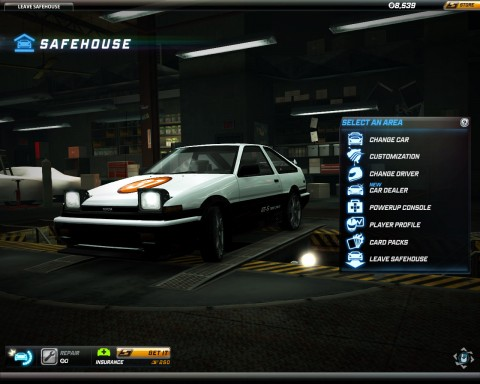
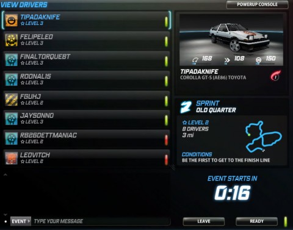

Back to: [West Karana](/posts/westkarana.md) > [2011](/posts/2011/westkarana.md) > [July](./westkarana.md)
# Need For Speed World: Drift online for free

*Posted by Tipa on 2011-07-05 06:53:02*

[caption id="attachment\_6430" align="aligncenter" width="480" caption="The AE86 in my garage"][/caption]

Super Mario Kart on the SNES was a racing gateway drug in our household in the 90s. We liked SMK. We LOVED SMK. All of us, me, my daughter and my son, mastered SMK. And we had a Playstation, so we turned to Need For Speed and many of its sequels to get that same joy of racing each other, togetherness as a family, etc.

I've become thoroughly disenchanted over not having a car of my own. I scour Craigslist for non-scams daily. Having never owned a Toyota, I've decided nonetheless when the Honda drivers attack, I will stand shoulder to shoulder with my Toyota brethren and sistren and win the battle of street racing supremacy, like in [Initial D](http://en.wikipedia.org/wiki/Initial_D). In fact, I probably need to hunt down and buy a mid-late 80s Toyota racing machine, like the Toyota Corolla GT-S AE86, the infamous "hachiroku".

[Need For Speed World](http://world.needforspeed.com/) has an AE86. It's an MMO (kinda). It's free. And I've been playing it for hours.

[caption id="attachment\_6431" align="aligncenter" width="480" caption="Where the doughnut meets the driveway"][/caption]

Need For Speed World is an open world street racing game played simultaneously with hundreds of other people, whom you will probably encounter while exploring the vaguely Los Angeles-like city. If some Civic is getting all up on your tail, you can challenge them to a 1-on-1 race, or at any time join a queue for a multiplayer race. If you'd like to join a race for a specific course, racing hubs are scattered around the map where you can choose to race against NPC cars or other players.

**Racing**

Racing in races gains you experience, cash, and a random reward which could include otherwise locked car parts. Levels gain you special moves (like a free nitro boost at race start) and access to better cars, parts and tunings. WINNING these races gives you even better stuff.

Although the game hints at being compatible with a game controller, I could find no way to make mine work. My very first race was me sitting at the starting line pressing every button on the thing, hoping to see a twitch of anything on the car. Nothing. Hence the keyboard.

W-A-S-D, or the arrow keys, move the car around. You can't strafe as far as I can tell. You CAN DRIFT, if you're careful, by tapping the hand brake (the SPACE bar) while turning. You'll have to take your finger off the W for a moment and understeer a bit to keep control... or just return to your garage and drop the front end and stiffen the suspension a bit so you can turn at speed without having to drift.

You'll gain access to various power-ups, through racing, that can help your chances on the course. There's the nitro boost, of course, the "traffic magnet" that attracts NPC cars to the car of your choice and so on. Playing against more experienced drivers means getting hit with every dirty trick they have at their disposal. Course knowledge is invaluable; knowing just when to push someone else against a sudden unavoidable barrier is a game changer.

[caption id="attachment\_6432" align="aligncenter" width="480" caption="Roadblock up ahead"][/caption]

**Pursuit**

Though racing is the heart of Need For Speed World, it's hardly the only form of gameplay. There's a daily exploration quest which involves driving around looking for checkpoints, and then there's Pursuit.

There's hundreds, thousands of police on patrol in NFSW City. They are more or less content to just let you do whatever you like. Drive on sidewalks. Destroy public property. Race at unsafe speeds. It's NFSW City, stuff HAPPENS.

But collide with a cop car... bump a cop car... scratch the paint of a cop car... and you're public enemy number 1, a menace to society. Every cop in the city wants you gone. Your job is to evade pursuit until the cops lose track of you. If you can manage that, you win, and gain xp and cash proportional to how long you kept them on the run, how many roadblocks you passed, spike strips dodged, cop cars tagged or totaled and so on. If you lose, you lose some cash. no big deal.

NFSW seamlessly generates an instance of the game world as you enter pursuit mode so you're not interfering with other players as you play cop-and-mouse. It's far too easy to anger a cop as you're exploring the city, though.

[caption id="attachment\_6433" align="aligncenter" width="480" caption="Race start"][/caption]

There's a cash shop where you can buy extended customization options to make your car a real danger on the road. I'm not certain you can obtain the special things through normal gameplay, so it could be an instance of paying to win, especially given the crudity of the control scheme costing you a lot of subtler strategies (for instance, every car in NFSW appears to be an automatic).

Nonetheless, there's plenty of fun to be had racing against the game and against other players. Players tend to gather at particularly picturesque spots where you can admire each other's paint jobs and take screen shots or engage in impromptu races. You're not going to spend a hundred hours leveling up in NFSW, and there is no plot or story, it's just online arcade-style street racing, for free, on your PC.

And that's just what I was looking for.

## Comments!

**[pasmith](http://dragonchasers.com)** writes: You're a constant source of surprise... never woulda figured you for a fan of driving games. 

I'd forgotten all about this game even though I pre-ordered a starter pack for it (when did it launch, last July?) after playing around in the beta.

---

**[Wilhelm Arcturus](http://tagn.wordpress.com/)** writes: Is this interest your surrogate as you attempt to buy a car via Craig's List? 

I see you're driving another Toyota.

---

**[Tipa](https://chasingdings.com)** writes: It's kinda like, I want a car (and have one as of tonight!). And I am angry at the cop who took my VW from me two years ago. I felt real catharsis happening as I sent cop car after cop car into the rails.

Sorry to any police reading this. The statie who took my car was just doing his job. I understand that. Doesn't mean I have to feel good about it.

---

**nyder** writes: I've been playing the NFSW since it's beta. As far as I can tell, there is only some special models/graphics of cars that you can buy thru it's "Boost" online payment stuff. But the basic cars and the ability to mod them up is free. I'm still coasting on the $20 boost they gave people who bought the starter packs when it went f2p.

It's a fun game and recently they put "daily quests" in it, specificly you drive around and find 15 diamonds for around 3k rep & cash.

I haven't actually gotten very high in it (L18 and L15) because i tend to enjoy trashing the cops in the game more then racing other people. =)

---

**[Tipa](https://chasingdings.com)** writes: I see that you can buy the cars for insane amount of in-game currency, so that is cool. Will have to do a lot of saving up for Tier 2 cars, though.

I do love the Pursuit game, but I almost never start it on purpose. Those cops are just suicidal. I've started taking level up powers to help me finish off the Pursuit games quickly.

---

**[World of Cars &laquo; The Ancient Gaming Noob](http://tagn.wordpress.com/2011/07/13/world-of-cars/)** writes: [...] I was interested to read about Tipa’s pass through Need for Speed: World, EA’s free, online street racing [...]

---

