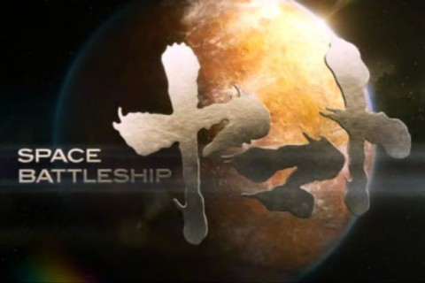
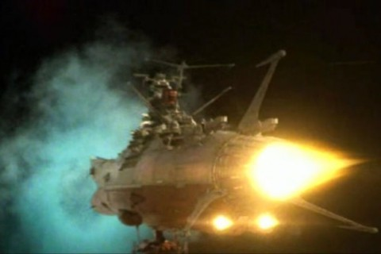

Back to: [West Karana](/posts/westkarana.md) > [2011](/posts/2011/westkarana.md) > [July](./westkarana.md)
# Space Battleship Yamato (the movie)

*Posted by Tipa on 2011-07-31 09:02:23*

[caption id="attachment\_6445" align="aligncenter" width="480" caption="Space Battleship Yamato"][/caption]

The movie starts, like all good space operas, in the silence of space. Blaster fire reflects off the eye of a lone pilot; the camera pulls back and we see she is part of a squadron; the camera pulls back more and we see an invasion of alien battleships against an Earth backdrop. Earth ships fire against the invaders, but their weapons are useless. The admiral sends a cruiser to attract enemy fire as he takes his flagship to safety.

The enemy are the Gamilas. They bombard Earth with meteors for reasons unknown, and now the surface of the Earth is radioactive and uninhabitable. The surviving remnants of humanity have retreated to caverns underground, and scientists expect humanity to become entirely extinct within a year. Scavengers roam the surface in pressure suits, looking for scrap metal to help the war effort. One such scavenger finds a mysterious glowing capsule.

The scavenger is Susumu Kodai, brother to the battleship captain sent to die in the opening. The message is from far-off Iscandar, and contains a schematic for a weapon (the wave motion gun), a star drive (the wave motion engine) and a location in the Greater Magellanic Cloud. Humanity's last hope is to build a ship -- the Space Battleship Yamato -- that can break the Gamilas blockade and bring help from Iscandar before Earth is lost and humanity entirely destroyed.

[caption id="attachment\_6443" align="aligncenter" width="480" caption="WARP!"][/caption]

The original Space Battleship Yamato ran for several years on Japanese TV in the 70s and in the US as Star Blazers in the 80s. Leiji Matumoto's distinctive characters (tall, willowy women, boylike men with wild hair), themes (anachronistic future tech) and mature plots brought an intensity to animation viewers had rarely seen. Instead of the episodic cartoons until then, Yamato told a continuing story. Each episode counted down the number of days left to Earth. As the series progressed, the crew of the Yamato met the blue-skinned Gamilas and their leader, Desslar, personally or in battle many times, with each earning a grudging respect for the other.

Adapting such a well-known and complex story to the screen is a challenge. When M. Night Shyamalan tried to bring the three seasons of "Avatar: The Last Airbender" to the screen with 2010's "The Last Airbender", the heart and humor that informed the Avatar's similar quest (defeat the Fire Nation before the coming of a comet made the Fire Nation omnipotent) was forgotten, leaving a lifeless mess with a poor, last-minute 3D conversion to darken the already muddy film.

"Space Battleship Yamato" never slows down. Plot and back story are filled in during the film's few quiet moments, when it catches its breath between crises. Why does Susumu Kodai join the crew of the Yamato at the last moment, knowing its Captain Okita was the one who sent his brother to his death? Why is ace pilot Yuki Mori so angry with Kodai? All the questions eventually get answered.

Fans of the original Yamato will find a few changes. The blue-skinned Gamilas are now a sort of crystalline insectoid hive mind called Desla, and the relationship between Gamilas and Iscandar is closer even than that in the original. The sake-swilling dwarfish doctor in the original is now a woman (but still a sake lover). The sarcastic robot in the original is now an equally sarcastic PDA carried by Kodai -- and he gets a bit of fan-service of his own near the end. Yuki Mori is now a pilot instead of bridge crew, but remains Kodai's love interest. And a lot of people who are alive in the series... are dead, or die, in the movie.

By turning the Gamilas into a mainly off-screen presence and shortening the trip to Iscandar (what took eleven months in the anime apparently takes about a month in the movie), the movie keeps the urgency up and the focus on the main characters. The significantly different ending to the movie makes sequels based on the further adventures of the Yamato in the original series unlikely.

[caption id="attachment\_6446" align="aligncenter" width="480" caption="Kodai and Mori on the Yamato bridge"][/caption]

I've never seen anything quite like this. It's not easy to bring animation to live action without seeming a parody of the original, but Yamato lifts some scenes shot-for-shot from the original, including the costumes in many cases, without irony. Well, except for Captain Okita's beard. I never did buy that.

It's an epic adventure set in the post-Battlestar Galactica reboot age. There is loss. There is no certain outcome. Victory could still lead to defeat. Life might not go on. There are epic space battles, cool special effects, a meaningful romance, guilt, pain, respect and friendship.

It's space opera. But, I *like* space opera, and I liked Space Battleship Yamato: The Movie.

[caption id="attachment\_6448" align="aligncenter" width="480" caption="The Yamato says goodbye to Earth"][/caption]
## Comments!

**Cow Nose the 50 Pound Cat** writes: Thanks for the review Tipa, I'm definitely gunna check this one out!

---

**[Bronte](http://arewenewatthis.wordpress.com/)** writes: Fire the Yamato cannons!

Unlike Cow Nose though, I don't think I will be checking this one out!

---

