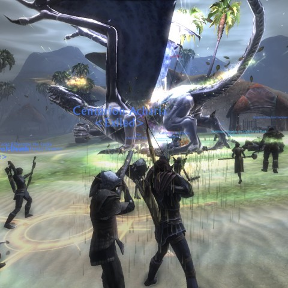
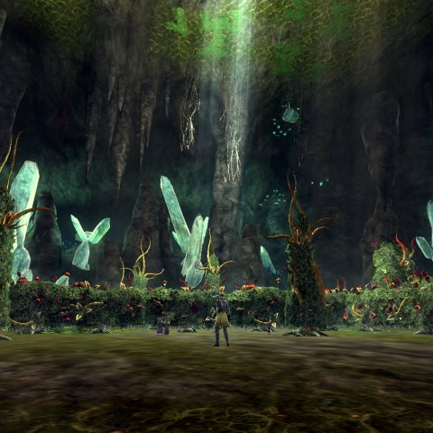
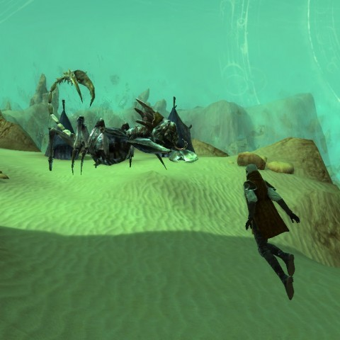
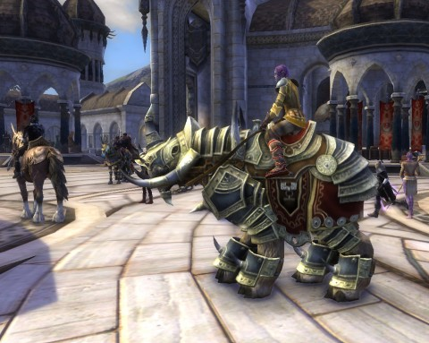

Back to: [West Karana](/posts/westkarana.md) > [2011](/posts/2011/westkarana.md) > [June](./westkarana.md)
# Rift: Just give me what I want...

*Posted by Tipa on 2011-06-20 07:01:21*

[caption id="attachment\_6398" align="aligncenter" width="480" caption="Raid rift in Shimmersands"][/caption]

All I want out of a fantasy game is dragons and the tools to kill them. DDO (more on that in another post) is a disappointment there. They should just rename that game "Dungeons and ????? Online". But Rift... Rift is just lousy with the big lizards. The whole rift concept seems tailor made for them as well. A dragon pushes a bit of its own reality into Telara; it comes with buildings, henchmen, swirling, floaty rocks and storm winds, and we push it back.

Right in the open world, too, among other adventurers going their own ways. They can even decide to join in for some rewards. I was benched out in Saturday's Greenscale raid, so while waiting for a spot to open, I went on a couple of pickup daily raid rifts. It's difficult to see how raiding could be more *accessible* than it is in Rift. Pickup raid rifts take about fifteen minutes to do, once you get started. Loot usually is a couple of planar essences and a bit of gear, as well as the inscribed sourcestones used to buy "best in slot" essences back in the capital. So there's a powerful incentive for even raid-geared folks to get these daily raid rifts done.

More dragons and lots of other stuff, after the break.

[caption id="attachment\_6400" align="aligncenter" width="480" caption="Dragon in Expert Darkening Deeps"][/caption]

I'm really liking the whole "expert dungeon" thing as well. As you level, you end up going through most of the ten dungeons at least a couple of times, but Rift is holding out on you. You're just seeing the preview for the REAL dungeon, the "expert" dungeon, that's waiting for you once you hit the level cap.

Expert Deepstrike Mines opens a section filled with lasers and robots -- for real! It's behind the last "normal" boss! In regular Iron Tombs, Eliam's Ghost (it is his tomb, btw) leads you to safety after killing the last fire demon boss. But in Expert Iron Tombs, just as Eliam is getting ready to bring you out of the dungeon, the villainous Alsbeth turns him to evil and forces him to unleash a further horror! Then you get to face Eliam himself in Expert Runic Descent -- along with the resurrected shade of the only boss in Realm of the Fae who seemed at all glad to see you... at least until he found out you were standing between him and his BEER.

[caption id="attachment\_6399" align="aligncenter" width="480" caption="Infiltrator Johlen"][/caption]

Guild is currently stuck on Infiltrator Johlen, second boss in Greenscale Blight, Rift's starter raid. It's a fight in several progressively more scripted phases, and we're working on the last. It's basically a DPS test that heats up as you get toward the end. The first boss, the Baron, tests the guild's ability to follow a script. The second is if the raid can bring a lot of damage to bear at need (and we rogues have a spec we have to adopt before Thursday to this end). Soon, I imagine, we'll have to pass a gear test, which stresses our resistances. That's the WoW model, anyway, and I can't see Rift straying far from that.

Tuesday, River of Souls, the second raid, is on the schedule. I actually prefer the raid rifts. They are quick bits of adventure that give you vast leeway in what kind of build you bring, allowing experimentation and tuning without the high stakes of a formal raid.

[caption id="attachment\_6401" align="aligncenter" width="480" caption="Alternate Meridian"][/caption]

I finally saved the 25,000 planarite required to purchase the "Quantum Sight" planar ability, which allows you to see into alternate Telaras. Now I don't have enough planarite to buy the elemental squirrel pets... I guess those will wait.

Anyway, the very first alternate Telara I got to see was one where the Guardians and the Defiants joined together to free Telara from the dragon lords and were so happy about it that the various faction leaders just happened to be having a group hug in Meridian when I popped in.

My first reaction was, "Grats! Cool! The ENTIRE POPULATION OF MY TELARA **INC**!"

[caption id="attachment\_6402" align="aligncenter" width="480" caption="Quantum Tear in Shimmersands"][/caption]

Quantum Sight is currently only useful for finding the entrances to new raids, like this one in Shimmersands which opens to a raid vs the bosses of a Telara where the Plane of Earth holds sway.

[caption id="attachment\_6403" align="aligncenter" width="480" caption="Plane of Earth boss"][/caption]

Thankfully, the whole weird "I'm dying from lack of oxygen" vision thing doesn't last long once you get a little further into the alternate reality. This is the first boss of the instance, which, according to the Wiki, is very heavily scripted.

Just as we'd expect.

[caption id="attachment\_6395" align="aligncenter" width="480" caption="Mechahorse"][/caption]

[Stingite](http://rift.happydueling.com/) was wondering why he'd never seen any of those faction mount vendors anywhere. They do tend to be squirreled away in hard-to-reach places, but you can find some of those mounts just by looking around Meridian.

Here's my character on the level 50 mecha-steed, bought at the vendor right at the Meridian gates. I didn't have to go far for that. But it was so expensive, that after buying it, I couldn't afford to use the teleportation gates or do soul repair. True story.

These two mounts are sold at the border between Iron Pine Peaks and Stillmoor, one on one side of the border and the other on the other. Not sure which one is which. Pretty damn fancy, though.

## Comments!

**[Elementalistly](http://simple-n-complex.blogspot.com/)** writes: "But Rift… Rift is just lousy with the big lizards"

At first I was like...WHAAA? But, then I think I understood....or, maybe I am still wrong?

Lousy as in LOUSY, or lousy as in DANGGGGG

Modern language eludes me at times....good thing I am FAT...(ARGH...Phat, I meant PHAT)

---

**spinks** writes: I'm soon going to have to choose between cute squirrel and quantum site. It isn't easy.

---

**[Tesh](http://tishtoshtesh.wordpress.com)** writes: "Lousy" as in "infested with big numbers of", as in "almost innumerable louses" in a dirty hovel.

... at least, that's how I read it.

---

**[Tipa](https://chasingdings.com)** writes: That's how I meant it, Tesh :)

Telara is INFESTED with GREAT NUMBERS of DRAGONS. YES!

Also can't wait for Skyrim, natch. Infinite dragons. Rawr.

---

**bhagpuss** writes: I hit the 60k planarite cap on both my Guardian and Defiant higher characters with no real effort. It's annoyingly low. That's what happens if you spend almost all your time doing zone events, and especially if you start doing Droughtlands, IPP, Shimmersands and Stillmoor zone events from about level 20 :P

So far, in all the countless hours I've played, I've done one dungeon (RotF at level 18), one Raid Rift (outside Zareph's, didn't even know what it was until half way through) and one session of Expert rifts on the white sands in Shimmer (5 in a row, main healing, exhausting). I keep meaning to start doing dungeons but there's always a zone event going on somewhere or I end up in a Warfront...

---

