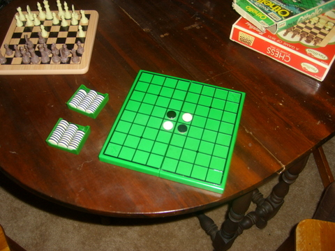

Back to: [West Karana](/posts/westkarana.md) > [2011](/posts/2011/westkarana.md) > [June](./westkarana.md)
# Go: Absolute Beginner

*Posted by Tipa on 2011-06-20 20:51:09*

[caption id="attachment\_6406" align="aligncenter" width="480" caption="Not a GO Board"][/caption]

My mom died when she was fairly young. Her carnival glass collection, her silver, her jewelry, I have nothing of those things. I think her new husband tossed all the childhood things of mine I was keeping at her place, all my childhood books I'd hoped to pass on to my kids. All I have of her are three gifts she got me; my Orange Teddy, a boxed collection of The Lord of the Rings (which will be my son's), and this old Othello board.

I played in the chess club at school, but I was not a star player. I had no real desire to memorize all the chess openings and just tried to hide my lack of study with aggressive play, which sometimes worked but usually didn't.

Othello [had just been reinvented](http://en.wikipedia.org/wiki/Reversi) earlier in the decade, in Japan in 1971, and was pretty heavily marketed as a quick, fun game. Mom bought it for me for my birthday, I was probably 15 or 16. She probably saw it on the rack in Toy City. I brought it with me to school and it was a hit among my nerdly crowd.

My math teacher explained that Othello was a cousin to a much older game, [Go](http://en.wikipedia.org/wiki/Go_(game)). He himself was something of a pro, he said. He showed me the board and the moves. I didn't understand it at all. I had no idea what was happening. My Othello experience was useless. I gave it up, but I knew I'd missed an opportunity. Chess and Othello fell by the wayside. In college, backgammon was the game of choice for the gamer crowd.

So, fast forward 35 years, and inspired by an [anime](http://en.wikipedia.org/wiki/Hikaru_no_Go), I'm going to try and learn it again. I'm starting from zero and working my way to internet play, where I will be ranked and find out just how much of a noob I am.

## Comments!

**[pasmith](http://dragonchasers.com)** writes: Not sure if you missed my comment in response to your voicing an interest in Go, or were just ignoring me, but dragongoserver.net is a nice place to play slow-paced games (ie, play asynchronously) and there are players there who'll offer to play teaching games, which is always a great idea. Go is devilishly hard to learn from books, in my experience. ItsYourTurn.com offers Go and the players there tend to be less skilled, which can be fun in its own way, too, but you probably won't learn too much. 

I used to play but never got very good at it. It's too... visual?? for me. I think it really helps if you have an eye for patterns, which I don't.

---

**[Tipa](https://chasingdings.com)** writes: lol... I would never ignore you. I probably was just off the computer. I don't expect to win any games; I hardly ever even against computers who are trying their best to let me win and allow me to take back moves!

---

**[Brian 'Psychochild' Green](http://psychochild.org/)** writes: It's been fashionable for some game developers to "study" an ancient game like Go, Chess, or Poker to try to understand it on a deeper level. I think I'll find it more fascinating to hear the process of learning one of these classic games, and I look forward to reading more.

---

**[Sente](http://adingworld.wordpress.com)** writes: I guess you have played against igowin? I like it for the early practice with 9x9 games. Its bigger brother Many Faces of Go is also a nice piece of software, but to take advantage of its learning/training features you need to buy the full version rather the trial version.

I should actually try to get back into practicing to try to get beyond newbie level ;)

---

**[Oakstout](http://www.oakstout.blogspot.com)** writes: I had that same Othello set when I was a kid, hell I may even have it in the closet at home lol. My dad taught it to me, he was also a pretty decent chess player as well. The only strategy I learned from him in Othello was you had to capture the corners. If you did that, the board was 90% of the time yours. However I'm sure there a lot of other strats.

If you do play on line and want an easy victim, give me a shout. I'd love to play it again.

---

