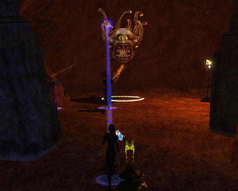

Back to: [West Karana](/posts/westkarana.md) > [2011](/posts/2011/westkarana.md) > [June](./westkarana.md)
# DDO: Beholders are racists.

*Posted by Tipa on 2011-06-27 00:24:40*

[caption id="attachment\_6423" align="aligncenter" width="480" caption="Behold!"][/caption]

So I knew this going in, there's nobody that hates us Drow more than your average beholder. There could be two paladins bashing away on it, a favored soul doing whatever it is they do, a sorcerer baking it in magical flames, and me plinking away at it from fifty meters away, trying to get a good holy arrow or two in its mad, unblinking eye, when it roars, "I SMELL BLUESKIN!" and zaps me with a death beam, TOTALLY IGNORING all the mayhem at its feet. If it had feet.

But you know, where I come from, you get used to the smell of burning Drow. It fades into the background. Just part of the day. "Lord D'Nazza, I believe?" you say. "unexpectedly aromatic. What was it, L'Narr, mind flayers? Rockworms? Ah, carrion crawlers. Again."

Again. Fellow Drow, we are losing a war here. A war for our existence. Surface dwellers don't care -- I know, I am in Stormreach every Sunday, and the sentiment there is the only good Drow is a dead Drow.

I'd dedicate this beholder's death to the Spider God, Lloth. If I'd lived. And if she just didn't see us all as potential drachnid chow.

Thanks for the rez.

[caption id="attachment\_6424" align="aligncenter" width="480" caption="Threnal"][/caption]

For the past three weeks, Team Spode has been delving in the [Ruins of Threnal](http://ddowiki.com/page/Ruins_of_Threnal), trying to add a Cloak of the Worldshaper, a cloak that offers see invis and 5% experience, to the d20 trinket we got from the [Deletera's Tomb](http://ddowiki.com/page/Delera%27s_Tomb) arc.

Delera's Tomb was narrated by the Head DM himself, Gary Gygax. Ruins of Threnal was narrated by the co-creator of the original Dungeons & Dragons, Dave Arneson. They died the real death within a year of each other, soon after they recorded the narration for their respective modules. United in death as they were in life. It's odd to hear them speak in game.

We've been guided in our journeys by the newest member of Team Spode, Lessah of [DDO Cocktail Hour](http://ddococktailhour.com/). She's like [our own River Song](http://tardis.wikia.com/wiki/River_Song), continually wondering if she should be warning us about imminent tragedy right around the corner...

And invariably, Spode crashes through anyway.

After all, there might be a CHEST past that monster, and in the few seconds it takes for the monster to hunt down and kill everyone's favorite Drow (me), Spode could have that bad boy looted.

I kid :) Spode is the very picture of chivalry and good. We never hear jokes about the size of his codpiece (which has a secret compartment in which a halfling can be stored). Nope. Decorum personified.

Anyway, the story of Threnal is one about discovering the fate of several archaeological expeditions that have gone missing. This is because archaeologists are playing the long game. They know that, someday, they WILL find a dungeon that isn't inhabited by hordes of screaming monsters. It just makes sense to hold off on hiring adventurers to guard expeditions until you're sure you need them, right?

We loot their adventurer packs as we step over their cold corpses. But you know, next time the dungeon will be monster-free, for sure. Can't be 100% death traps every time, law of probability wouldn't allow it. Science!

[caption id="attachment\_6425" align="aligncenter" width="480" caption="Wall o' Fire"][/caption]

The Ruins of Threnal share that annoying mechanic where you have to clear to a certain point in the dungeon, rush out to tell some NPC some nugget of news, then fight back through a mysteriously repopulated dungeon, get a little farther, come back, etc. This proves just how soft on logic these NPCs *are*.

"Go look for our missing expedition. They entered yon dungeon and never returned."

"Have you gone to look for them yourself?"

"How could I? I'm standing right here inside this tent! HAH!"

"So, you don't actually know they are missing. They could be right on the other side of the door, having a laugh or something."

"No, I'm pretty sure they're dead. You should go look. I have totally awesome stuff to give you if you just go to the door and give a holler inside."

So we go in, door slams shut behind us, we find the dead expedition and we all get massive experience and level several times. We return to the NPC.

"So, they were all dead. Can we have our stuff?"

"Well, sounds like one got away. He probably was right around the corner, about to shout out, when you left. Could you go JUST A LITTLE FURTHER this time? I'll make it worth your while."

We rush in, door slams shut behind us again, fight all the monsters we fought ten minutes ago, bust all the crates we busted five minutes ago, go a little further, find the missing scientist has turned evil and hates us, etc. So we do a lot of killing and level a bunch more times, return to the NPC.

We gather around the NPC, each of us like level five million, and he wants us to go back in and go JUST A LITTLE FURTHER and I'm thinking, I want to stand under a tent and send people to their doom. I'm level five million, bitch.

But I never do. I guess I like being bossed around by pale-faced dandies. They're all racists.

## Comments!

**Longasc** writes: For some reason I never really got into DDO despite being quite a (A)D&D fan. Probably a bit similar to you and LOTRO.

Just wanted to say: GREAT STORY!

Personal pet peeve: Lloth <- absolutely! For some reason "Lloth" is called a Drow-dialect and the horrible "Lolth" seems to have become the official version nowadays.

---

**[Gankalicious](http://www.gankalicious.blogspot.com)** writes: Having worked as an archaeologist I can tell you that the reason there are no caravan guards is because we just weren't given the funding for it. We had our tools, our (usually) non-white train of laborers to cart stuff around, and fancy tents to sit in and sip gin...oh, and the white shirts, hats, and whips of course, but no bloody funding for caravan guards. If I had a dime for every time one of my expeditions went missing, let me tell you....

---

