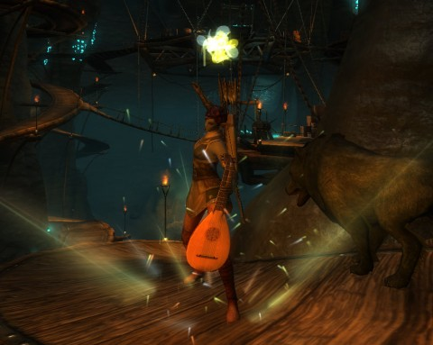

Back to: [West Karana](/posts/westkarana.md) > [2011](/posts/2011/westkarana.md) > [March](./westkarana.md)
# Rift: Who am I, this time?

*Posted by Tipa on 2011-03-03 07:46:57*

[caption id="attachment\_6250" align="aligncenter" width="480" caption="Striking a Power Chord in Deepstrike Mines"][/caption]

I only had a chance to play for a little while last night. The guild message of the day told us to complete dungeon runs to finish off some guild quests, so I went off to the Stonefields looking for a Deepstrike Mines group.

DSM is a dungeon filled with undead who are using kobold slaves to mine sourcestone, the heartblood of Telera. There's a couple tricky fights in there, especially the last boss, who tosses out crystals that you must either run from or destroy, depending on the color. Everyone likes maximum dps there.

As a rogue with hundreds of possible soul combinations available, figuring out how to market myself to a group is a puzzler. I think my best contribution to a dungeon is in my ranged bard/ranger spec, what with pretty awesome buffs, decent second healing and ranged/pet dps. For those times when groups are just calling for DPS, I have a secondary assassin/bladedancer/riftstalker spec.

So I yelled that I was either baranger buffs/dps or assassin dps and got a group straight off.

Here's where the fun begins. Every player in the group could handle more than one role. The warrior knew he was the tank, and we did have a cleric who switched over to a healing role, but we two rogues and a mage rounded it out, and between us, we could tank, crowd control, buff, heal and dps -- if we set our specs correctly.

On the way through the dungeon, we each switched specs a couple of times, looking for the best group for the challenge. If it looked like we had healing and tanking handled, we'd all switch to dps specs. If it was a crowd, then crowd control would begin to happen.

When we got down to the crystal-hurling boss, we were all in dps mode. Those of us with the option switched to melee dps to boot, me in assassin, the other rogue in nightblade. We had problems with the boss' PBAOE. So we'd move to range. DPS on the crystals wasn't high enough. We wiped three or four times. Once we got our specs worked out, though, it was easy.

Someone noted, when we finally won, that we seemed to be taking a lot less damage in the last fight. Someone else pointed out I'd switched to bard for the last fight, and was buffing and group healing throughout. It took us awhile, but we did manage to form the best group for the fight, eventually.

That's the power and the danger in Rift groups. When anyone can fill multiple roles, and swap through them on a whim, how do you market yourself and once in a group, how do you decide who will play which role? The bard soul isn't seen as particularly necessary, but that's only because players don't yet know how amazing our buffs are; but going deep in the bard tree does limit opportunities to be incredible at dps.
## Comments!

**[Scopique](http://levelcapped.com)** writes: This still seems like a potentially slippery slope to me. It's good that people COULD switch on the fly, in the dungeon, as needed, but as you state (at least what I got out of it) when do you know what you have a lot of and what you are lacking without the absolute best communication within the group? What if someone DOESN'T have a particular spec in their pocket that someone else wants them to have, because the owner wasn't ever interested in playing that role? We're going to get some abusive scenarios, I'm sure.

---

**João Carlos** writes: "The bard soul isn’t seen as particularly necessary, but that’s only because players don’t yet know how amazing our buffs are;[...]"

The players at beta thought bard was necessary, at least for raids. Eventually the players after launch will learn it too. The same to all otehr souls possible at all callings. Sooner or later players will learn that clerics can tank or that mages can heal.

My guess is that players will just market themselves with calling and roles ("mage dps or healer roles LFG DSM" or maybe "rogue dps or tank or support roles LFG IT"). I fear the only ones that will have a harder time will be warriors, they are tanks or dps, and obviously groups will want tanks.

---

**Bhagpuss** writes: We'll see. I think that, while some players, especially those who take things more seriously, will build and learn a variety of specs, others will just play what they are used to playing. For years we've heard people saying "I always play a Paladin" or "I only ever play healers". Whether those players will be interested or willing to expand their repertoire is uncertain.

It's not just a question of willingness, either. There's also the issue of competence. In straightforward, normal play it may well be that anyone can swap roles on the fly and do a good-enough job, but when it comes to content that requires something more than "being there", will a player used to providing ranged DPS be able to provide not just the character skills but the player skills to perform acceptably as main healer?

Then there's the really important part - character. Personally, I've been playing Rift several hours a day now since Friday and I've spent the lion's share of that time in a single spec. I am becoming more and more convinced that I will be using the roles mainly to find the build that fits that character and then sticking with it. Even solo I find swapping from one Role to another disorienting. I keep thinking I have swapped characters and I am actually surprised when I find I am still on the same quests and still have the same things in my bags. And I don't like it, so I don't swap roles much. 

It's early days and this may all settle down in a while, but at the moment i anticipate making a lot of characters and giving each of them a static build similar to a conventional class, rather than stacking up multiple roles against an Archetype on the same character.

---

**[Tipa](https://chasingdings.com)** writes: I admit I am increasingly comfortable with sticking with my bard/ ranger in all cases, but I do feel I need to make at least a tanking role so I can get comfortable with that. I wasn't being a very good assassin last night, as my rotation was so very different and I hadn't put the time into exploring synergies with the other rogue melee souls. 

I can't imagine starting another rogue from scratch just to explore new combos, though. I do think most Rifters will be comfortable in at least two roles in the end.

---

**[mythokia](http://perpetuallybored.com)** writes: I play an Archon (most points in it)/Chloro/Pyro, and the Archon really stands out in having buffs that gives the group spikes of damage and overall buff/debuffs. It's still a pretty rare class in comparison to the other mage souls just because most people don't realize the usefulness it yet.

---

**[MMOGamerChick](http://mmogamerchick.wordpress.com)** writes: We did the exact same thing in DSM last night, trying to switch roles to find the best group makeup to take down the last boss. It's a DPS race, really, and because we did have two lower level DPS players who were with us who were only 23 or 24, in truth a little low for DSM, we just couldn't burn him down. But we learned a lot about the fight and knew ultimately we weren't doing anything wrong strategically. Seems like as long as a group has tank and heals, it can pretty much be set it up in so many different viable ways.

---

**[Mojeaux](http://voodoogamer.wordpress.com/)** writes: Bards for the Win!

---

**[I&rsquo;m a Loner, Dottie. A Rebel &laquo; Levelcapped!](http://levelcapped.com/?p=1015)** writes: [...] expected to make wild heading changes in response to the need of a party, which is something that Tipa touched on in regards to Rift’s soul system. I always felt that it was bad enough that people judged you on your build choices, but because one [...]

---

**[pkudude99](http://nomadicgamer.com)** writes: @MMOGC -- in Beta7 I went in to DSM as a dps spec'd mage, but while the tank was well geared, our cleric wasn't quite up to keeping him alive even against trash, so I swapped to Chloromancer and we had 2 healers for the rest of the run. Final boss took a little while to kill, but wasn't bad, I didn't think. I assume that since we had 2 healers that our dps was "low" but that didn't seem to affect anything that I noticed. As a result, I don't think it's necessarily a dps race, just a matter of being sure to move away from the red bombs and to kill the brown ones.

---

**[Tipa](https://chasingdings.com)** writes: It's a DPS fight in that you need to kill the brown/yellow crystals that heal him ASAP.

---

**Anakh** writes: I understand what you are talking about. I am also a rogue, and a bard - initially I planned to make a 51 point bard, and still do, as a main buffer/healer, etc. But I have found it is very nice to have a second role as a saboteur - I end up doing most of my levelling as the sab, then switch to bard in groups.

---

