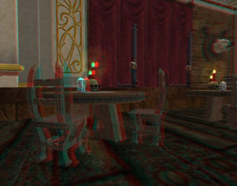

Back to: [West Karana](/posts/westkarana.md) > [2011](/posts/2011/westkarana.md) > [March](./westkarana.md)
# Rift, yer pretty, but ya ain't no EverQuest II

*Posted by Tipa on 2011-03-05 08:24:52*

[caption id="attachment\_6254" align="aligncenter" width="480" caption="Plushies, Appearance Items and Housing"][/caption]

Since the times when the local post office is open correspond almost exactly to the times I am at work, I won't be able to pick up my Rift Collector's Edition until later today... and I couldn't play last night at all. My headstart amnesty was up.

So I turned to EQ2 for a little fun.
 .bbpBox43845498133692420 {background:url(http://a3.twimg.com/a/1298664727/images/themes/theme1/bg.png) #e4ecec;padding:20px;} p.bbpTweet{background:#fff;padding:10px 12px 10px 12px;margin:0;min-height:48px;color:#000;font-size:18px !important;line-height:22px;-moz-border-radius:5px;-webkit-border-radius:5px} p.bbpTweet span.metadata{display:block;width:100%;clear:both;margin-top:8px;padding-top:12px;height:40px;border-top:1px solid #fff;border-top:1px solid #e6e6e6} p.bbpTweet span.metadata span.author{line-height:19px} p.bbpTweet span.metadata span.author img{float:left;margin:0 7px 0 0px;width:38px;height:38px} p.bbpTweet a:hover{text-decoration:underline}p.bbpTweet span.timestamp{font-size:12px;display:block} @[tipadaknife](http://twitter.com/tipadaknife) eq2 really? Figured you were done with it.[less than a minute ago](http://twitter.com/#!/redheadedtim/status/43845498133692416 "Sat Mar 05 01:29:16 +0000 2011") via [Twitter for BlackBerry®](http://blackberry.com/twitter)**[redheadedtim](http://twitter.com/redheadedtim)**  
redheadedtim

 

I've always kinda felt EQ2 was done with *me*. It's one of those games that I feel you have to get some momentum going to carry you through the grindier bits. Once you've lost that momentum, it takes a significant effort and desire to get it back.

Most know that I've given up my halfling troubadour and have been working for some time on a new character, Scatterfall, a now level 53 Fae berserker. The recipient of all my Fortune League rewards, I log Scatterfall in each week to claim the AA XP scroll and ding four or five AAs all at once.

This last week has been all Rift, all the time, and when I logged into EQ2 to finish up the Lavastorm Sootfoot line, I felt really ... weak. Since I couldn't heal myself, I had to choose my fights carefully, and still died a lot if I got too many adds. Since there were no other people of my level in the zone, soloing was my only option. Since there was no public content at my level (there is for level 90s in the new expansion) I just hacked away at goblins and drakes and colossi, finished my quests, got my rewards -- a really nice blade I can wield at 55, a weird hat which will prevent me from being mind-controlled by Void-touched creatures (maybe), and access to a lot of housing items and appearance armor.

[caption id="attachment\_6253" align="aligncenter" width="480" caption="Lunar Wolves guild hall... in 3D"][/caption]

Oh yeah.

Rift knows nothing about those things.

Rift does a very good job at taking elements from World of Warcraft and Warhammer Online and melding them into an exciting game that feels fresh. The soul system and the rifts themselves -- game changers.

It's jarring, a little, that they stopped there. My Fae has a home among the branches of Kelethin. It's basically a two story acorn. Downstairs is decorated for guests; upstairs, I am building a hedge maze from Night of the Dead rewards. It's spooky.

I belong to a fairly inactive guild on Antonia Bayle called Lunar Wolves. They have a huge guild hall in New Halas, ornately decorated and lavishly appointed -- the 3D picture is from the theater (very similar to the one Stargrace made for me years ago). Even EverQuest has housing and guild halls. Even Dungeons & Dragons Online has guild airships.

I can see the issues about having housing and guild halls in the game. Lots of new art assets, where will you put these things, now you have to make a ton of new stuff in order to give players ways to make their homes and guild halls unique... I can see that.

But, where is the appearance armor? You already have the art assets -- the armor and weapons that are already in the game. You even have armor dyes, though why someone would use dyes when the armor is being continually replaced is confusing to me. In games like Spellborn and Star Trek Online, your item stats and the look of your gear are entirely disconnected.

Spellborn had this really innovative idea -- one of many, really -- that you should always look as badass as you wanted. You were, after all, a hero. Leveling could earn you even better looks, but the concept of starting out a poor orphan in tattered armor was never a concept that made any sense in Spellborn. The very first thing you did in the game was save a shardship from an invasion of void creatures. You're a hero from day 1, hour 1. You should look like it!

Likewise, in Rift, we're the Ascended! Resurrected heroes (in the case of the Guardians, anyway) who should be able to choose their own appearance from the gear they earn. Some of my weapons I've been sad to see runebreaked, they looked so cool, but their stats were off that critical 5% from the newer stuff.

I'm happy Rift has done such a good job of lifting ideas from WoW and Warhammer that I have no desire whatsoever to play any of those last generation games. Isn't it time Rift turned around and started getting a little inspiration from EQ2?

([Thanks for the Anaglyph GIMP plugin!](http://registry.gimp.org/node/6527))
## Comments!

**[Paeroka](http://paeroka.wordpress.com)** writes: I'd absolutely love to have appearance armor/cosmetic slots or whatever you want to call it. *sigh* Especially since my little cleric is currently "forced" to wear a big belt instead of a pair of trousers (I could wear something lower level but... stats!). And housing... I'm never sure about that. I really loved that LotRO has housing until I realised the poor implementation. So yes to housing, but only if it's good. ;)

---

**Esri** writes: Yes, lift the housing from EQ2 and the appearance slots from LOTRO, please Trion! I have been "screaming" about the armor since beta 1. I just cannot bring myself to play a warrior (I always play females) in Rift. That could be fixed by more armor options (I don't want to take away the 12 year olds' right to naked female tanks, I just don't want my female tank to wear a thong) or, even more easily, by appearance slots. 

Of course, you always have those guys on the board who think that any time spent by the devs on "fluff" rather than raiding is time wasted... and they are very vocal about it.

---

**[MmoQuests.com » Rift is Fun.. But&#8230; #Rift #EQ](http://mmoquests.com/2011/03/05/rift-is-fun-but-rift-eq/)** writes: [...] post today really hit home for me, it was exactly what I was going to write about (but she does a much better [...]

---

**Bhagpuss** writes: Appearance slots are coming:

http://forums.riftgame.com/showthread.php?62338-Scott-Puts-Us-in-Our-Place/page16

Scott Hartsman's response there to the question "So does that mean some of the RP concerns are still on the table. For example appearance tab?" is:

 "Of course. We have a long list of features we'll be adding in post launch updates."

I don't have the time to dig for the quote but I believe the position on housing is that it is "being considered" for "later".

Personally, I'd like an appearance tab that could be toggled Off by other players. In other words, you could see your appearance garb, other players who consented to do so could see you wearing it, but the default would be that everyone else would see you wearing what you were actually wearing. Housing I love but I'm scared of. 

Mrs Bhagpuss has spent a full year in EQ2 doing almost nothing but first decorating and later building houses. She literally built an entire new house in the grounds of one of her Halas house and completely removed the old one. You can zone in there and move around a full building with extensive grounds and amenities and not see a trace of the original property bar the front door. I prefer Rift without housing for the time being so we actually go out hunting again!

---

**Bob** writes: Housing is a waste of development time. The majority of people will spend their time in dungeons and the open world doing things while a small percentage will stand around in the housing in playing doll house or maids.

Guild housing turned EQ2 into a ghostland. No one uses major cities anymore. People say WoW has no community?

---

**[Jomu](http://www.justonemoreunlock.blogspot.com)** writes: I think housing would be cool in Rift(tho placement would be a concern; ie. UO); i kinda wish there would be atleast guild housing and they could implement it as an instanced area like DDO and the airships =)

---

**[Eliot](http://expostninja.wordpress.com)** writes: @Bhagpuss: "Being considered for later implementation" seems to be development code for "I'm not looking for a relationship right now, but I'd appreciate it if you still fawn over me as if I were."

Sadly, the idea of features that do not directly contribute to your character's ability to slaughter hapless minions has been getting steadily phased out from MMOs. There are not wholly indefensible reasons for that, but it's still kind of depressing. In a tabletop game, I can make a legitimate choice to have my elven bard buy a new instrument that provides no tactical bonuses but looks or sounds nicer. Not so in an MMO; we are creatures of statistics, these days, and you only want that new lawn chair if it's going to help buff your mana regen for difficult battles.

---

**[Elementalistly](http://simple-n-complex.blogspot.com/)** writes: My requests...in order

1. Guild Bank...just stop ANY further development until this is DONE!
2. Appearance Slots...yes, please...NOW you can make this (after Guild Bank, madams and sirs of Trion)
3. Housing...YES! And then add more collectibles to put in homes...oh my.

Rift has all the right tools to be THE game. Just need to focus on whats right...for the peoples.

---

