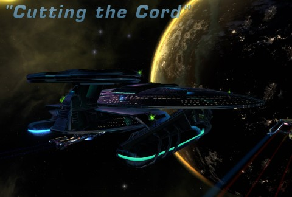
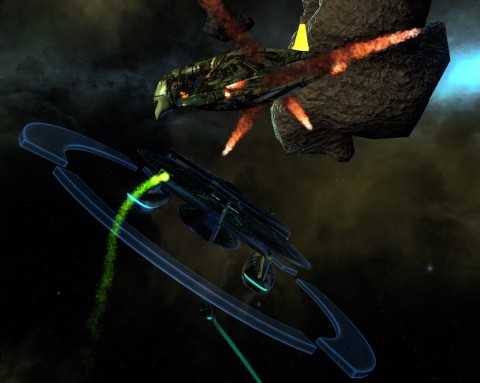
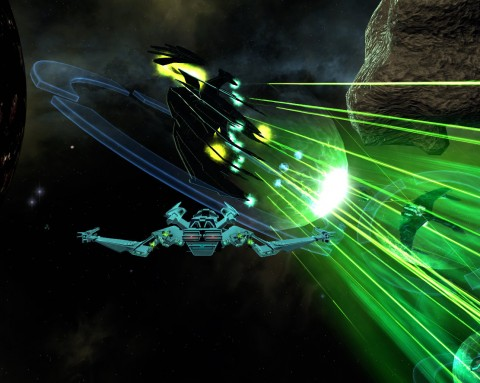
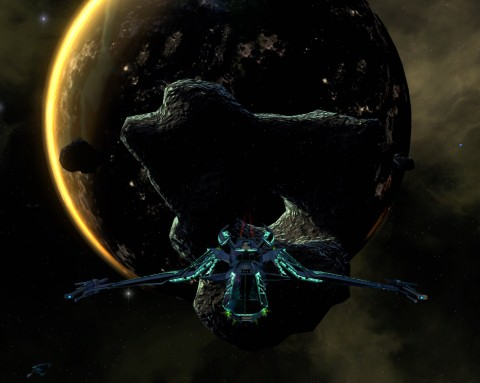

Back to: [West Karana](/posts/westkarana.md) > [2011](/posts/2011/westkarana.md) > [March](./westkarana.md)
# Star Trek Online FE305: Cutting the Cord (spoilers)

*Posted by Tipa on 2011-03-06 00:00:03*

[caption id="attachment\_6260" align="aligncenter" width="480" caption="Cutting the Cord"][/caption]

After last week's epic episode, "Coliseum", those of us at the Federation News Service were intrigued to see just how they could possibly top that nod back to the high point of the Star Trek franchise -- the very beginning.

Maybe they could have stayed in a retro mood, and maybe it would have been better if they had. "Cut the Cord", the finale of the "Cloaked Intentions" arc, instead took its cues from "Star Trek Nemesis", the movie that finally killed the Star Trek franchise. Nonetheless, it was still a fun, if literally on rails, experience.

Details, and spoilers, after the break.

[caption id="attachment\_6262" align="aligncenter" width="480" caption="Tal Shiar Orbital Defense"][/caption]

It was Admiral T'nae who had the job for us. Evil megalomaniacal Hakeev had been tracked to a heavily fortified base in the Brea system. We now had proof of Tal Shiar involvement with the Iconians, which the Remans charmingly call demos of air and darkness. The word Iconian is so much SHORTER, though. That's the Remans, for you. Whining about how light it is. Scared of demons. Building those thalaron weapons.

Oh yeah. Those thalaron weapons. I guess it really IS the Federation's problem, after all. Gee, I sure hope we don't meet any ships armed with thalaron weapons... That would suck, as we Andorians say.

The Tal Shiar built their base on a temperate planet in the Brea system. The guarded it with a ring of satellite torpedo weapons and patrols. When we warped in, we were instantly detected, and escort ships sent to take us down. That started a space battle of epic proportions. Battles in Star Trek Online scale to the number and rank of the ships you bring. We were in a full group scaled to the highest rank, so the game threw everything it had at us.

Tactical officers can reprogram some of the satellites to fire on the other satellites; that helped a little. The fight ended with an exhausting melee with a Rommie battleship, way stronger than it had any right to be.

With the Tal Shiar base now undefended from space, we closed in and beamed down to Rommie central.

[caption id="attachment\_6264" align="aligncenter" width="480" caption="A guided tour"][/caption]

There was some strange radiation in the air, interfering with the transporter beam. Our bridge officers beamed down, all right -- but nowhere near us. What's worse, the radiation was such that we couldn't be beamed back up unless we managed to destroy some of the generators in the area that emitted that radiation.

We'd beamed down into a nest of Tal Shiar; to be expected of course. Neither side was interested in anything but aggressive diplomacy. They managed to clear things up enough up in orbit that they could beam down security teams to help take down the Rommie scum, so we weren't entirely defenseless. Once we'd planted charges on a couple generators, the Remans beamed down some teams that would keep the Romulans on the ground occupied.

Helpful advice from our missing bridge officers (now safely retrieved and in orbit) advised us to use the bridges and catwalks that connected the tall buildings to cross some barriers and evade the fighting on the ground. My chief engineer even rigged up a guided beam on our heads-up display to show us exactly where to go.

[caption id="attachment\_6269" align="aligncenter" width="480" caption="Nuke 'em from orbit"][/caption]

Yes, we were led around the city by glowing arrows. We were all a little crushed by that. But there were some amenities. We were able to get high enough to get above the interference and spot some coordinates for orbital bombardment. Oh yes. Sweet torpedoes from heaven. On an adjoining rooftop, some Romulans took potshots at us, safe from reprisal. Except our phasers could reach their Scorpion fighter. We blew it up, and it blew them up.

Engineering officers had a task to use the weather control system to destroy a gravitic lift. Everyone eventually would have a task.

[caption id="attachment\_6265" align="aligncenter" width="480" caption="The Last of Hakeev"][/caption]

Our lighted guide brought us eventually to Hakeev, who was standing with an aide in a central plaza, waiting for us. He railed at us, screamed at us, told of the power of the Iconians and his anger at the blindness of his people.

We had no choice, so we shot him, and he laughed. We dealt with his aide and he himself easily, and yet he laughed and, as a dozen Romulans beamed in (while an Iconian virus played havoc with the systems of the ships in orbit). Hakeev boasted that he could just keep beaming in new troops for every one we killed.

Then Obisek beamed in, with Reman resistance troops. He'd put a transporter interdiction field around the entire area; the troops Hakeev had with him were all he would get.

We made short work of them and of him and so Hakeev died, on the surface of that odd world. He struggled to monologue once more, then breathed a last breath and died.

We saw on his datalink that there was an Iconian gateway very near. It was active -- and about to let something through. 

[caption id="attachment\_6266" align="aligncenter" width="480" caption="The Iconian Gateway"][/caption]

We ran out of the plaza, detected some signals from a building on the left. It was the source of the Iconian viruses being beamed to our ships -- as a science officer, I was able to send up a counter virus that erased the Iconian one from all systems.

Straight across the plaza we found the Iconian gateway, a twin to the one we'd seen in the Dera system. A Tal Shiar commander ducked through into what looked like the planet of the Guardian of Forever. We blasted the portal to bits behind her.

Outside we detected a huge energy surge as a giant arch in the plaza was revealed as a hidden Iconian portal. It flashed through scenes from several worlds -- Qo'noS, others, peeks into the most secret places in all the quadrant...

So we called down an orbital bombardment on it. No more gateway.

Our adventure over, we returned to our ships.

[caption id="attachment\_6270" align="aligncenter" width="480" caption="The Scimitar"][/caption]

... we returned into a heated space battle. The Romulans had arrived in force, commanded by Empress Sela herself. After we took out her escorts and battleships, we still had her to deal with. She flitted about the battlefield in the immense Romulan dreadnought, cloaking with a cloak so powerful that even our boosted sensors could not find it. She'd always decloak with one of our ships targeted, and then hit it with a concentrated blast of thalaron energy.

If we hadn't had the Reman resistance fleet, commanded by Obisek himself, on our side, we'd have been lost. We had a dozen Scorpion fighters out, photonic fleets and Starfleet reinforcements and still it was a near thing.

[caption id="attachment\_6271" align="aligncenter" width="480" caption="Planet, gateway and Bird of Prey"][/caption]

Just as it seemed we would finally be victorious, all the ships stopped dead in space. A hole in a nearby asteroid flickered -- it, too, was an Iconian gate. An Iconian ship emerged, took Sela's ship in tow, and dragged her off to who knows where.

We destroyed the gate, of course.

[caption id="attachment\_6267" align="aligncenter" width="480" caption="The reward"][/caption]

Admiral T'nae said Starfleet was very much on the side of the Remans now, though it seemed to them that it was quite possible that Empress Sela was not a party to the Tal Shiar machinations. With her missing, the various Romulan factions have fallen to warring among themselves. There's chaos throughout the sector.

Hakeev sent over a monument to remember the adventure by. The Reman scientist who brought it asked to join the crew of the USS Concord, and we were more than glad to have him on board.

[caption id="attachment\_6272" align="aligncenter" width="480" caption="The Reman bridge officer"][/caption]

We met up with Obisek once again at the Vault. He plans to turn it into a full functioning home for the resistance and any other Reman -- or Romulan -- who was interested in building a new life. We wished him the best, but someday we'd meet the Iconians openly... and we'd probably need the help of the Reman resistance once more.

---

There were some good space battles in Cutting the Cord, and it was a kick to see the Scimitar and the thalaron weapon in use. Calling in orbital strikes was good fun, and there were many optional objectives to keep everyone busy.

I did not appreciate the glowing line, though. Of course, we didn't HAVE to use the line -- you had to explicitly activate it -- and we didn't HAVE to use the special security forces for the larger ground battles, but we did. So I guess we have only ourselves to blame. 

After the fun and scope of Coliseum, though, this felt a little perfunctory and very much on rails. Though all missions are, of course, as they are more a storytelling device than something which had an effect on the universe, in this one we seemed particularly led.

Doesn't mean I'm not counting the minutes to the next one, of course.
## Comments!

**[AyAitch](http://combat-archaeology.net/)** writes: Gosh, you're such a better writer than me. And those screen caps are most excellent.

---

