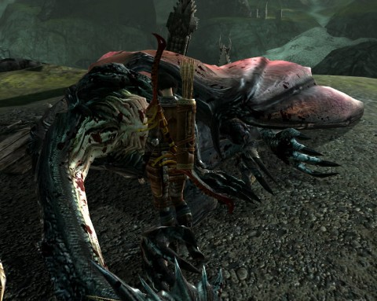

Back to: [West Karana](/posts/westkarana.md) > [2011](/posts/2011/westkarana.md) > [March](./westkarana.md)
# Dragon Age 2: A Kinder, Gentler Dragon Age

*Posted by Tipa on 2011-03-12 07:59:03*

[caption id="attachment\_6283" align="aligncenter" width="480" caption="Finally, we get to kill the dragon."][/caption]

It's more than a little frustrating that the very first dragon we see in Dragon Age 2, we're not allowed to kill. Turns out to be Flemeth (note: not a spoiler, happens in the intro and we see it in all the pre-release footage) whom we left alive in Dragon Age Origins. She's gotten a better 'do and filled out a bit. Life in the Wilds has been good to her.

Back up to the beginning, which is valid as the whole adventure is a tale told by a possibly unreliable narrator, a dwarf rogue who is among the first to join you on your journey. You are Yourfirstname boygirl Hawke, a warriorroguemage refugee from Lothering. With your well-connected mother and apostate mage sister in tow, you flee from the Darkspawn to Kirkwall, your ancestral home, gathering companions along the way.

Since I was adventuring with my family, I changed my look at a stall in an underground bazaar that came with the signature edition of the game so that I would look more like my mother and sister. At least the game sets the skin tone of your family to match yours so that there weren't any really uncomfortable questions about my parentage. Though as it turns out, our family history is a little clouded...

Dragon Age 2 has been streamlined and simplified from the first game. All the same elements exist in some form; even your faithful hound remains, though as a summoned pet rather than a full-fledged companion. The skill book has been replaced with an icon chart that looks like a subway map; on it are clearly explained the combo skills that either set up or key off of a special state on the enemy -- for example, a warrior can stun an enemy while a rogue or mage uses that opportunity to unleash a devastating attack.

On normal difficulty, the fights (so far) have been fairly brainless. I think the difficulty of the game has gone down at least one stop; I used to have to be at least a little strategic in normal difficulty fights in DA:O, now I can just wade in, confident the tactics screens (essentially unchanged from the first game) will keep my group mates doing something useful while I direct the flow of battle with my character. I'll be switching up to hard mode. I haven't even used any heal pots yet. They're taking up space.

Crafting has become curiously indirect. Instead of tossing things together yourself, you hire NPC crafters to make things for you -- you order potions, poisons and stuff. You still need the recipes and you need to have discovered the ingredients, but you don't need to have them in quantity. Just having one is good enough.

So far, about two hours in to the story, the main fun has been tracing back the connections to my saved game on DA:O. In my most recent playthrough, I'd done all the "bad" things -- killed the elves and allied with the werewolves; allowed the creation of more golems from the souls of outcast dwarfs; saved Flemeth; made Alistair hate me while also placing him on the throne; befriending Loghain the Kingslayer and so on. I was pleased to see Alistair remains king and that the werewolves now need my help.

In the first game, mages were all-powerful. They were the crowd control, the damage, the healing and once you unlocked the Arcane Warrior specialization, the tanks as well. Playing anything other than a mage was a quaint but pointless choice, since you'd soon be inhabiting Wynne or Morrigan anyway if you didn't roll your own.

I haven't seen any sign so far that specializations exist in DA2. Warriors and rogues can learn abilities that control the battlefield, so while mages have not been nerfed in any way, the other classes have received a bit of a buff. No more do warriors need to straggle behind the battle while the mages do the killing. Both warriors and rogues have abilities that let them zoom from encounter to encounter.

I'm very happy to see that rogues have some decent-looking armor choices, at least for player rogues. Most of the better stuff that drops is tagged for your character only, which is weird, but I imagine makes sense when you remember the whole game is one enormous flashback. This is the stuff you did have, this is where you got it, as the game jumps through time (having at this point already jumped forward a year) your companions may shift and change and where's the stuff you gave them? Aside from that, some of your companion's gear grows with their level, so there's lesser need for them to upgrade.

The Signature edition of the game contains a lot of perks that will give you a significant boost once you come to your first home base in Kirkwall -- some of this can be bought as DLC from the Bioware store. You can unlock more stuff in the Facebook game Dragon Age Legends. All this has been useful.

Replayability? Every play of the game starts out the same, with your family fleeing Lothering. Tere are definite branching plot paths, as in Kirkwall where you are given the choice to spend a year with mercenaries or smugglers. I chose smugglers, and that now has changed how people react to me in the city. That said, even in DA:O, no matter what path you chose, you still found yourself on top of a tower in Denerim, slaying the archdemon. But really, after the first playthrough, it was the differing origins I really enjoyed most. That will be absent in DA2.

I'm liking the game so far and expect to have a lot of fun with it. Will it inspire three or four playthroughs like the first game? I doubt it -- but I reserve the right to change my mind as I get deeper into the story. 

Oh Flemeth -- you ARE a clever girl, aren't you?

## Comments!

**[spinks](http://www.spinksville.com)** writes: One thing I am happy about is that after a couple of hours in, I am really liking my main character, I think she's pretty cool. Not sure if I like her as much as my grey warden (who has her own entry in the codex which mentions her origin!) but am enjoying the character side of thing. I'm doing my first play through on easy mode because I want to enjoy the story without having to fuss about whether my build is optimal or not.

---

**Longasc** writes: The style of combat is no longer medieval. In fact the game no longer has this medieval feel that sold DA1 for me. Esp. combat has a mangaesque feeling that I don't like. I am not really enthusiast how DA2 turned out, I decided to wait a year till I can get it as patched and bugfixed complete edition.

---

**[Callan S.](http://philosophergamer.blogspot.com/)** writes: *That said, even in DA:O, no matter what path you chose, you still found yourself on top of a tower in Denerim, slaying the archdemon.* 

Devils advocate - perhaps you complain about it, but really you wouldn't have had it any other way?

I mean, what, you'd end the game tending cabbages in your little plot just outside of St Nowhere?

---

**[Eliot](http://expostninja.wordpress.com)** writes: @Longasc This was exactly what I thought until I really thought about combat in DAO. True, there weren't any moments when I performed leaps that would make a basketball player die of envy on the spot - but, wait, there were. Like, any time I got a deathblow on an ogre or a dragon. And come to think of it, while I was frequently splattered in blood, everyone was still able to absorb a remarkable amount of punishment, such as Alistair becoming completely immune to any sort of knockback and just standing, shield raised and unharmed, as a demon clawed against it with a force that could rip stone.

DAO's combat was a bit lower-key, but it never really had the sense of a brutal medieval battle engine where fights are short, decisive, and bloody. At least not in my opinion.

@Tipa: There are specializations available, but the game doesn't show them off to you until you're around level 5 or 6, i.e. not too far from taking one. You've got a choice of three, and all have been cleaned up and made more attractive in a general sense.

---

**Bhagpuss** writes: I got about half-way through a single playthrough of Origins and gave up. I wasn't playing a mage and I was not having fun. I was also not willing either to re-roll as a mage or subordinate myself to one of my mage companions just to complete the game.

That said, I didn't like the game anyway. Having to complete endless videogame fights in order to listen to chunks of third-rate voiceover acting is possibly the least enjoyable way of following a narrative. Wuthering Heights by Semaphore looks positively sensible by comparison. 

I think I am done with Bioware for good now. The more they do for me, the less they draw me in.

---

**[Jaffa](http://dailyanimals.net)** writes: I did the final fight in DA:O without a mage in the party at all. And that was tough.

---

**auric** writes: Dragon age 2 is a huge disapointment for me ,it plays and feels like an add on of mass effect 2,not the game i loved at all,fighting feels like it is made for button mashers on consoles,(im not dissing consoles but if i want to button mash i will play cod on the ps3),the levels are repetitive to say the least with the same pathways and mine being rehashed again and again ad nauseum,
 I really really wanted to love this game im 20 hours in and am about finished ,DAO kept me playing for months with numerous playthroughs i will consider myself lucky if i see this through to the end of the week ,
 really really strange that bioware would chop up this game so badly its almost streetfighter-esque and hugely biased towards consoles ,this surely was not the market this game was intended for ?,
 massively linear bland ,very little interplay or humour between the other members and just a massive mass effect let down .

---

**[Dragon Age II Travelogue: Skipping ahead | Ex Post Ninja](http://expostninja.wordpress.com/2011/03/19/dragon-age-ii-travelogue-skipping-ahead/)** writes: [...] if you want to read other opinions, there’s a set on Game By Night, Spinksville, and West Karana that are all good and not previously linked by me.  So you have some reading [...]

---

