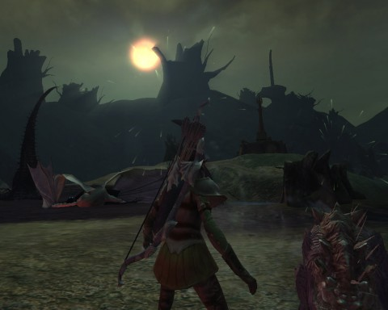
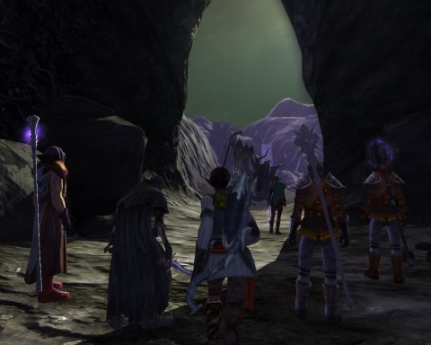
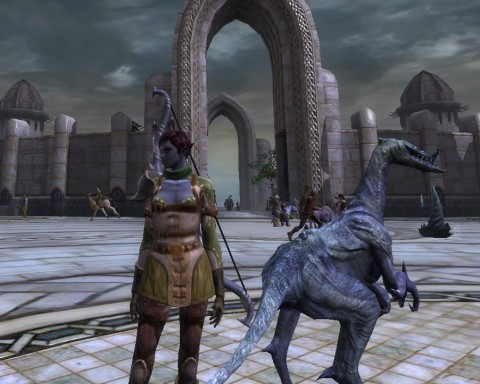

Back to: [West Karana](/posts/westkarana.md) > [2011](/posts/2011/westkarana.md) > [March](./westkarana.md)
# Rift: Sealing the King's Breeches.

*Posted by Tipa on 2011-03-13 20:10:56*

[caption id="attachment\_6289" align="aligncenter" width="480" caption="Scarwood Reach is safe again"][/caption]

It's important to remember that in Rift, the best laid plans of mice and men go oft awry. (Men drop cloth when they die. Mice drop tears). Oh, speaking of mice, my cat decided she wanted some attention today, while I was wrapped up playing Rift, so she laid on my mouse pad and stared at me, challenging me. So I used her as my mouse pad. There's a lot of cats in Scarwood Reach; when they see a pig, they attack it. On the way to King's Breach -- KB -- you'll pass a lot of cats and pigs fighting each other.

I'm pretty sure they're fighting.

That paragraph went places I didn't really expect -- but that's the Rift experience. You log on thinking to do some crafting or maybe grind some quests or try out a new build, and then a rift happens, or an invasion happens, and you're going around the zone madly whacking stuff as fast as you can, and then you bump up against an instance, or decide to do some open world PvP by taking out some border Guardian footholds, or just start exploring the corners of the zone... I found an artifact somewhere, or well, I found one but couldn't figure out how to get to it. I freed some prisoners nearby. I dinged 35 in there somewhere.

Where does the time go?

I love rifting, but I do dungeons whenever I can. It's the group dynamic that really defines MMOs for me. I know that isn't universal; hell, it's practically an aberration these days to admit you prefer to group for experience. But it's only in dungeons that I can define myself as a character. When I solo, I switch specs to fit my mood, but I always have to end up with a balanced spec with buffs, heals, damage, some sort of crowd control and so on, or I'm going to die. Die more often that I do already, because soloing Guardian footholds in the middle of Guardian controlled lands does tend to anger people.

I really thought they wouldn't notice. Time for another King's Breech picture.

[caption id="attachment\_6287" align="aligncenter" width="480" caption="Rushing to adventure!"][/caption]

It looks like we're running toward some sort of massive place of mystery, but really everyone was taking a quick AFK except me, and I just kept running forward and backward to make a dramatic screenshot. You gotta stage these things.

I've been doing Foul Cascade a few times (Foul Cascade is not the subject of this post), and I begin to learn my role -- I'm a ranger/bard, with big points in ranger, small points in bard. I don't really need the bard points, but I just feel uncomfortable with giving up my small ability to heal (with an off soul) and have some buffs. That's just a bit of control I need. And it's also a reminder to my group that at ANY MOMENT, I could just stop a second and ZING, I'm a bard. I don't just WANT to be DPS or support. I want to be dps --and-- support --and-- a healer. I really just want to do it all.

King's Breech was different. It's nominally a level 35-37 dungeon, but when a call went out for a level 34+ dps of any class, I put my name in the hat and I got the invite. THEY had no idea what role they wanted me to use, so I opted for ... pure bard.

[caption id="attachment\_6288" align="aligncenter" width="480" caption="You see these nasty suckers everywhere in KB"][/caption]

Up through about level 30, I went with a bard/ranger spec everywhere. It was decent dps, came with its own tank and so on. Post 30, I swapped that around with most of my points in ranger because I really needed a lot more stopping power, a better pet, and significant healing power for when I got crushed by mobs or decide to open a planar tear (most solo rogue builds mix in bard for this reason). So when I go back and do older dungeons like Deepstrike Mines or Foul Cascade, I go ranger. Ranger has a couple of cool AEs which keep you in the gold while rifting.

Since I no longer used the Bard/Ranger role for soloing, I decided to swap things up and make it pure bard, absolutely with no survival or parser potential, about as pure a support class as you can make with a rogue. Pure bards even have their own colors in the raid window -- pink.

That's what I took into King's Breech. Bard. Four strummed 30 second buffs. A strummed power chord followed by a channeled fingerpicking with one of various strums for finishers -- or a toot of the horn if I wanted to toss in a direct group heal. When I play my ranger in dungeons, sometimes we wipe. It happens. When I'm full bard, nobody dies. I should use that when I call for groups.

[caption id="attachment\_6290" align="aligncenter" width="480" caption="New clothes"][/caption]

I guess I should talk about the instance itself. Like Foul Cascade, it's an outdoor zone, and like Foul Cascade, it's attacked by rifts. Foul Cascade is anchored by an enormous death rift, but King's Breech has a life rift at the beginning and a death rift at the end. The life rift area is the domain of King Hylar of the Aelfwar -- he whose story dominates the Guardian zone of Silverwood. He is the king whose britches we are pursuing. He is, if I remember this correctly, trying to keep undead out of Scarwood Reach so that he can make it his own. Scarwood Reach is, like King's Breach, split north and south, Guardian and Defiant, Life and Death. When the zone wide invasions start, it's not unusual to find yourself rifting with the opposite faction, and perhaps accidentally plinking one with an AE, and perhaps starting a war that has nothing to do with a planar invasion.

I'd leveled my outfitting up at great personal hardship to outfit myself in some really sweet looking gear, most of which got replaced in the last couple dungeon runs. So there I am, in a tunic from the last boss of King's Breach, leggings from the planar vendor in some zone, with my raptor pet.

That raptor pet is the laziest pet EVER. People in guild chat go on and on about the damn thing, but while he's good at dps and pretty good at AEing, he absolutely refuses to do anything like a taunt unless I give him a really long time to build aggro.

So... I'm thinking of maybe trying a riftstalker/ranger build. Tanking, self heals, and that raptor biting stuff in the butt.

Just before I logged off, some NPC asked me to test out their teleporter and it zoomed me to the Moonshadow Highlands. I leveled through Scarlett Gorge without doing more than a fraction of the quests, because of my love for rifts and dungeons. I've gotten a little further in Scarwood Reach, and now I'm halfway across the world.

Rift could drop 90% of its quests and I promise, I wouldn't miss them.

## Comments!

**[pkudude99](http://nomadicgamer.com)** writes: I rift enough that I've got planarite coming out my ears and my quests are green or gray in the zones if I don't skip past quest hubs. . . and I'd still miss the quests. Some of them are hilarious! I loved the one in the Last Valley section of Stonefield where you go deface the Dreadbone troll glyphs with Stonecrush troll propaganda, kill their leader, then morph into a Stonecrush troll in order to prove their superiority. . . . even though it's the Defiant army sending you to do it, not the Stonecrush trolls. I laughed so hard reading that quest text.

---

**[Saylah](http://notadiary.typepad.com/mysticworlds/)** writes: Same here. I hit 30 today and I don't know how I make the levels when I've done maybe half the quests before out leveling the content. Then I remember that I rarely pass up major rifts, big invasions, heal guild instance runs if I'm around and woooooosh, another few levels gone. BUT I'd play rift without the rifts that's how much I love playing Cleric, the quests and zones. Not doing lots of the quests now will leave plenty of new stuff to see on guild alt nite so it's all good.

---

**Longasc** writes: Interesting, I rather predicted people becoming tired of Rift after Rift!

---

**Bhagpuss** writes: Rifts are just plain !FUN! in the same way as when you were nine years old and everyone ran around the playground screaming and shouting and throwing a ball in some game that no-one really knew the rules of yet everyone did. The only reason that ever got old was because you grew up. 

That part doesn't surprise me. What has surprised me is the quests. The further into the game you get, the more intriguing, exciting and amusing they are. They don't have cut-scenes, they have something much better than that, namely acted-out, in-game set pieces with lots of special effects and really quite good voice-overs. I'm quite impressed.

---

**[Elementalistly](http://simple-n-complex.blogspot.com/)** writes: @Longasc
"Interesting, I rather predicted people becoming tired of Rift after Rift!"

Nope...and as a matter of fact, I and several of my guildmates (old time friends from our Guild Wars launch days) log in and the FIRST thing we usually do is see if any Rifts are happening.

The fact some are elongated quest style Rifts, where you go through major steps in the zone (closing major foci, dropping various invasions) and then take out a final boss (or bosses in several I have been in)...they never get old.

The Rifts really are a great metagame within the game...and works.

Now, if I could just get my wife to join me and get off running the paths between zones or spelunking or mountain climbing as she looks for shinies everytime SHE logs in...

---

**[Saylah](http://notadiary.typepad.com/)** writes: I often hear people asking where's the rift action the second the pop in the game. People are still rushing from rift to rift. I will skip them IF I'm in the middle of a long quest or one that requires me to find something very specific and I'm close to achieving it. Otherwise, I run in and start healing.

---

