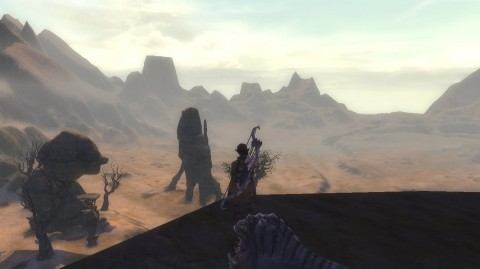

Back to: [West Karana](/posts/westkarana.md) > [2011](/posts/2011/westkarana.md) > [March](./westkarana.md)
# Rift: Imagine a world without quests...

*Posted by Tipa on 2011-03-21 06:19:13*

[caption id="attachment\_6293" align="aligncenter" width="480" caption="Droughtlands"][/caption]

Pictured is the Droughtlands, from a high vantage above the desert floor on a plateau called Lantern Hook. There's a neutral city within it, and a dungeon ("The Fall of Lantern Hook") beneath it. I had no idea where this place was until a crafting daily sent me here, but it's a nice place. The area is around my level (39) and I could skip the Moonshade Highlands and work on Droughtlands quests, just like I skipped out of Scarlett Gorge to work on Scarwood Reach quests, and Scarwood Reach quests to work on Moonshade Highlands quests.

And why not? Aside from the experience, there's little reason to do quests. The nigh-inevitable destruction of the world is only a handful of years in the future. In the original timeline, the Guardians had the upper hand against the forces of Regulos, and THEY LOST. They were destroyed while undead swallowed the world. Only a last few Defiants, by sending reincarnated heroes with borrowed souls into the past, threw the dice of the fate of the world one final time...

... so that I could pick mushrooms around a lake. 

Just like World of Warcraft, every living thing you see has a quest to kill it, so you don't WANT to kill anything or do anything until some NPC tells you to do so. The difference is with the rifts, invasions and footholds; when you see one of those, you drop what you're doing and wade in, because THIS is the fight against the future, THIS is you doing what you are meant to be doing.

Then, unless you find yourself in a dungeon (and this past weekend, I have both main healed and main tanked a dungeon, as bard and riftstalker), you look for a bunch of NPC chumps with green punctuation over their heads, find out which local fauna they hate or flora they need gathered, and set to your task.

Doing pointless boring quests was half the reason I left WoW. The other half was being abused by the so-called "community".

Here's an example -- a quest series I did, as a ranger, with a random bard (yay public groups).

There's this village of dead dwarfs. You can tell they are dead because they have their opacity set to 50% and their colors are desaturated, but they don't bemoan their fate or give dark warnings of the hereafter or fear that their soul will be swallowed up by some needy Guardian Ascended or something. In fact I'm not sure what they were about. They just stood around, except for a couple who patrolled, and you just know death hardly interrupted their routines.

Anyway, there are three treasures in this village that we need to burn, for some reason. These treasures -- a chest, a book and a doll if I remember right -- are on the front stoops of the houses, because you can't ENTER houses in this game; like WoW, there are no doors, which is an innovation Ultima Online delivered in 1997 but has been slow to make its way to newer games. There may have been a reason why we needed to antagonize these dead dwarfs, but I can't imagine it really was a turning point against the forces that would destroy the world.

Seriously, I'm trying to save your lives, NPCs. If you have a trinket that will help in that fight, JUST GIVE IT TO ME.

The quest hub mechanic is Rift's weakest point. What would the game be like, I wonder, without quest hubs? Where what quests did exist, were integral to the plot of the game? When I get sent into a fairy wood to pick mushrooms, I'm not thinking "Yay! Bringing the fight to Regulos!". I'm thinking, "this quest sucks. I am wasting my time."

[caption id="attachment\_6294" align="aligncenter" width="480" caption="A big gun"][/caption]

Quests are not meant to challenge players. They are just meant as busywork to keep people in the game while they are waiting to do something fun. They could be removed and just replaced with a mechanic that would deliver XP, coin and the occasional trinket to you as long as you were online with no difference to total enjoyment of the game.

Except when quests go BAD.

There's a quest chain in Moonshade Highlands where the Defiants and Guardians are fighting over the control of a few cannon and some monitoring devices. As part of this, you (the Defiant player) capture a Guardian NPC and bring him back to Timberveil (Defiant outpost) for torturing. You then torture the NPC until he commits suicide rather than reveal more information, after which you skip merrily to a ridge and fire cannon at Guardian emplacements.

I was so shaken by this quest that I almost stopped playing. Did Trion think that American players would be so blasé about torture after Guantanamo that it means nothing to us any more? I did the quest hoping to see some sort of repercussions for this, some feeling or sense that we, as Defiants, perhaps have gone too far, that we must not become the monsters we fight. But, no. There was nothing. It was just another stupid quest. Burn a child's doll, pick a mushroom, torture an NPC to death. I proved I will do absolutely anything if an NPC asks me to.

Take away the quests hubs. Replace them, perhaps, with set pieces that advance the plot of the game, or fer chrissakes help the Defiants and the Guardians set aside their differences so that they can band together to SAVE THE WORLD. The reason everything fell apart to begin with was Defiants and Guardians seeing the conflict against Regulos as a zero sum game where they could not win unless the other lost.

I won't even get started about what the Warfronts say about the motivations of the two sides, while the true darkness gathers unchallenged. Not this post, anyway.

## Comments!

**[pasmith](http://dragonchasers.com)** writes: I was talking to @girl\_vs\_mmo at PAX about Guild Wars 2 -- she'd gone to a demo and a panel on it. She said it doesn't have quests like these. Instead there are quests that are generated based on what's going on in the world at that particular time (keyed off the dynamic content in the game).

So we'll see. Of course Rift was much more 'dynamic' in beta too, before Trion extracted all the teeth from Rift creatures and turned them into temporary obstacles that could never inconvenience players for more than a few minutes.

I'm not a Guild Wars 1 fan, but after hearing about this aspect of GW2 I'm much more interested than I was.

---

**Longasc** writes: Quests were once seen as the savior from the horrors of the GRIND. Soon the word became quest-grind, and quests became daily chores. They turned into tasks. Do this, do that, here, there, follow the arrow. The WoW new player experience does exactly this, plus puts it into some kind of more or less interesting story. SWTOR will probably go crazy on story and voice overs.

I am not sure what is the right way to do it, seems Rift apparently does not have much use for Quests at all. But maybe there are Rift players that are rather questing than rifting? I for sure did a lot in Beta 2. Rifts were a bit repetitive, not that the quests were particularly great, still...

I am right now playing LOTRO, I am in Moria again. Hope STO gets back on track, putting so much emphasis on Feature Episodes has the drawback that people simply stop playing when there are none.

---

**[Stabs](http://stabbedup.blogspot.com/)** writes: I think they serve a useful purpose in that they mix up the gameplay. I do a lot of warfronts and instances, the quests help get me to the world. Quite possibly without quests I would rift a lot less as I simply wouldn't be in the area.

Another element that some of us really like is the pvp aspect. On pvp servers ganking and being ganked while questing is the main difference from pve servers. It's quite good fun.

---

**[Saylah](http://notadiary.typepad.com/mysticworlds/)** writes: Interesting. I feel like rifts quest hubs are superior to other MMOs I've played. Sure you encounter NPCs crouching behind boulders or standing feet away from the enemy doing nothing but waiting on me to arrive. But I simply adore how most of the combat zones are in NPC civilian populated areas with some sort of community nearby. That makes the quests feel more relevant and necessary.

For me, I don't need to feel the urgency or heroism in the regular questing. I get that from rifts, invasions and dungeons. I honestly don't believe a game can support that level of relevance for every quest for the entire game. It's for the same reason that books and movies have structural beats with high and low peaks of excitement. It's for the mental and emotional breather.

---

**Jonathan** writes: I'll put a poke in here about questing in Guild Wars 2. They seem to be moving to the point where the only content they do is something very similar to Rifts... shared events that happen that you can just join in and do. The event ends, consequences happen that will spawn other events based on how this event ended. World changes then for everyone (not instanced or phased) and you can go on to the next event... or not. 

They are moving to a system where if you want to play events, you can talk to an NPC scout who will tell you where things are happening right now (since the events are dynamic, you never know what's happening unless you ask around) or just wander around and do events as they come.

Sounds to me very much like "RIFT without quest hubs." I'm curious to see how it plays in actual live use.

---

**[Thac0](http://phentaripress.wordpress.com)** writes: That quest abiut the torture and no redeeming quality bothers me. I haven't gotten to it yet in fact I may not for a while since my interwebs are off for a bit. It almost makes me want to see if the guardians has the same disregard for morals when I come back.

As far as questsin general... i feel as this point in time they area necessary evil and as long as they are written fairly well i don't mind them. Although i do feel all the kill X mobs quests are a chore most of the time and look forward to the day they don't exist. Until then .. meh the mindless grind is somewhat relaxing to be honest.

---

**[Gankalicious](http://www.gankalicious.blogspot.com)** writes: "They are just meant as busywork to keep people in the game while they are waiting to do something fun. They could be removed and just replaced with a mechanic that would deliver XP..."

Eve online removed that obstable and replaced it with time..... Players still 'quest' for faction points, and cash, of course but it is optional. You don't have to quest to advance your skills. 

I don't play a lot of so-called 'theme park' games because I loathe and despise quests- get your own freaking mushrooms you lazy NPC! That said I'd personally love to do a few torture quests- sounds like good fun. Oh, come on, it'd okay to mass-slaughter pigs for mats but not torture someone to save the world? Bring it on I say and I"ll help you hide the bodies!

In any case it's all about personal preference- some people really like quests, and there's nothing wrong with that. Each to his/her own.

---

**[PeterD](http://rpgwire.blogspot.com)** writes: I'm finding that my playtime in Rift is divided amongst rifting, questing, pvping, and running dungeons. I'd be doing more dungeons if groups were easier to find (hurry up with that lfg tool Trion, but keep it server specific, i don't mind waiting, I just want a tool) but am filling the void with quests.

I agree that the majority of the quests fairly pointless and I wouldn't feel bad if they were removed. The story quests are a little more involved and worthwhile though, as they culminate in removing threats associated with the Rifts, and so feel like they are properly part of your overall mission.

I have also noticed that despite not being mentioned anywhere Rift does seem to use some small amounts of a "phasing" like technology for certain quests. Gloamwood for Guardians has a quest where the leader of the town (whom you've spoken to many times) doesn't want to see you, and has bodyguards blocking the path up to his house. When you reach the house, the door is locked and you have to kick it in. In all the times I've visited the guy, I'd never seen bodyguards or a closed door. I hope they do more of this, though not to the disruptive extend WoW did.

As to Defiant morality, the tutorial area shows you two Guardian Ascended being brutally tortured to death in a machine to create a single Defiant Ascended. I knew at that point that the Defiant faction was not for me. That there is a quest later that has you torture a Guardian NPC hardly seems surprising.

---

**[Blue Kae](http://www.bluekae.com)** writes: I just did that torture quest myself last night, and while there could have been more done with it, there was some comment from the quest NPC when I turned the quest in about not wanting to use such questionable means be feeling it was necessary because of the threat presented by the Guardians.

---

**[Callan S.](http://philosophergamer.blogspot.com/)** writes: I think the only bad thing about the torture quest is that if you bail on it, you get no XP. I think a game that actually grasps problematic issues in a narrativist vein will give you an equal reward for either torturing him, or bailing on the whole thing. Because for narrativism, it's about what your character would do and not about choosing an optimal path.

Frankly it sounds like you could do with more quests like that - albiet in a narrativist framework, instead of the psuedo gamist one where you did it because that was the shortest path to advancement.

---

**Cam** writes: Came over here after a link from Tobold's. 

I certainly agree with you on the realization that in almost any MMO, my in-game characters will do ANYTHING for money. Or not even money. Notoriety, in some cases.

That's right. We are MURDER AGENTS. We rampage across the country-side, maiming anything or anyone we are told to. It doesn't even matter WHO is telling us to... all that matters is that we were asked. It's all the moral reasoning we need. (I haven't played it myself, but my brother tells me this trope is lamp-shaded in WoW's early goblin quests. You are sent to collect a key from a goblin. When you loot it off his corpse, his ghost haunts you for the rest of the quest-chain, abusing you and guilting you over the fact that you never actually ASKED for the key, and he would've given it to you if it meant sparing his life.) 

Clearly, we are psychopaths. My brother and I, who play Rift together, now embrace our darker nature. The only alternative is to go irrevocably insane. We are immortal, murderous mercenaries. ...And we're OK with this, now.

"Ho there, brave hero! Your heroic feats have saved us all, please accept this reward... ACCEPT/DECLINE."

"No. This is madness. I decline. There is no bravery or heroism in what I do, poor farmer. I am immortal. Death holds no terror for me, no sway. I have nothing in this world to lose. My power is near infinite, compared to yours, and I travel through space and time to span entire worlds with ease in mere moments. Mighty warlords, fallen heroes, demons and GODS have all fallen to my blade, not through virtue or divine right... but by the simple fact of my willingness to die at their hands, over and over and over until I finally discover and exploit their weakness. I can foster no children. Till no soil. Change no aspect of your preordained paths. I possess gold in the thousands; my wealth could feed all of Azeroth for months on a diet of the finest [Succulent Apple]. But the bellies of Westfall's refugees remain empty. For all my staggering power, I can have no impact on this world til mortals like you ask it. What you offer is no challenge, farmer... The fear is not that you will send me to my demise... My fear is that you will ask me no more, and I shall return to being powerless. No, farmer. I do not accept your reward. The insanity ends here."

"...Ho there, brave hero!"

---

**[Callan S.](http://philosophergamer.blogspot.com/)** writes: Indeed, Cam. It's like a species of the diving bell and the butterfly.

---

**[Bronte](http://arewenewatthis.wordpress.com/)** writes: "Did Trion think that American players would be so blasé about torture after Guantanamo that it means nothing to us any more?"

I think this is a little presumptuous. Trion built a game for people from around the world. I hail from the part of the world from where more of the Guantanamo detainees hail from, yet I didn't think much of the quest in question. For me, it was simply gaining a better understanding of the Defiant agenda, a Jack-Bauer-esque approach, if you will, and certainly didn't phase me much at all.

---

**Bhagpuss** writes: Annoyingly, I have just read Tipa's post right before I have to go to bed - early start tomorrow - so I can't comment as I'd like to.

Just very briefly, I think the quests in Rift are above average for MMOs. Some i have enjoyed quite a bit and many are well-written. The one about the children's toys that you refer to is quite a moving one, I thought.

If there's anything I would do away with, it isn't the trivial "life carries on" quests, it's the whole overblown cliche end-of-the-world storyline itself. I agree there's a serious disconnect between the two, but it's saving the world that I find tedious and uninvolving.

As for the poor judgment in the torture quest, being on the Guardian side I haven't encountered that one but in beta I sent some absolutley blisterign negative feedback about some of the Silverwwod quests, which I considered to be more than subconsciously racist. They remain unchanged, of course. I am no longer convinced, however, that this sort of thing is unintentional. I get the impression that both Guardians and Defiant are intended to be deeply unlikeable and not in any way admirable. Which is an original approach, if not a wise one.

---

**[icbleu](http://icbleu.wordpress.com/)** writes: I have to agree about the torture thing. It bothered me too. Worse yet was the cage burning quest further into Moonshade highlands called, Burn the Offerings". you basically burn the fae's wicker cages while people are still trapped within. Overall I love this game, just sometimes MMO's ask you to do things you would rather not do.

---

**[/AFK: Humorous Choice Edition &laquo; Bio Break](http://biobreak.wordpress.com/2011/03/27/afk-humorous-choice-edition/)** writes: [...] West Karana — Rift: Imagine a world without quests “Only a last few Defiants, by sending reincarnated heroes with borrowed souls into the past, threw the dice of the fate of the world one final time… so that I could pick mushrooms around a lake.” [...]

---

**Cam** writes: I like the trackback link's quote focus. 

But to me, that always seems like it skirts a pretty important issue. Why aren't we drafted into the military? What do you think would happen if you suddenly manifested multiple legendary powers inherited by the masters of human physical achievement and a proven inability to stay dead? Hello black suits, hello cosy new cell, hello hours of being poked by needles every day - and when the answer turns out to be less science, more religion, so they can't just empower their already-loyal soldiers... hello being drafted. Given that there are maybe a million ascended/mutants/superheroes/whatever, that gets a little trickier in a game world. 

Now sure, there's an argument to be made for menial tasks being given to the enlisted. The real military does it all the time. Most of your time spent in the infantry corps of the army is going to be spent digging holes, then filling them back up, in between running ridiculous distances with ridiculous weights on your back. Ostensibly these all have a purpose - instinctive obedience, unit cohesion, forming the habit of knowing orders might have no sense at the ground level, but obeying them anyway. And if something useful can be done at the same time (such as gathering mushrooms), then why not? 

But in this case, you are cajoled, guilted, begged, and bribed. All-powerful beings cavort around the country-side, beholden only to their whims. If you've ever seen a major zone invasion in RIFT, you definitely get the sense that the 'elite special forces' of the Ascended rather outnumber the pitiful mortal military. And this force answers to no-one but money and curiosity with occasional bursts of dedicated patriotism. This seems to happen in many MMOs.

I know I'd love to be tasked with quests in the manner of an elite special operative of the time. "Here is your objective. We do not care how you go about achieving it, just see that it is done." WoW tries this, but there's really only one way: kill ten foozles, or obey your quest-givers. SWTOR looks like it might try a more Dragon Agey/Mass Effecty type approach (kill =everything=. Spare one or two guys who actually try to strike up a conversation. Or not). 

Just tossing it out there... Maybe we should be =less= powerful?

---

**Panazule** writes: Aside from the fact that there has been no evidence of torture in Guantanamo Bay... if you consider water boarding torture you don't deserve the freedom the military have afforded you..

It's an MMO about a WAR between two sides for the sake of the future... if you have a problem with it, don't do the quest or go play Barbieland Adventures... Were you upset when Sauruman "tortured" gandalf in the lord of the rings? Or is that just different than this fantasy MMO?

But anyway...

How a website that seems to cater to EQ can actually have a problem with the quest dynamic in Rift really confuses me.

In EQ you were given quests, which until the last few expansions, wound up giving you gear that was horrible and was destroyed when you looted it. Not to mention the endless hours of grinding and camping and searching just to complete that said quest for your useless gear... or even worse.. just for faction.

Then there was EQ2, the game which ripped apart the EQ1 community and drove people to WOW... that game had quests.. and quests.. and quests.. and quests... and they were horrible compared to Rifts...

As a 10 year veteran of EQ, who's subscription is still good albeit I haven't logged on in over 11 months, RIFT has taken the all of the best parts of other MMO's and put them together and have done a very good job of fixing all of the BAD things about MMO's... the endless LFG, endless camping, endless faction and they have put their own spin on it and created a game that is FUN where you can logon and do a multitude of things and actually feel like something got done.

Playing a game where there isn't the ongoing, never ending frustration is a welcome change to the awful horrible thing that Sony has created.

Of course I can see how someone who would group the entire country as having an issue with the STILL OPEN "torture" at Guantanamo Bay would embrace a game like EQ where people who raided and obtained the end game to get gear, worked their butts off for it just to watch a new expansion come out and gear start raining down from the sky nearly as good as what they worked for an entire year for... it turned into MMORPG welfare.

Enjoy your internet while you can, until Net Neutrality starts pushing every company to start selling tiered usage plans again... you get what you ask for.

---

