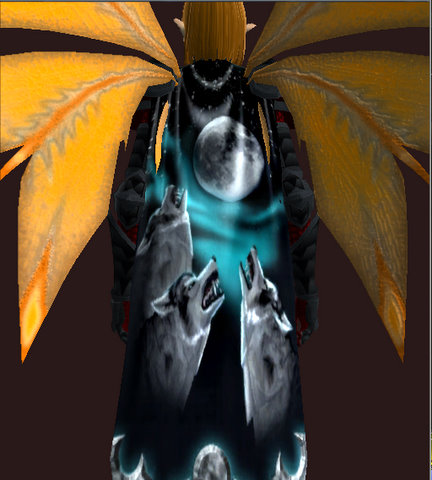

Back to: [West Karana](/posts/westkarana.md) > [2011](/posts/2011/westkarana.md) > [March](./westkarana.md)
# EQ2: Three Wolf Moon

*Posted by Tipa on 2011-03-25 06:37:35*

[caption id="attachment\_6298" align="aligncenter" width="432" caption="Three Wolf Moon cloak"][/caption]

Lore text: This cloak will make you more desirable! Also has the property of featherfall. 

And why it's particularly funny...

The whole "Three Wolf Moon" phenomenon started with [this comment on Amazon.com](http://www.amazon.com/review/R2XKMDXZHQ26YX/ref=cm_cr_dp_perm?ie=UTF8&ASIN=B002HJ377A&nodeID=1036592&tag=&linkCode=), and from there took on a life of its own (and spawned [hundreds of imitators](http://www.threadless.com/submission/222011/Three_Keyboard_Cat_Moon)):

> This item has wolves on it which makes it intrinsically sweet and worth 5 stars by itself, but once I tried it on, that's when the magic happened. After checking to ensure that the shirt would properly cover my girth, I walked from my trailer to Wal-mart with the shirt on and was immediately approached by women. The women knew from the wolves on my shirt that I, like a wolf, am a mysterious loner who knows how to 'howl at the moon' from time to time (if you catch my drift!). The women that approached me wanted to know if I would be their boyfriend and/or give them money for something they called mehth. I told them no, because they didn't have enough teeth, and frankly a man with a wolf-shirt shouldn't settle for the first thing that comes to him. 

I arrived at Wal-mart, mounted my courtesy-scooter (walking is such a drag!) sitting side saddle so that my wolves would show. While I was browsing tube socks, I could hear aroused asthmatic breathing behind me. I turned around to see a slightly sweaty dream in sweatpants and flip-flops standing there. She told me she liked the wolves on my shirt, I told her I wanted to howl at her moon. She offered me a swig from her mountain dew, and I drove my scooter, with her shuffling along side out the door and into the rest of our lives. Thank you wolf shirt. 

Pros: Fits my girthy frame, has wolves on it, attracts women 
Cons: Only 3 wolves (could probably use a few more on the 'guns'), cannot see wolves when sitting with arms crossed, wolves would have been better if they glowed in the dark.

## Comments!

**Egat** writes: It totally took me 10 minutes before I got the point of the cartoon, I guess I must be slow.

---

**Bhagpuss** writes: I still don't get it. I spent about ten minutes trying to figure it out but I still have no clue what it means.

---

**[Tipa](https://chasingdings.com)** writes: Okay, the Three Wolf Moon shirt was a popular meme awhile back, maybe as far back as 2009. So this girl comes into this guy's room and sees the 3WM shirt on the floor, and sarcastically begins to say, "Hey, 2009 called, they want their shirt back." So the guy turns it around by jumping in on the things you would say to 2009 if it really called.

---

**Bhagpuss** writes: Doh! I thought of that, but then I thought "but Japan just happened now" so I thought that couldn't be it. Not like the future isn't a continuum or anything! 

Thanks for explaining!

---

**Paul** writes: The mouseover for that cartoon at xkcd.com is "2017 called, but I couldn't understand what they were saying over all the screams."

---

